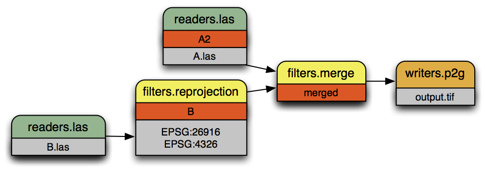

.. _pipeline:

******************************************************************************
Pipeline
******************************************************************************

Pipelines define the processing of data within PDAL.  They describe how point
cloud data are read, processed and written.
PDAL internally constructs a pipeline to
perform data translation operations using :ref:`translate_command`, for
example. While specific :ref:`applications <apps>` are useful in many contexts,
a pipeline provides useful advantages for many workflows:

1. You have a record of the operation(s) applied to the data
2. You can construct a skeleton of an operation and substitute specific
   options (filenames, for example)
3. You can construct complex operations using the `JSON`_ manipulation
   facilities of whatever language you want.

.. note::

    :ref:`pipeline_command` is used to invoke pipeline operations
    via the command line.

.. _`JSON`: http://www.json.org/

Introduction
--------------------------------------------------------------------------------

A PDAL processing pipeline is represented in JSON.  The structure may either:

- a JSON object, with a key called ``pipeline`` whose value is an array of
  inferred or explicit PDAL :ref:`stage_object` representations.
- a JSON array, being the array described above without being encapsulated by a
  JSON object.

Simple Example
................................................................................

A simple PDAL pipeline, inferring the appropriate drivers for the reader and
writer from filenames, and able to be specified as a set of sequential steps:

.. code-block:: json

    [
        "input.las",
        {
            "type":"filters.crop",
            "bounds":"([0,100],[0,100])"
        },
        "output.bpf"
    ]

.. figure:: ./images/las-crop-bpf-pipeline.png

    A simple pipeline to convert :ref:`LAS <readers.las>` to :ref:`BPF <readers.bpf>`
    while only keeping points inside the box :math:`[0 \leq x \leq 100, 0 \leq y \leq 100]`.

Reprojection Example
................................................................................

A more complex PDAL pipeline reprojects the stage tagged ``A1``, merges
the result with ``B``, and writes the merged output to a GeoTIFF file
with the :ref:`writers.gdal` writer:

.. code-block:: json

      [
          {
              "filename":"A.las",
              "spatialreference":"EPSG:26916"
          },
          {
              "type":"filters.reprojection",
              "in_srs":"EPSG:26916",
              "out_srs":"EPSG:4326",
              "tag":"A2"
          },
          {
              "filename":"B.las",
              "tag":"B"
          },
          {
              "type":"filters.merge",
              "tag":"merged",
              "inputs":[
                  "A2",
                  "B"
              ]
          },
          {
              "type":"writers.gdal",
              "filename":"output.tif"
          }
      ]

    A more complex pipeline that merges two inputs together but uses
    :ref:`filters.reprojection` to transform the coordinate system of
    file ``B.las`` from `UTM`_ to `Geographic`_.

.. _`UTM`: http://spatialreference.org/ref/epsg/nad83-utm-zone-16n/
.. _`Geographic`: http://spatialreference.org/ref/epsg/4326/

.. _processing_modes:

Point Views and Multiple Outputs
................................................................................

Some filters produce sets of points as output.  :ref:`filters.splitter`,
for example, creates a point set for each tile (rectangular area) in
which input points exist.
Each of these output sets is called a point view.  Point views are carried
through a PDAL pipeline individually.  Some writers can produce separate
output for each input point view.  These writers use a placeholder character
(#) in the output filename which is replaced by an incrementing integer for
each input point view.

The following pipeline provides an example of writing multiple output
files from a single pipeline.  The crop filter creates two output point views
(one for each specified geometry) and the writer creates output files
'output1.las' and 'output2.las' containing the two sets of points:

.. code-block:: json

  [
      "input.las",
      {
          "type" : "filters.crop",
          "bounds" : [ "([0, 75], [0, 75])", "([50, 125], [50, 125])" ]
      },
      "output#.las"
  ]

Processing Modes
--------------------------------------------------------------------------------

PDAL process data in one of two ways: standard mode or stream mode.  With
standard mode, all input is read into memory before it is processed.  Many
algorithms require standard mode processing because they need access to
all points. Operations that do sorting or require neighbors of points, for
example, require access to all points.

For operations that don't require access to all points, PDAL provides stream
mode.  Stream mode processes points through a pipeline in chunks, which
reduces memory requirements.

When using :ref:`pdal translate<translate_command>` or
:ref:`pdal pipeline<pipeline_command>`
PDAL uses stream mode if possible.  If stream mode can't be used
the applications fall back to standard mode processing.  Streamable stages are
tagged in the stage documentation with a blue bar.  Users can explicitly
choose to use standard mode by using the ``--nostream`` option.  Users of the PDAL API can explicitly control the selection of the PDAL
processing mode.

Pipelines
--------------------------------------------------------------------------------

Pipeline Array
................................................................................

PDAL JSON pipelines are an array of stages.

.. note::

    In versions of PDAL prior to 1.9, the array of stages needed to be the
    value of a key named "pipeline" which was encapsulated in an object.
    The earlier format is still accepted for backward compatibility.

    Old format:

    .. code-block:: json

        {
            "pipeline" :
            [
                "inputfile",
                "outputfile"
            ]
        }

    Equivalent new format:

    .. code-block:: json

        [
            "inputfile",
            "outputfile"
        ]

* The pipeline array may have any number of string or :ref:`stage_object`
  elements.

* String elements shall be interpreted as filenames. PDAL will attempt to infer
  the proper driver from the file extension and position in the array. A writer
  stage will only be created if the string is the final element in the array.

.. _stage_object:

Stage Objects
................................................................................

For more on PDAL stages and their options, check the PDAL documentation on
:ref:`readers`, :ref:`writers`, and :ref:`filters`.

* A stage object may have a member with the name ``tag`` whose value is a
  string. The purpose of the tag is to cross-reference this stage within other
  stages. Each ``tag`` must be unique.

* A stage object may have a member with the name ``inputs`` whose value is an
  array of strings. Each element in the array is the tag of another stage to be
  set as input to the current stage.

* Stages are processed sequentially in the order listed. An empty default input list is
  created when interpretation of the pipeline begins.

* Reader stages will disregard the ``inputs`` member.  When the current stage is a reader
  it is added to the default input list.

* If ``inputs`` is specified for a writer or filter, those inputs are used
  for the current stage. The default input list is replaced with the current stage.

* If ``inputs`` is not specified for a writer or filter, the default input list is used
  for the current stage. The default input list is replaced with the current stage.

* A ``tag`` mentioned in another stage's ``inputs``  must have been previously
  defined in the ``pipeline`` array.

* A reader or writer stage object may have a member with the name ``type`` whose
  value is a string. The ``type`` must specify a valid PDAL reader or writer
  name.

* A filter stage object must have a member with the name ``type`` whose value is
  a string. The ``type`` must specify a valid PDAL filter name.

* A stage object may have additional members with names corresponding to
  stage-specific option names and their respective values. Values provided as
  JSON objects or arrays will be stringified and parsed within the stage.
  Some options allow multiple inputs.  In those cases, provide the option
  values as a JSON array.

* A ``user_data`` option can be added to any stage object and it will be
  carried through to any serialized pipeline output.

* All stages support the ``option_file`` option that allows options to be
  places in a separate file. See :ref:`option_files` for details.

Filename Globbing
................................................................................

* A filename may contain the wildcard character ``*`` to match any string of
  characters. This can be useful if working with multiple input files in a
  directory (e.g., merging all files).

  Filename globbing ONLY works in pipeline file specifications.  It doesn't
  work when a filename is provided as an option through a command-line
  application like ``pdal pipeline`` or ``pdal translate``.

.. _option_files:

Option Files
................................................................................

All stages accept the ``option file`` option that allows extra options for a
stage to be placed in a separate file.  The value of the option is the filename
in which the additional options are located.

Option files can be written using either JSON syntax or command line syntax.
When using the JSON syntax, the format is a block of options just as if the
options were placed in a pipeline:

.. code-block:: json

    {
        "minor_version": 4,
        "out_srs": "EPSG_4326"
    }

When using the command line syntax, the options are specified as they would
be on the command line without the need to qualify the option names with
the stage name:

.. code-block:: none

    --minor_version=4 --out_srs="EPSG_4326"

Extended Examples
--------------------------------------------------------------------------------

BPF to LAS
................................................................................

The following pipeline converts the input file from :ref:`BPF <readers.bpf>` to
:ref:`LAS <writers.las>`, inferring both the reader and writer type, and
setting a number of options on the writer stage.

.. code-block:: json

  [
      "utm15.bpf",
      {
          "filename":"out2.las",
          "scale_x":0.01,
          "offset_x":311898.23,
          "scale_y":0.01,
          "offset_y":4703909.84,
          "scale_z":0.01,
          "offset_z":7.385474
      }
  ]

Python HAG
................................................................................

In our next example, the reader and writer types are once again inferred. After
reading the input file, the ferry filter is used to copy the Z dimension into a
new height above ground (HAG) dimension. Next, the :ref:`filters.python`
is used with a Python script to compute height above ground values by comparing
the Z values to a surface model. These height above ground values are then
written back into the Z dimension for further analysis. See the Python
code at `hag.py`_.

.. seealso::

    :ref:`filters.hag_nn` describes using a specific filter to do
    this job in more detail.

.. code-block:: json

  [
      "autzen.las",
      {
          "type":"filters.ferry",
          "dimensions":"Z=>HAG"
      },
      {
          "type":"filters.python",
          "script":"hag.py",
          "function":"filter",
          "module":"anything"
      },
      "autzen-hag.las"
  ]

.. _`hag.py`: https://raw.githubusercontent.com/PDAL/PDAL/master/test/data/autzen/hag.py.in

DTM
................................................................................

A common task is to create a digital terrain model (DTM) from the input point
cloud. This pipeline infers the reader type, applies an approximate ground
segmentation filter using :ref:`filters.smrf`, filters out all points but the
ground returns (classification value of 2) using the :ref:`filters.range`, and
then creates the DTM using the :ref:`writers.gdal`.

.. code-block:: json

    [
        "autzen-full.las",
        {
            "type":"filters.smrf",
            "window":33,
            "slope":1.0,
            "threshold":0.15,
            "cell":1.0
        },
        {
            "type":"filters.range",
            "limits":"Classification[2:2]"
        },
        {
            "type":"writers.gdal",
            "filename":"autzen-surface.tif",
            "output_type":"min",
            "gdaldriver":"GTiff",
            "window_size":3,
            "resolution":1.0
        }
    ]

Decimate & Colorize
................................................................................

This example still infers the reader and writer types while applying options on
both. The pipeline decimates the input LAS file by keeping every other point,
and then colorizes the points using the provided raster image. The output is
written as ASCII text.

.. code-block:: json

  [
      {
          "filename":"1.2-with-color.las",
          "spatialreference":"EPSG:2993"
      },
      {
          "type":"filters.decimation",
          "step":2,
          "offset":1
      },
      {
          "type":"filters.colorization",
          "raster":"autzen.tif",
          "dimensions": ["Red:1:1", "Green:2:1", "Blue:3:1" ]
      },
      {
          "filename":"junk.txt",
          "delimiter":",",
          "write_header":false
      }
  ]

Reproject
................................................................................

Our first example with multiple readers, this pipeline infers the reader types,
and assigns spatial reference information to each.
:ref:`filters.reprojection` filter reprojects data to the specified output
spatial reference system.

.. code-block:: json

  [
      {
          "filename":"1.2-with-color.las",
          "spatialreference":"EPSG:2027"
      },
      {
          "filename":"1.2-with-color.las",
          "spatialreference":"EPSG:2027"
      },
      {
          "type":"filters.reprojection",
          "out_srs":"EPSG:2028"
      }
  ]

Globbed Inputs
................................................................................

Finally, we capture another merge pipeline demonstrating the ability to glob
multiple input LAS files from a given directory.

.. code-block:: json

  [
      "/path/to/data/\*.las",
      "output.las"
  ]

.. seealso::

    The PDAL source tree contains a number of example pipelines that
    are used for testing. You might find these inspiring. Go to
    https://github.com/PDAL/PDAL/tree/master/test/data/pipeline to find
    more.

.. note::

    Issuing the command ``pdal info --options`` will list all available
    stages and their options. See :ref:`info_command` for more.
