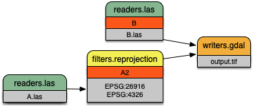

.. _pipeline:

******************************************************************************
Pipeline
******************************************************************************

Pipelines are the operative construct in PDAL, and it is how data are modeled
from reading, processing, and writing. PDAL internally constructs a pipeline to
perform data translation operations using :ref:`translate_command`, for
example. While specific :ref:`applications <apps>` are useful in many contexts,
a pipeline provides useful advantages for more complex things:

1. You have a record of the operation(s) applied to the data
2. You can construct a skeleton of an operation and substitute specific
   options (filenames, for example)
3. You can construct complex operations using the `JSON`_ manipulation
   facilities of whatever language you want.

.. note::

    :ref:`pipeline_command` is used to invoke pipeline operations
    via the command line.

.. warning::

    As of PDAL 1.2, `JSON`_ is the preferred specification language
    for PDAL pipelines. XML read support is still available at 1.5, but
    XML support will be dropped at the 1.6 release.

.. _`JSON`: http://www.json.org/

Introduction
--------------------------------------------------------------------------------

A JSON object represents a PDAL processing pipeline.  The structure is always a
JSON object, with the primary object called ``pipeline`` being an array of
inferred or explicit PDAL :ref:`stage_object` representations.

Simple Example
................................................................................

A simple PDAL pipeline, inferring the appropriate drivers for the reader and
writer from filenames, and able to be specified as a set of sequential steps:

.. code-block:: json

  {
      "pipeline":[
          "input.las",
          {
              "type":"crop",
              "bounds":"([0,100],[0,100])"
          },
          "output.bpf"
      ]
  }

.. figure:: ./images/las-crop-bpf-pipeline.png

    A simple pipeline to convert :ref:`LAS <readers.las>` to :ref:`BPF <readers.bpf>`
    while only keeping points inside the box :math:`[0 \leq x \leq 100, 0 \leq y \leq 100]`.

Reprojection Example
................................................................................

A more complex PDAL pipeline reprojects the stage tagged ``A1``, merges
the result with ``B``, and writes the merged output to a GeoTIFF file
with the :ref:`writers.gdal` writer:

.. code-block:: json

  {
      "pipeline":[
          {
              "filename":"A.las",
              "spatialreference":"EPSG:26916"
          },
          {
              "type":"filters.reprojection",
              "in_srs":"EPSG:26916",
              "out_srs":"EPSG:4326",
              "tag":"A2"
          },
          {
              "filename":"B.las",
              "tag":"B"
          },
          {
              "type":"filters.merge",
              "tag":"merged",
              "inputs":[
                  "A2",
                  "B"
              ]
          },
          {
              "type":"writers.gdal",
              "filename":"output.tif"
          }
      ]
  }

    A more complex pipeline that merges two inputs together but uses
    :ref:`filters.reprojection` to transform the coordinate system of
    file ``B.las`` from `UTM`_ to `Geographic`_.

.. _`UTM`: http://spatialreference.org/ref/epsg/nad83-utm-zone-16n/
.. _`Geographic`: http://spatialreference.org/ref/epsg/4326/

Pipeline Objects
--------------------------------------------------------------------------------

PDAL JSON pipelines always consist of a single object. This object (referred to
as the PDAL JSON object below) represents a processing pipeline.

* The PDAL JSON object may have any number of members (name/value pairs).

* The PDAL JSON object must have a :ref:`pipeline_array`.

.. _pipeline_array:

Pipeline Array
................................................................................

* The pipeline array may have any number of string or :ref:`stage_object`
  elements.

* String elements shall be interpreted as filenames. PDAL will attempt to infer
  the proper driver from the file extension and position in the array. A writer
  stage will only be created if the string is the final element in the array.

.. _stage_object:

Stage Objects
................................................................................

For more on PDAL stages and their options, check the PDAL documentation on
:ref:`readers`, :ref:`writers`, and :ref:`filters`.

* A stage object may have a member with the name ``tag`` whose value is a
  string. The purpose of the tag is to cross-reference this stage within other
  stages. Each ``tag`` must be unique.

* A stage object may have a member with the name ``inputs`` whose value is an
  array of strings. Each element in the array is the tag of another stage to be
  set as input to the current stage.

* Reader stages will disregard the ``inputs`` member.

* If ``inputs`` is not specified for the first non-reader stage, all reader
  stages leading up to the current stage will be used as inputs.

* If ``inputs`` is not specified for any subsequent non-reader stages, the
  previous stage in the array will be used as input.

* A ``tag`` mentioned in another stage's ``inputs``  must have been previously
  defined in the ``pipeline`` array.

* A reader or writer stage object may have a member with the name ``type`` whose
  value is a string. The ``type`` must specify a valid PDAL reader or writer
  name.

* A filter stage object must have a member with the name ``type`` whose value is
  a string. The ``type`` must specify a valid PDAL filter name.

* A stage object may have additional members with names corresponding to
  stage-specific option names and their respective values. Values provided as
  JSON objects or arrays will be stringified and parsed within the stage.

* Applications can place a ``user_data`` node on any stage object and it will be
  carried through to any serialized pipeline output.

Filename Globbing
................................................................................

* A filename may contain the wildcard character ``*`` to match any string of
  characters. This can be useful if working with multiple input files in a
  directory (e.g., merging all files).

Extended Examples
--------------------------------------------------------------------------------

BPF to LAS
................................................................................

The following pipeline converts the input file from :ref:`BPF <readers.bpf>` to
:ref:`LAS <writers.las>`, inferring both the reader and writer type, and
setting a number of options on the writer stage.

.. code-block:: json

  {
      "pipeline":[
          "utm15.bpf",
          {
              "filename":"out2.las",
              "scale_x":0.01,
              "offset_x":311898.23,
              "scale_y":0.01,
              "offset_y":4703909.84,
              "scale_z":0.01,
              "offset_z":7.385474
          }
      ]
  }

Python HAG
................................................................................

In our next example, the reader and writer types are once again inferred. After
reading the input file, the ferry filter is used to copy the Z dimension into a
new height above ground (HAG) dimension. Next, the :ref:`filters.programmable`
is used with a Python script to compute height above ground values by comparing
the Z values to a surface model. These height above ground values are then
written back into the Z dimension for further analysis. See the Python
code at `hag.py`_.

.. seealso::

    :ref:`filters.hag` describes using a specific filter to do
    this job in more detail.

.. code-block:: json

  {
      "pipeline":[
          "autzen.las",
          {
              "type":"ferry",
              "dimensions":"Z=HAG"
          },
          {
              "type":"programmable",
              "script":"hag.py",
              "function":"filter",
              "module":"anything"
          },
          "autzen-hag.las"
      ]
  }

.. _`hag.py`: https://raw.githubusercontent.com/PDAL/PDAL/master/test/data/autzen/hag.py.in

DTM
................................................................................

A common task is to create a digital terrain model (DTM) from the input point
cloud. This pipeline infers the reader type, applies an approximate ground
segmentation filter using :ref:`filters.pmf`, and then creates the DTM using
the :ref:`writers.gdal` with only the ground returns.

.. code-block:: json

  {
      "pipeline":[
          "autzen-full.las",
          {
              "type":"ground",
              "approximate":true,
              "max_window_size":33,
              "slope":1.0,
              "max_distance":2.5,
              "initial_distance":0.15,
              "cell_size":1.0,
              "extract":true,
              "classify":false
          },
          {
              "type":"writers.gdal",
              "filename":"autzen-surface.tif",
              "output_type":"min",
              "output_format":"tif",
              "grid_dist_x":1.0,
              "grid_dist_y":1.0
          }
      ]
  }

Decimate & Colorize
................................................................................

This example still infers the reader and writer types while applying options on
both. The pipeline decimates the input LAS file by keeping every other point,
and then colorizes the points using the provided raster image. The output is
written as ASCII text.

.. code-block:: json

  {
      "pipeline":[
          {
              "filename":"1.2-with-color.las",
              "spatialreference":"EPSG:2993"
          },
          {
              "type":"decimation",
              "step":2,
              "offset":1
          },
          {
              "type":"colorization",
              "raster":"autzen.tif",
              "dimensions":"Red:1:1, Green:2:1, Blue:3:1"
          },
          {
              "filename":"junk.txt",
              "delimiter":",",
              "write_header":false
          }
      ]
  }

Merge & Reproject
................................................................................

Our first example with multiple readers, this pipeline infers the reader types,
and assigns spatial reference information to each. Next, the
:ref:`filters.merge` merges points from all previous readers, and the
:ref:`filters.reprojection` filter reprojects data to the specified output
spatial reference system.

.. code-block:: json

  {
      "pipeline":[
          {
              "filename":"1.2-with-color.las",
              "spatialreference":"EPSG:2027"
          },
          {
              "filename":"1.2-with-color.las",
              "spatialreference":"EPSG:2027"
          },
          {
              "type":"filters.merge"
          },
          {
              "type":"reprojection",
              "out_srs":"EPSG:2028"
          }
      ]
  }

Globbed Inputs
................................................................................

Finally, we capture another merge pipeline demonstrating the ability to glob
multiple input LAS files from a given directory.

.. code-block:: json

  {
      "pipeline":[
          "/path/to/data/\*.las",
          "output.las"
      ]
  }

.. seealso::

    The PDAL source tree contains a number of example pipelines that
    are used for testing. You might find these inspiring. Go to
    https://github.com/PDAL/PDAL/tree/master/test/data/pipeline to find
    more.

API Considerations
------------------------------------------------------------------------------

A `Pipeline` is composed as an array of :cpp:class:`pdal::Stage` , with the
first stage at the beginning and the last at the end.  There are two primary
building blocks in PDAL, :cpp:class:`pdal::Stage` and
:cpp:class:`pdal::PointView`. :cpp:class:`pdal::Reader`,
:cpp:class:`pdal::Writer`, and :cpp:class:`pdal::Filter` are all subclasses of
:cpp:class:`pdal::Stage`.

:cpp:class:`pdal::PointView` is the substrate that flows between stages in a
pipeline and transfers the actual data as it moves through the pipeline. A
:cpp:class:`pdal::PointView` contains a :cpp:class:`pdal::PointTablePtr`, which
itself contains a list of :cpp:class:`pdal::Dimension` objects that define the
actual channels that are stored in the :cpp:class:`pdal::PointView`.

PDAL provides four types of stages -- :cpp:class:`pdal::Reader`,
:cpp:class:`pdal::Writer`, :cpp:class:`pdal::Filter`, and
:cpp:class:`pdal::MultiFilter` -- with the latter being hardly used (just
:ref:`filters.merge`) at this point. A Reader is a producer of data, a Writer
is a consumer of data, and a Filter is an actor on data.

.. note::

   As a C++ API consumer, you are generally not supposed to worry about the underlying
   storage of the PointView, but there might be times when you simply just
   "want the data." In those situations, you can use the
   :cpp:func:`pdal::PointView::getBytes` method to stream out the raw storage.

Usage
..............................................................................

While pipeline objects are manipulable through C++ objects, the other, more
convenient way is through an JSON syntax. The JSON syntax mirrors the
arrangement of the Pipeline, with options and auxiliary metadata added on a
per-stage basis.

We have two use cases specifically in mind:

* a :ref:`command-line <pipeline_command>` application that reads an JSON
  file to allow a user to easily construct arbitrary writer pipelines, as
  opposed to having to build applications custom to individual needs with
  arbitrary options, filters, etc.

* a user can provide JSON for a reader pipeline, construct it via a simple call
  to the PipelineManager API, and then use the :cpp:func:`pdal::Stage::read()`
  function to perform the read and then do any processing of the points.  This
  style of operation is very appropriate for using PDAL from within
  environments like Python where the focus is on just getting the points, as
  opposed to complex pipeline construction.

.. code-block:: json

    {
      "pipeline":[
        "/path/to/my/file/input.las",
        "output.las"
      ]
    }

.. note::

    https://github.com/PDAL/PDAL/blob/master/test/data/pipeline/ contains
    test suite pipeline files that provide an excellent example of the
    currently possible operations.

Stage Types
..............................................................................

:cpp:class:`pdal::Reader`, :cpp:class:`pdal::Writer`, and
:cpp:class:`pdal::Filter` are the C++ classes that define the stage types in
PDAL. Readers follow the pattern of :ref:`readers.las` or
:ref:`readers.oci`, Writers follow the pattern of :ref:`writers.las` or
:ref:`readers.oci`, with Filters using :ref:`filters.reprojection` or
:ref:`filters.crop`.

.. note::

    :ref:`stage_index` contains a full listing of possible stages and
    descriptions of their options.

.. note::

    Issuing the command ``pdal info --options`` will list all available
    stages and their options. See :ref:`info_command` for more.

