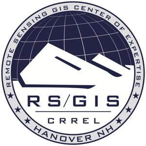

.. _contributors:

******************************************************************************
Contributors
******************************************************************************

Numerous organizations, companies, and individuals have contributed time,
money, and code to build PDAL up into a highly capable software package.
Without these contributions, PDAL would not progress as quickly, and its
quality wouldn't be as high. The development team is proud of the software, and
it collectively represents years of experiences doing point cloud data
management. We hope you'll find it useful too.

This page is to recognize these contributors and their contributions. Thanks.

Engineering Contributors
--------------------------------------------------------------------------------

.. image:: https://hobu.co/theme/images/hobulogo.png
    :target: http://hobu.co

`Hobu`_ is the primary company behind the design, testing, development, and
distribution of PDAL. Two Hobu team members primarily interact with PDAL.
`Howard Butler`_ founded the project, and he provides project leadership and
software development.  `Andrew Bell`_ has contributed design, refactoring, and
new feature development of PDAL over the past couple of years.

.. _`Howard Butler`: https://github.com/hobu
.. _`Andrew Bell`: https://github.com/abellgithub
.. _`Hobu`: http://hobu.co

.. image:: http://radiantblue.com/wp-content/uploads/2015/12/logo1.png
    :target: http://radiantblue.com

`Michael Gerlek`_ from `DigitalGlobe`_ helped bootstrap PDAL by providing its
first design, basic primitive objects, and first :ref:`stage <stage_index>`
implementations.

.. _`Michael Gerlek`: http://github.com/mpgerlek

`Bradley Chambers`_ from `DigitalGlobe`_ has contributed numerous features and
capabilities to the PDAL project, including :ref:`Poisson sampling
<dart-throwing-tutorial>` and :ref:`Progressive Morphological Filters <pcl_ground>`. He is also a prolific
:ref:`tutorial` writer.

.. _`Bradley Chambers`: https://github.com/chambbj
.. _`DigitalGlobe`: https://www.digitalglobe.com/

Funding Contributors
--------------------------------------------------------------------------------

The US Army Corps of Engineers Remote Sensing / GIS Center of Expertise at
`CRREL`_ sponsors development of PDAL for its use in point cloud data
management systems. `CRREL`_'s `GRiD`_ project manages LiDAR and point cloud
data for a multitude of U.S. Army Corps missions. Find out more about GRiD in
this `LiDAR Magazine article`_.

.. image:: ../development/nsf1.png
    :target: http://www.nsf.gov

.. image:: ../development/uoh.png
    :target: http://www.uh.edu

`NSF <http://www.nsf.gov>`_, in collaboration with `Dr. Craig Glennie
<http://www.cive.uh.edu/faculty/glennie>`_ at the `University of Houston
<http://www.uh.edu>`_ supports PDAL with funding support to develop and enhance
statistical methods, transformation operations, tutorial and example
development, and `PCL <http://pointclouds.org>`_ integration.

.. _`GRiD`: http://lidar.io/about.html
.. _`LiDAR Magazine article`: http://www.lidarmag.com/content/view/11343/198/
.. _`CRREL`: http://www.erdc.usace.army.mil/Locations/CRREL.aspx
