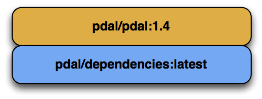
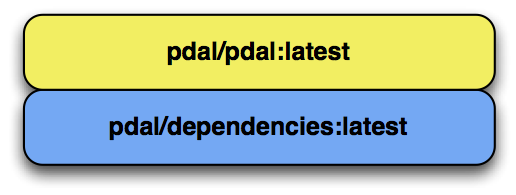

.. _development_docker:

================================================================================
Building Docker Containers for PDAL
================================================================================

PDAL's :ref:`repository <source>` is linked to `DockerHub`_ for automatic
building of `Docker`_ containers. PDAL keeps three Docker containers current.

* ``pdal/dependencies:latest`` -- PDAL's dependencies for Travis builds
* ``pdal/pdal:latest`` -- Latest PDAL release branch
* ``pdal/pdal:1.5`` -- PDAL 1.5 maintenance branch
* ``pdal/pdal:1.6`` -- PDAL 1.6 maintenance branch

.. _`Docker`: https://www.docker.com/
.. _`DockerHub`: https://hub.docker.com/r/pdal/pdal/

.. note::

    PDAL's public use Docker containers are built using `Alpine Linux <https://alpinelinux.org/>`__,
    but the containers that PDAL's `Travis`_ infrastructure uses
    are built upon Ubuntu. The `Dependences`_ container
    corresponds to where ever the ``dependencies`` tag of the PDAL
    source tree at https://github.com/PDAL/PDAL resides

.. _`DockerHub`: https://hub.docker.com/r/pdal/pdal/

Dependencies
================================================================================

The PDAL dependencies Docker container is used by Travis
:ref:`integration` testing by Travis. It is built using the Dockerfile at
https://github.com/PDAL/PDAL/blob/master/scripts/docker/dependencies/Dockerfile

The ``pdal/dependencies:latest`` image is regenerated by force-pushing a tag of
the SHA you wish to use to have `DockerHub`_ build.

::

    git tag -f dependencies
    git push origin refs/tags/dependencies -f

.. note::

    The dependencies container is currently built upon `Ubuntu Xenial`_. When
    the next Ubuntu LTS is released, the PDAL project will likely move to it.

.. _`Ubuntu Xenial`: http://releases.ubuntu.com/16.04/

Maintenance
================================================================================

A PDAL container corresponding to the last major release is automatically
created and maintained with every commit to the active release branch. For
example, the ``1.6-maintenance`` branch will have a corresponding
``pdal/pdal:1.6`` container made with every commit on `DockerHub`_. Users are
encouraged to use these containers for testing, bug confirmation, and deployment

    Docker containers on maintenance branch correspond to major PDAL releases.

Latest (or master)
================================================================================

For convenience, `pdal/pdal:latest` corresponds to the latest
release-branch, automatically built from the
`1.x-maintenance` branch as new commits are pushed to it.

.. warning::

    You should be using the `Maintenance`_ Docker container for any
    production-oriented operations. `latest` may change version as
    a new PDAL release is made, but specifically versioned Docker containers
    will continue to be available.

    The ``pdal/pdal:latest`` branch is current relative to the ``docker-master``
    branch in GitHub.

::

    $ git tag -f docker-master
    $ git push origin refs/tags/docker-master -f
