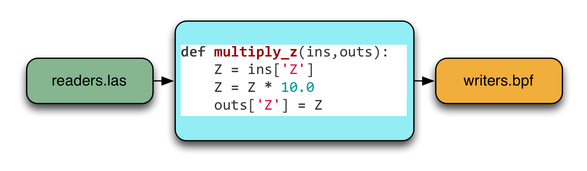

.. _python:

********************************************************************
Python
********************************************************************

.. index:: Numpy, Python

PDAL provides Python support in two significant ways. First it `embeds`_ Python
to allow you to write Python programs that interact with data using
:ref:`filters.python` filter. Second, it `extends`_ Python by providing an
extension that Python programmers can use to leverage PDAL capabilities in
their own applications.

.. _`embeds`: https://docs.python.org/3/extending/embedding.html
.. _`extends`: https://docs.python.org/3/extending/extending.html

.. note::

    PDAL's Python story always revolves around `Numpy`_ support. PDAL's
    data is provided to both the filters ands the extension as
    Numpy arrays.

.. _NumPy: http://www.numpy.org/

Versions
--------------------------------------------------------------------------------

PDAL supports both Python 2.7 and Python 3.4+. :ref:`integration` tests Python
2.7 on both Linux and Windows. Python 3 is used by a number of developers
for adhoc development and testing.

Embed
--------------------------------------------------------------------------------

.. index:: Embed, Python

PDAL allows users to embed Python functions inline with other :ref:`pipeline`
processing operations. The purpose of this capability is to allow users to
write small programs that implement interesting actions without requiring a
full C++ development activity of building a PDAL stage to implement it. A
Python filter is an opportunity to interactively and iteratively prototype a
data operation without strong considerations of performance or generality.  If
something works well enough, maybe one takes on the effort to formalize it, but
that isn't necessary. PDAL's embed of Python allows you to be as grimy as you
need to get the job done.

    Embedding a Python function to take Z values read from a
    :ref:`readers.las` and then output them to a :ref:`writers.bpf`.

Extend
--------------------------------------------------------------------------------

.. index:: Extension, Python

PDAL provides a Python extension that gives users access to executing
:ref:`pipeline` instantiations and capturing the results as `Numpy`_ arrays.
This mode of operation is useful if you are looking to have PDAL simply act as
your data format and processing handler.

Python extension users are expected to construct their own JSON :ref:`pipeline`
using Python's ``json`` library, or whatever other libraries they wish to
manipulate JSON. They then feed it into the extension and get back the
results as `Numpy`_ arrays:

.. code-block:: python

    json = """
    {
      "pipeline": [
        "1.2-with-color.las",
        {
            "type": "filters.sort",
            "dimension": "X"
        }
      ]
    }"""

    import pdal
    pipeline = pdal.Pipeline(json)
    pipeline.validate() # check if our JSON and options were good
    pipeline.loglevel = 8 #really noisy
    count = pipeline.execute()
    arrays = pipeline.arrays
    metadata = pipeline.metadata
    log = pipeline.log

Installation
................................................................................

PDAL Python bindings require a working PDAL install (:ref:`PDAL <building>`)
and then installation of the Python extension. The extension lives on `PyPI`_
at https://pypi.python.org/pypi/PDAL and you should use that version as your
canonical Python extension install.

.. _`PyPI`: https://pypi.python.org/pypi/PDAL

Install from local
~~~~~~~~~~~~~~~~~~~~~~~~~~~~~~~~~~~~~~~~~~~~~~~~~~~~~~~~~~~~~~~~~~~~~~~~~~~~~~~~

In the source code of PDAL there is a ``python`` folder, you have to enter
there and run ::

    python setup.py build
    # this should be run as administrator/super user
    python setup.py install

Install from repository
~~~~~~~~~~~~~~~~~~~~~~~~~~~~~~~~~~~~~~~~~~~~~~~~~~~~~~~~~~~~~~~~~~~~~~~~~~~~~~~~

.. index:: Install, Python

The second method to install the PDAL Python extension is to use `pip`_
or `easy_install`_, you have to run the command as administrator. ::

    pip install PDAL

.. note::

    To install pip please read
    `here <https://pip.pypa.io/en/stable/installing/>`_

Install from Conda
~~~~~~~~~~~~~~~~~~~~~~~~~~~~~~~~~~~~~~~~~~~~~~~~~~~~~~~~~~~~~~~~~~~~~~~~~~~~~~~~

.. index:: Install, Python, Conda

The final method to install the PDAL Python extension is to use `conda`_. An
added advantage of using Conda to install the extension is that Conda will also
install PDAL. ::

    conda install -c conda-forge python-pdal

.. note::

    The official ``pdal`` and ``python-pdal`` packages reside in the
    conda-forge channel, which can be added via ``conda config`` or manually
    specified with the ``-c`` option, as shown in the examples below.

It is recommended that you actually either install PDAL and the Python
extension either into an existing environment ::

    conda install -n <environment name> -c conda-forge python-pdal

or create a new environment from scratch ::

    conda create -n <environment name> -c conda-forge python-pdal

Once the environment has been created, you will be prompted to activate it. ::

    conda activate <environment name>

.. _`pip`: https://pip.pypa.io/en/stable/
.. _`easy_install`: https://pypi.python.org/pypi/setuptools
.. _`conda`: https://conda.io/docs/
