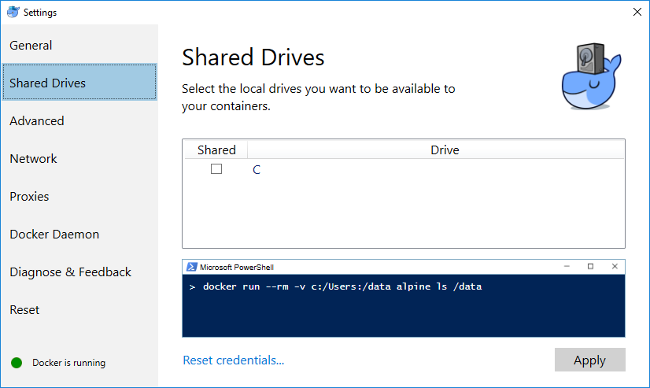
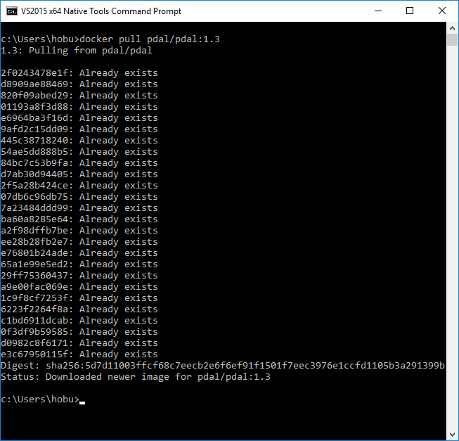

.. _quickstart:

******************************************************************************
Quickstart
******************************************************************************

.. index:: Docker, Quickstart

Introduction
------------------------------------------------------------------------------

It's a giant pain to build everything yourself. The quickest way to start using
PDAL is to leverage builds that were constructed by the PDAL development team
using `Docker`_. Docker is a containerization technology that allows you to
run pre-built software in a way that is isolated from your system. Think of
it like a binary that doesn't depend on your operating system's configuration
to be able to run.

This exercise will print the first point of an :ref:`ASPRS LAS <readers.las>` file.
It will utilize the PDAL :ref:`command line application <apps>` to inspect the
file.

.. _docker:

Install Docker
------------------------------------------------------------------------------

Docker starting documentation can be found at the following links. Read through
them a bit for your platform so you have an idea what to expect.

* `Windows <https://docs.docker.com/docker-for-windows/>`__
* `OSX <https://docs.docker.com/docker-for-mac/>`__
* `Linux <https://docs.docker.com/engine/installation/linux/>`__

.. _`Docker Toolbox`: https://www.docker.com/docker-toolbox

.. note::

    We will assume you are running on Windows, but the same commands should
    work in OSX or Linux too -- though definition of file paths might provide
    a significant difference.

Enable Docker access to your machine
................................................................................

In order for Docker to be able to interact with data on your machine, you must
make sure to tell it to be able to read your drive(s). Right-click on the
little Docker whale icon in you System Tray, choose Settings, and click
the Shared box by your C drive:

Run Docker Quickstart Terminal
................................................................................

`Docker`_ is most easily accessed using a terminal window that it configures
with environment variables and such. Run PowerShell or `cmd.exe` and issue
a simple `info` command to verify that things are operating correctly:

::

    docker info

.. image:: ./images/docker-quickstart-env.png

Obtain PDAL Image
................................................................................

A PDAL image based on the latest release, including all recent patches, is
pushed to `Docker Hub`_ with every code change on the PDAL maintenance branch.
We need to pull it locally so we can use it to run PDAL commands. Once it is
pulled, we don't have to pull it again unless we want to refresh it for
whatever reason.

::

    docker pull pdal/pdal:1.3

.. note::

    Other PDAL versions are provided at the same `Docker Hub`_ location,
    with an expected tag name (ie ``pdal/pdal:1.3``, or ``pdal/pdal:1.x``) for
    major PDAL versions. The PDAL Docker hub location at
    https://hub.docker.com/u/pdal/ has images and more information
    on this topic.

.. _`Docker Hub`: http://hub.docker.com

Fetch Sample Data
------------------------------------------------------------------------------

We need some sample data to play with, so we're going to download
the ``autzen.laz`` file to your ``C:/Users/hobu/Downloads`` fold.
Inside your terminal, issue the following command:

::

    explorer.exe http://www.liblas.org/samples/autzen/autzen.laz

::

    cd C:/Users/hobu/Downloads
    copy autzen.laz ..

Print the first point
------------------------------------------------------------------------------

::

    docker run -v /c/Users/hobu:/data pdal/pdal:1.3 pdal info /data/autzen.laz -p 0

Here's a summary of what's going on with that command invocation

1. ``docker``: We are running PDAL within the context of docker, so all of our
   commands will start with the ``docker`` command.

2. ``run``: Tells docker we're going to run an image

3. ``-v /c/Users/hobu:/data``: Maps our home directory to a directory called
   ``/data`` inside the container.

   .. seealso::

       The `Docker Volume <https://docs.docker.com/engine/userguide/dockervolumes/>`__
       document describes mounting volumes in more detail.

4. ``pdal/pdal:1.3``: This is the Docker image we are going to run. We fetched it
   with the command above. If it were not already fetched, Docker would attempt
   to fetch it when we run this command.

5. ``pdal``: We're finally going to run the ``pdal`` command :)

6. ``info``: We want to run :ref:`info_command` on the data

7. ``/data/autzen.laz``: The ``pdal`` command is now running in the context of
   our container, which we mounted a ``/data`` directory in with the volume
   mount operation in Step #3. Our ``autzen.laz`` file resides there.

.. image:: ./images/docker-print-one.png

What's next?
------------------------------------------------------------------------------

* Visit :ref:`apps` to find out how to utilize PDAL applications to process
  data on the command line yourself.
* Visit :ref:`development_index` to learn how to embed and use PDAL in your own
  applications.
* :ref:`readers` lists the formats that PDAL can read, :ref:`filters` lists the
  kinds of operations you can do with PDAL, and :ref:`writers` lists the
  formats PDAL can write.
* :ref:`tutorial` contains a number of walk-through tutorials for achieving
  many tasks with PDAL.
* :ref:`The PDAL workshop <workshop>` contains numerous hands-on examples with screenshots and
  example data of how to use PDAL :ref:`apps` to tackle point cloud data
  processing tasks.

.. seealso::

    :ref:`community` is a good source to reach out to when you're stuck.

.. _`Points2Grid`: https://github.com/CRREL/points2grid
.. _`Oracle Point Cloud`: http://docs.oracle.com/cd/B28359_01/appdev.111/b28400/sdo_pc_pkg_ref.htm
.. _`pgpointcloud`: https://github.com/pramsey/pointcloud

.. _`LASzip`: http://laszip.org
.. _`VirtualBox`: https://www.virtualbox.org/
.. _`GDAL`: http://gdal.org
.. _`MapServer`: http://mapserver.org
.. _`Mapnik`: http://mapnik.org
.. _`PCL`: http://www.pointclouds.org
