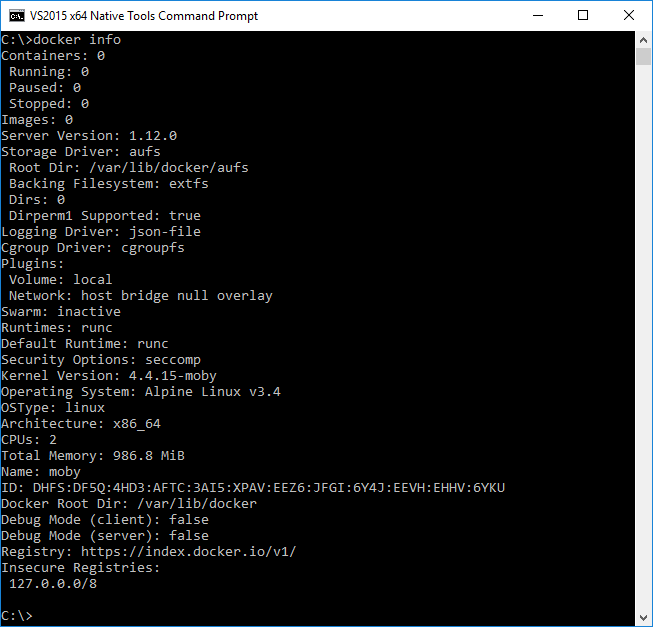
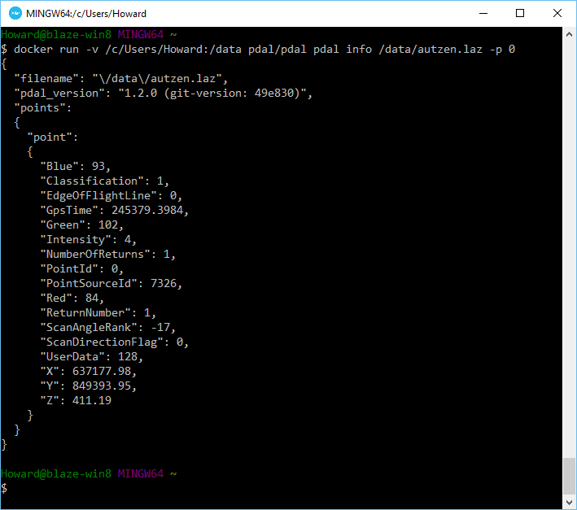

.. _quickstart:

******************************************************************************
Quickstart
******************************************************************************

.. index:: Docker, Quickstart

Introduction
------------------------------------------------------------------------------

It's a giant pain to build everything yourself. To make it simpler to use PDAL, a
build based on Docker is available. This document describes how
to use it to print the first point of an :ref:`ASPRS LAS <readers.las>` file.

.. _docker:

Install Docker
------------------------------------------------------------------------------

The Docker configuration that PDAL provides contains nearly every possible
feature except for `Oracle Point Cloud`_ support. Things it includes are:

Docker starting documentation can be found at the following links. Read through
them a bit for your platform so you have an idea what to expect.

* `Windows <http://docs.docker.com/windows/started/>`__
* `OSX <http://docs.docker.com/mac/started/>`__
* `Linux <http://docs.docker.com/linux/started/>`__

.. _`Docker Toolbox`: https://www.docker.com/docker-toolbox

.. note::

    We will assume you are running on Windows, but the same commands should
    work in OSX or Linux too -- though definition of file paths might provide
    a significant difference.

.. seealso::

    :ref:`apps` provides detailed information on using PDAL applications, and
    :ref:`workshop` provides a full suite of exercises you can follow to learn
    how to use PDAL with Docker.

Run Docker Quickstart Terminal
................................................................................

`Docker`_ is most easily accessed using a terminal window that it configures
with environment variables and such. Double-click on the "Docker Quickstart Terminal"
link on your desktop (Windows) or run the "Docker Quickstart Terminal" application
(Mac).

After some text scrolls by, you should see something like the following image
:

.. image:: ./images/docker-quickstart-terminal.png

To be sure Docker is working correctly and everything is happy,
issue the following command and confirm that it reports similar information:

::

    docker-machine env default

Obtain PDAL Image
................................................................................

A PDAL image based on the latest release, including all recent patches, is
pushed to `Docker Hub`_ with every code change on the PDAL maintenance branch.
We need to pull it locally so we can use it to run PDAL commands. Once it is
pulled, we don't have to pull it again unless we want to refresh it for
whatever reason.

::

    docker pull pdal/pdal

.. note::

    Other PDAL versions are provided at the same `Docker Hub`_ location,
    with an expected tag name (ie ``pdal/pdal:1.2``, or ``pdal/pdal:1.x``) for
    major PDAL versions. The PDAL Docker hub location at
    https://hub.docker.com/u/pdal/ has images and more information
    on this topic.

.. _`Docker Hub`: http://hub.docker.com

Fetch Sample Data
------------------------------------------------------------------------------

We need some sample data to play with, so we're going to download
the ``autzen.laz`` file to your ``C:/Users/Howard`` drive. Inside the
`Docker Quickstart Terminal`, issue the following ``curl`` command:

::

    curl -O http://www.liblas.org/samples/autzen/autzen.laz

.. note::

    That's a capital Oh, not a zero.

List the directory to be sure that it was downloaded

::

    ls *.laz

Print the first point
------------------------------------------------------------------------------

Docker
................................................................................

Run the following command in the `Docker Quickstart Terminal`

::

    docker run -v /c/Users/Howard:/data pdal/pdal pdal info /data/autzen.laz -p 0

Here's a summary of what's going on with that command invocation

1. ``docker``: We are running PDAL within the context of docker, so all of our
   commands will start with the ``docker`` command.

2. ``run``: Tells docker we're going to run an image

3. ``-v /c/Users/Howard:/data``: Maps our home directory to a directory called
   ``/data`` inside the container.

   .. seealso::

       The `Docker Volume <https://docs.docker.com/engine/userguide/dockervolumes/>`__
       document describes mounting volumes in more detail.

4. ``pdal/pdal``: This is the Docker image we are going to run. We fetched it
   with the command above. If it were not already fetched, Docker would attempt
   to fetch it when we run this command.

5. ``pdal``: We're finally going to run the ``pdal`` command :)

6. ``info``: We want to run :ref:`info_command` on the data

7. ``/data/autzen.laz``: The ``pdal`` command is now running in the context of
   our container, which we mounted a ``/data`` directory in with the volume
   mount operation in Step #3. Our ``autzen.laz`` file resides there.

Native
................................................................................

Run the following command in a terminal window:

::

    pdal info /data/autzen.laz -p 0

Here's a summary of what's going on with that command invocation

1. ``pdal``: We're finally going to run the ``pdal`` command :)

2. ``info``: We want to run :ref:`info_command` on the data

3. ``/data/autzen.laz``:  Read our ``autzen.laz`` file .

What's next?
------------------------------------------------------------------------------

Visit :ref:`apps` to find out how to utilize PDAL applications to process data
on the command line yourself. Visit :ref:`development_index` to learn how to
embed and use PDAL in your own applications. :ref:`readers` lists the formats
that PDAL can read, :ref:`filters` lists the kinds of operations you can do
with PDAL, and :ref:`writers` lists the formats PDAL can write.

.. seealso::

    :ref:`community` is a good source to reach out to when you're stuck.

.. _`Points2Grid`: https://github.com/CRREL/points2grid
.. _`Oracle Point Cloud`: http://docs.oracle.com/cd/B28359_01/appdev.111/b28400/sdo_pc_pkg_ref.htm
.. _`pgpointcloud`: https://github.com/pramsey/pointcloud

.. _`LASzip`: http://laszip.org
.. _`VirtualBox`: https://www.virtualbox.org/
.. _`GDAL`: http://gdal.org
.. _`MapServer`: http://mapserver.org
.. _`Mapnik`: http://mapnik.org
.. _`PCL`: http://www.pointclouds.org
