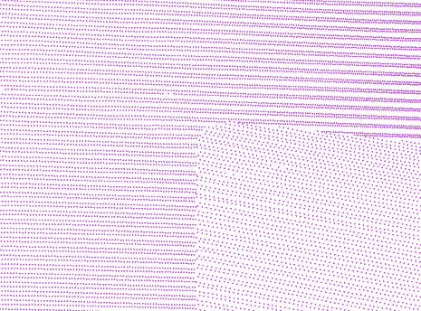

.. _filters.chipper:

filters.chipper
===============

The **Chipper Filter** takes a single large point cloud and converts it
into a set
of smaller clouds, or chips. The chips are all spatially contiguous and
non-overlapping, so the result is a an irregular tiling of the input data.

.. note::

    Each chip will have approximately, but not exactly, the capacity_ point
    count specified.

.. seealso::

    The :ref:`PDAL split command <split_command>` utilizes the
    :ref:`filters.chipper` to split data by capacity.

    Before chipping, the points are all in one collection.

.. figure:: filters.chipper.img2.png
    :scale: 100 %
    :alt: Points after chipping

    After chipping, the points are tiled into smaller contiguous chips.

Chipping is usually applied to data read from files (which produce one large
stream of points) before the points are written to a database (which prefer
data segmented into smaller blocks).

.. embed::

Example
-------

.. code-block:: json

  [
      "example.las",
      {
          "type":"filters.chipper",
          "capacity":"400",
      },
      {
          "type":"writers.pgpointcloud",
          "connection":"dbname='lidar' user='user'"
      }
  ]

Options
-------

_`capacity`
  How many points to fit into each chip. The number of points in each chip will
  not exceed this value, and will sometimes be less than it. [Default: 5000]

