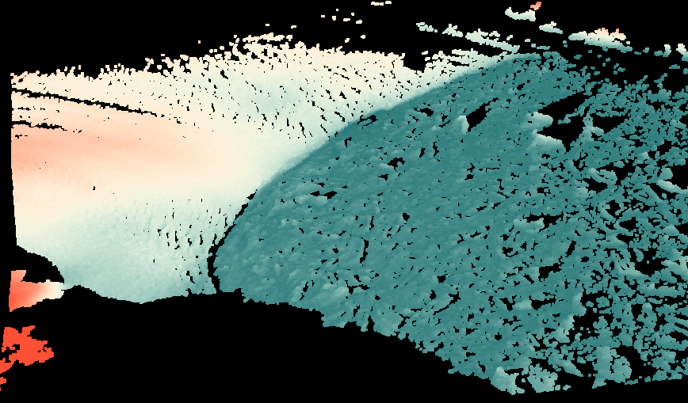
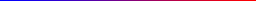
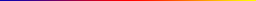

.. _filters.colorinterp:

filters.colorinterp
====================

The color interpolation filter assigns scaled RGB values from an image based on
a given dimension.  You can provide your own `GDAL`_-readable image for the
scale color factors. :ref:`filters.colorinterp` will use the entire band to
scale the colors. The default ramps provided by PDAL are 256x1 RGB images, and
might be a good starting point for creating your own scale factors. See
`Default Ramps`_ for more information.

After applying this filter, RGB values for the point cloud are scaled based on the
image provided by the ``ramp``.

.. code-block:: json

  {
    "pipeline":[
      "uncolored.las",
      {
        "type":"filters.colorinterp",
        "ramp":"pestel_shades",
        "minimum":0,
        "maximum":100,
        "dimension":"Z"
      },
      "colorized.las"
    ]
  }

    Image data with interpolated colors based on ``Z`` dimension and ``pestel_shades``
    ramp.

Default Ramps
--------------------------------------------------------------------------------

PDAL provides a number of default color ramps you can use in addition to
providing your own. Give the ramp name as the ``ramp`` option to the filter
and it will be used. Otherwise, provide a `GDAL`_-readable raster filename.

``awesome_green``
~~~~~~~~~~~~~~~~~~~~~~~~~~~~~~~~~~~~~~~~~~~~~~~~~~~~~~~~~~~~~~~~~~~~~~~~~~~~~~~~

``black_orange``
~~~~~~~~~~~~~~~~~~~~~~~~~~~~~~~~~~~~~~~~~~~~~~~~~~~~~~~~~~~~~~~~~~~~~~~~~~~~~~~~

.. image:: ../images/black-orange.png
    :scale: 400%
    :alt: black-orange color ramp

``blue_orange``
~~~~~~~~~~~~~~~~~~~~~~~~~~~~~~~~~~~~~~~~~~~~~~~~~~~~~~~~~~~~~~~~~~~~~~~~~~~~~~~~

``blue_hue``
~~~~~~~~~~~~~~~~~~~~~~~~~~~~~~~~~~~~~~~~~~~~~~~~~~~~~~~~~~~~~~~~~~~~~~~~~~~~~~~~

``blue_orange``
~~~~~~~~~~~~~~~~~~~~~~~~~~~~~~~~~~~~~~~~~~~~~~~~~~~~~~~~~~~~~~~~~~~~~~~~~~~~~~~~

``blue_red``
~~~~~~~~~~~~~~~~~~~~~~~~~~~~~~~~~~~~~~~~~~~~~~~~~~~~~~~~~~~~~~~~~~~~~~~~~~~~~~~~

``heat_map``
~~~~~~~~~~~~~~~~~~~~~~~~~~~~~~~~~~~~~~~~~~~~~~~~~~~~~~~~~~~~~~~~~~~~~~~~~~~~~~~~

``pestel_shades``
~~~~~~~~~~~~~~~~~~~~~~~~~~~~~~~~~~~~~~~~~~~~~~~~~~~~~~~~~~~~~~~~~~~~~~~~~~~~~~~~

Options
-------

ramp
  The raster file to use for the color ramp. Any format supported by `GDAL`_ may be read.
  Alternatively, one of the default color ramp names can be used. [Default: ``pestel_shades``]

dimension
  A dimension name to use for the values to interpolate colors. [Default: ``Z``]

minimum
  The minimum value to use to scale the data. If none is specified, one is
  computed from the data.

maximum
  The maximum value to use to scale the data. If none is specified, one is
  computed from the data.

invert
  Invert the direction of the ramp? [Default: false]

stddev
  Color based on the given number of standard deviations from the median. If
  set, ``minimum`` and ``maximum`` will be computed from the median and setting
  them will have no effect.

.. _`GDAL`: http://www.gdal.org
