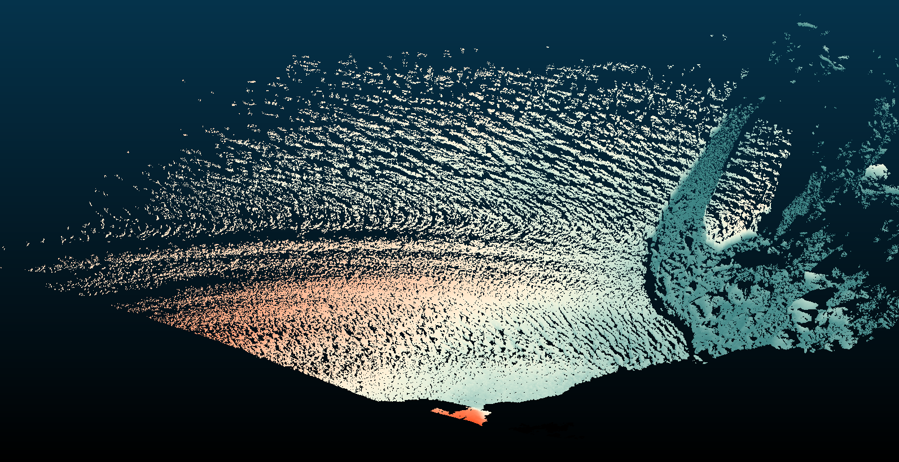

.. _filters.colorinterp:

filters.colorinterp
====================

The color interpolation filter assigns scaled RGB values from an image based on
a given dimension.  It provides three possible approaches:

1. You provide a minimum_ and maximum_, and the data are scaled for the
   given dimension_ accordingly.

2. You provide a k_ and a mad_ setting, and the scaling is set based on
   Median Absolute Deviation.

3. You provide a k_ setting and the scaling is set based on the
   k_-number of standard deviations from the median.

You can provide your own `GDAL`_-readable image for the scale color factors,
but a number of pre-defined ramps are embedded in PDAL.  The default ramps
provided by PDAL are 256x1 RGB images, and might be a good starting point for
creating your own scale factors. See `Default Ramps`_ for more information.

.. note::

    :ref:`filters.colorinterp` will use the entire band to scale the colors.

.. embed::

Example
--------------------------------------------------------------------------------

.. code-block:: json

  [
      "uncolored.las",
      {
        "type":"filters.colorinterp",
        "ramp":"pestel_shades",
        "mad":true,
        "k":1.8,
        "dimension":"Z"
      },
      "colorized.las"
  ]

    Image data with interpolated colors based on ``Z`` dimension and ``pestel_shades``
    ramp.

Default Ramps
--------------------------------------------------------------------------------

PDAL provides a number of default color ramps you can use in addition to
providing your own. Give the ramp name as the ramp_ option to the filter
and it will be used. Otherwise, provide a `GDAL`_-readable raster filename.

``awesome_green``
~~~~~~~~~~~~~~~~~~~~~~~~~~~~~~~~~~~~~~~~~~~~~~~~~~~~~~~~~~~~~~~~~~~~~~~~~~~~~~~~

``black_orange``
~~~~~~~~~~~~~~~~~~~~~~~~~~~~~~~~~~~~~~~~~~~~~~~~~~~~~~~~~~~~~~~~~~~~~~~~~~~~~~~~

.. image:: ../images/black-orange.png
    :scale: 400%
    :alt: black-orange color ramp

``blue_orange``
~~~~~~~~~~~~~~~~~~~~~~~~~~~~~~~~~~~~~~~~~~~~~~~~~~~~~~~~~~~~~~~~~~~~~~~~~~~~~~~~

.. image:: ../images/blue-orange.png
    :scale: 400%
    :alt: blue-orange color ramp

``blue_hue``
~~~~~~~~~~~~~~~~~~~~~~~~~~~~~~~~~~~~~~~~~~~~~~~~~~~~~~~~~~~~~~~~~~~~~~~~~~~~~~~~

.. image:: ../images/blue-hue.png
    :scale: 400%
    :alt: blue-hue color ramp

``blue_orange``
~~~~~~~~~~~~~~~~~~~~~~~~~~~~~~~~~~~~~~~~~~~~~~~~~~~~~~~~~~~~~~~~~~~~~~~~~~~~~~~~

.. image:: ../images/blue-orange.png
    :scale: 400%
    :alt: blue-orange color ramp

``blue_red``
~~~~~~~~~~~~~~~~~~~~~~~~~~~~~~~~~~~~~~~~~~~~~~~~~~~~~~~~~~~~~~~~~~~~~~~~~~~~~~~~

``heat_map``
~~~~~~~~~~~~~~~~~~~~~~~~~~~~~~~~~~~~~~~~~~~~~~~~~~~~~~~~~~~~~~~~~~~~~~~~~~~~~~~~

.. image:: ../images/heat-map.png
    :scale: 400%
    :alt: heat-map color ramp

``pestel_shades``
~~~~~~~~~~~~~~~~~~~~~~~~~~~~~~~~~~~~~~~~~~~~~~~~~~~~~~~~~~~~~~~~~~~~~~~~~~~~~~~~

.. image:: ../images/pestel-shades.png
    :scale: 400%
    :alt: pestel-shades color ramp

Options
-------

_`ramp`
  The raster file to use for the color ramp. Any format supported by `GDAL`_
  may be read.  Alternatively, one of the default color ramp names can be
  used. [Default: "pestel_shades"]

_`dimension`
  A dimension name to use for the values to interpolate colors. [Default: "Z"]

_`minimum`
  The minimum value to use to scale the data. If none is specified, one is
  computed from the data. If one is specified but a k_ value is also
  provided, the k_ value will be used.

_`maximum`
  The maximum value to use to scale the data. If none is specified, one is
  computed from the data. If one is specified but a k_ value is also
  provided, the k_ value will be used.

_`invert`
  Invert the direction of the ramp? [Default: false]

_`k`
  Color based on the given number of standard deviations from the median. If
  set, minimum_ and maximum_ will be computed from the median and setting
  them will have no effect.

_`mad`
  If true, minimum_ and maximum_ will be computed by the median absolute
  deviation. See :ref:`filters.mad` for discussion. [Default: false]

_`mad_multiplier`
  MAD threshold multiplier. Used in conjunction with k_ to threshold the
  diferencing. [Default: 1.4862]

.. _`GDAL`: http://www.gdal.org
