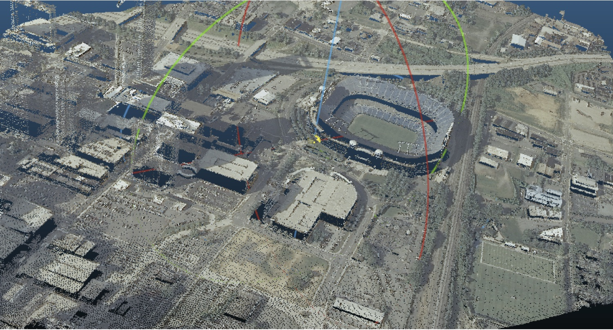

.. _filters.colorization:

filters.colorization
====================

The colorization filter populates dimensions in the point buffer using input
values read from a raster file. Commonly this is used to add Red/Green/Blue
values to points from an aerial photograph of an area. However, any band can be
read from the raster and applied to any dimension name desired.

    After colorization, points take on the colors provided by the input image

.. note::

    `GDAL`_ is used to read the color information and any GDAL-readable
    `supported format`_ can be read.

.. _`GDAL`: http://www.gdal.org
.. _`supported format`: www.gdal.org/formats_list.html

The bands of the raster to apply to each are selected using the "band" option,
and the values of the band may be scaled before being written to the dimension.
If the band range is 0-1, for example, it might make sense to scale by 256 to
fit into a traditional 1-byte color value range.

.. code-block:: xml

  <?xml version="1.0" encoding="utf-8"?>
  <Pipeline version="1.0">
    <Writer type="writers.las">
      <Option name="filename">colorized.las</Option>
      <Filter type="filters.colorization">
        <Option name="dimensions">
          Red:1:1.0, Blue, Green::256.0
        </Option>
        <Option name="raster">aerial.tif</Option>
        <Reader type="readers.las">
          <Option name="filename">uncolored.las</Option>
        </Reader>
      </Filter>
    </Writer>
  </Pipeline>

Considerations
--------------------------------------------------------------------------------

Certain data configurations can cause degenerate filter behavior. One significant
knob to adjust is the ``GDAL_CACHEMAX`` environment variable. One driver which
can have issues is when a `TIFF`_ file is striped vs. tiled. GDAL's data access
in that situation is likely to cause lots of re-reading if the cache isn't large
enough.

Consider a striped TIFF file of 286mb:

::

    -rw-r-----@  1 hobu  staff   286M Oct 29 16:58 orth-striped.tif

::

    <?xml version="1.0" encoding="utf-8"?>
    <Pipeline version="1.0">
    <Writer type="writers.las">
      <Option name="filename">coloured-striped.las</Option>
      <Filter type="filters.colorization">
        <Option name="raster">orth-striped.tif</Option>
        <Reader type="readers.las">
          <Option name="filename">colourless.laz</Option>
        </Reader>
      </Filter>
    </Writer>
    </Pipeline>

Simple application of the :ref:`filters.colorization` using the striped `TIFF`_
with a 268mb :ref:`readers.las` file will take nearly 1:54.

.. _`TIFF`: http://www.gdal.org/frmt_gtiff.html

::

    [hobu@pyro knudsen (master)]$ time ~/dev/git/pdal/bin/pdal pipeline -i striped.xml

    real	1m53.477s
    user	1m20.018s
    sys	0m33.397s

Setting the ``GDAL_CACHEMAX`` variable to a size larger than the TIFF file
dramatically speeds up the color fetching:

::

    [hobu@pyro knudsen (master)]$ export GDAL_CACHEMAX=500
    [hobu@pyro knudsen (master)]$ time ~/dev/git/pdal/bin/pdal pipeline striped.xml

    real	0m19.034s
    user	0m15.557s
    sys	0m1.102s

Options
-------

raster
  The raster file to read the band from. Any format supported by `GDAL`_ may be read.

dimensions
  A comma separated list of dimensions to populate with values from the raster
  file. The format of each dimension is <name>:<band_number>:<scale_factor>.
  Either or both of band number and scale factor may be omitted as may ':'
  separators if the data is not ambiguous.  If not supplied, band numbers
  begin at 1 and increment from the band number of the previous dimension.
  If not supplied, the scaling factor is 1.0.
  [Default: "Red:1:1.0, Green:2:1.0, Blue:3:1.0"]

.. _GDAL: http://gdal.org
