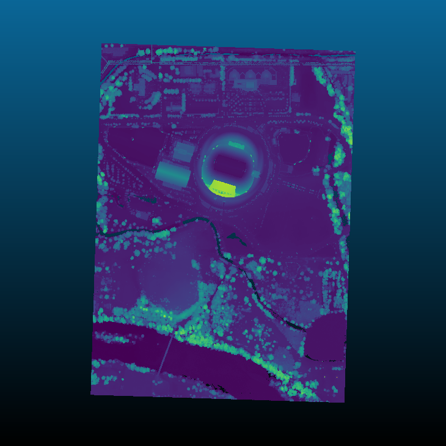
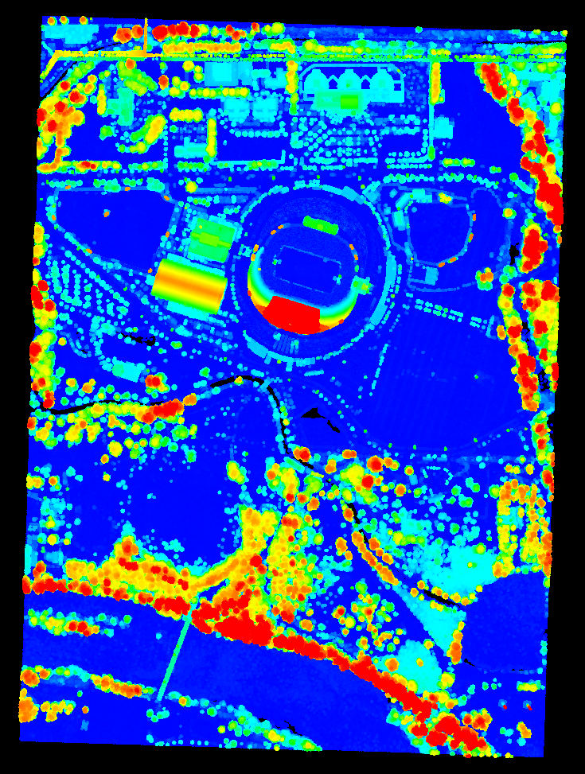

.. _filters.hag:

filters.hag
===============================================================================

The Height Above Ground (HAG) filter takes as input a point cloud with a
Classification dimension, with ground points assigned the classification label
of 2 (per LAS specification).

.. note::

   We expect ground returns to have the classification value of 2 in keeping
   with the ASPRS Standard LIDAR Point Classes (see
   http://www.asprs.org/a/society/committees/standards/LAS_1_4_r13.pdf).

This could, for example, be generated by :ref:`filters.pmf` or
:ref:`filters.smrf` (see :ref:`pcl_ground`), but you can use whichever method
you choose, as long as the ground returns are marked.

It returns a point cloud with a new dimension ``HeightAboveGround`` that
contains the normalized height value.

Normalized heights are a commonly used attribute of point cloud data. This can
also be referred to as *height above ground* (HAG) or *above ground level* (AGL)
heights. In the end, it is simply a measure of a point's relative height as
opposed to its raw elevation value.

The HAG filter works by iterating through all points, finding the nearest
neighbor (in XY only) amongst the ground points, and computing the distance
between the two Z values.

The process of computing normalized heights is straightforward. First, we must
have an estimate of the underlying terrain model. With this we can compute the
difference between each point's elevation and the elevation of the terrain model
at the same XY coordinate. The quality of the normalized heights will be a
function of the quality of the terrain model, which of course depends on the
quality of the ground segmentation approach and any interpolation that is
required to arrive at the terrain elevation for a given XY coordinate. We will
use a nearest neighbor interpolation scheme to estimate terrain elevations.

To compute the normalized heights, we first create a 2D KdTree (X and Y only) to
accelerate our nearest neighbor search. The tree is composed of only ground
returns. We then iterate over each of our points, searching for the nearest
neighbor in the ground points. We then compute the difference between the
elevation of the query point and the nearest neighbor in the ground set. This
value is encoded as a new dimension called ``HeightAboveGround``.

.. embed::

Example #1
----------

Using the autzen dataset (here shown colored by elevation)

we execute the following pipeline

.. code-block:: json

    {
      "pipeline":[
        "autzen.laz",
        {
          "type":"filters.hag"
        },
        {
          "type":"writers.bpf",
          "filename":"autzen-height.bpf",
          "output_dims":"X,Y,Z,HeightAboveGround"
        }
      ]
    }

which is equivalent to the ``pdal translate`` command

::

    $ pdal translate autzen.laz autzen-height.bpf hag \
        --writers.bpf.output_dims="X,Y,Z,HeightAboveGround"

In either case, the result, when colored by the normalized height instead of
elevation is

Example #2
-------------------------------------------------------------------------------

In the previous example, we chose a :ref:`writer <writers.bpf>` that could
output custom dimensions. If you'd instead like to overwrite your Z values, then
follow the height filter with :ref:`filters.ferry` as shown

.. code-block:: json

    {
      "pipeline":[
        "autzen.laz",
        {
          "type":"filters.hag"
        },
        {
          "type":"filters.ferry",
          "dimensions":"HeightAboveGround=Z"
        },
        "autzen-height-as-Z.laz"
      ]
    }

which is equivalent to the command

::

    $ pdal translate autzen.laz autzen-height-as-Z.laz hag ferry \
        --filters.ferry.dimensions="HeightAboveGround=Z"

Example #3
-------------------------------------------------------------------------------

If you don't yet have points classified as ground, start with :ref:`filters.pmf`
or :ref:`filters.smrf` to label ground returns, as shown

.. code-block:: json

    {
      "pipeline":[
        "autzen.laz",
        {
          "type":"filters.smrf"
        },
        {
          "type":"filters.hag"
        },
        {
          "type":"filters.ferry",
          "dimensions":"HeightAboveGround=Z"
        },
        "autzen-height-as-Z-smrf.laz"
      ]
    }

which is once again equivalent to the command

::

    $ pdal translate autzen.laz autzen-height-as-Z-smrf.bpf smrf hag ferry \
        --filters.ferry.dimensions="HeightAboveGround=Z"

Options
-------------------------------------------------------------------------------

None
