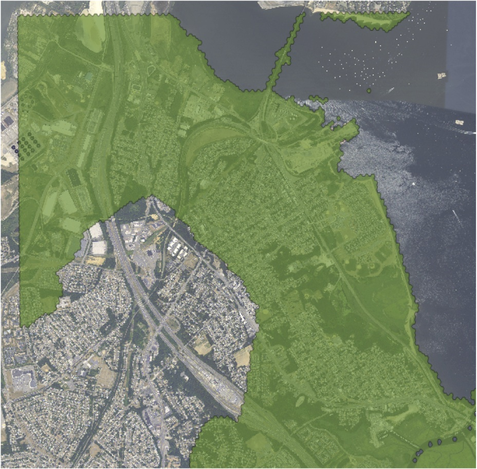

.. _filters.hexbin:

filters.hexbin
==============

A common questions for users of point clouds is what the spatial extent of a
point cloud collection is. Files generally provide only rectangular bounds, but
often the points inside the files only fill up a small percentage of the area
within the bounds.

    Hexbin output shows boundary of actual points in point buffer, not just rectangular extents.

The hexbin filter reads a point stream and writes out a metadata record that
contains a much tighter data bound, expressed as a well-known text polygon. In
order to write out the metadata record, the `pdal` pipeline command must be
invoked using the `--pipeline-serialization` option:

.. plugin::

Example
--------------------------------------------------------------------------------

::

    $ pdal pipeline hexbin-pipeline.json --pipeline-serialization hexbin-out.json

After running with the pipeline serialization option, the output file looks like this:

.. code-block:: json

  {
    "pipeline":
    [
      {
        "execution_metadata":
        {
          "comp_spatialreference": "",
          "compressed": false,
          "count": 1065,
          "creation_doy": 0,
          "creation_year": 0,
          "dataformat_id": 3,
          "dataoffset": 229,
          "filesource_id": 0,
          "global_encoding": 0,
          "global_encoding_base64": "AAA=",
          "header_size": 227,
          "major_version": 1,
          "maxx": 638982.55,
          "maxy": 853535.43,
          "maxz": 586.38,
          "minor_version": 2,
          "minx": 635619.85,
          "miny": 848899.7,
          "minz": 406.59,
          "offset_x": 0,
          "offset_y": 0,
          "offset_z": 0,
          "project_id": "00000000-0000-0000-0000-000000000000",
          "scale_x": 0.01,
          "scale_y": 0.01,
          "scale_z": 0.01,
          "software_id": "TerraScan",
          "spatialreference": "",
          "srs":
          {
            "compoundwkt": "",
            "horizontal": "",
            "isgeocentric": false,
            "isgeographic": false,
            "prettycompoundwkt": "",
            "prettywkt": "",
            "proj4": "",
            "units":
            {
              "horizontal": "",
              "vertical": ""
            },
            "vertical": "",
            "wkt": ""
          },
          "system_id": ""
        },
        "filename": "1.2-with-color.las",
        "tag": "readers.las1",
        "type": "readers.las"
      },
      {
        "execution_metadata":
        {
          "area": 40981005.83,
          "boundary": "MULTIPOLYGON (((636019.34031678 847308.55730142, 639990.93904966 850748.06269858, 638998.03936644 855907.32079433, 633040.64126713 852467.81539716, 636019.34031678 847308.55730142)))",
          "density": 2.598764912e-05,
          "edge_length": 0,
          "estimated_edge": 3439.505397,
          "hex_offsets": "MULTIPOINT (0 0, -992.9 1719.75, 0 3439.51, 1985.8 3439.51, 2978.7 1719.75, 1985.8 0)",
          "sample_size": 5000,
          "threshold": 10
        },
        "inputs":
        [
          "readers.las1"
        ],
        "tag": "filters.hexbin1",
        "threshold": "10",
        "type": "filters.hexbin"
      },
      {
        "filename": "file-output.las",
        "inputs":
        [
          "filters.hexbin1"
        ],
        "tag": "writers.las1",
        "type": "writers.las"
      }
    ]
  }

In addition, if you have defined a writer you will have the usual point data output file.

Example
-------

.. code-block:: json

  {
    "pipeline":[
      "1.2-with-color.las",
      {
        "type":"filters.hexbin",
        "threshold":10
      },
      "file-output.las"
    ]
  }

Options
-------

edge_size
  If not set, the hexbin filter will estimate a hex size based on a sample of
  the data. If set, hexbin will use the provided size in constructing the
  hexbins to test.

sample_size
  How many points to sample when automatically calculating the edge size? [Default: **5000**]

threshold
  Number of points that have to fall within a hexbin before it is considered "in" the data set. [Default: **15**]

precision
  Coordinate precision to use in writing out the well-known text of the boundary polygon. [Default: **8**]
