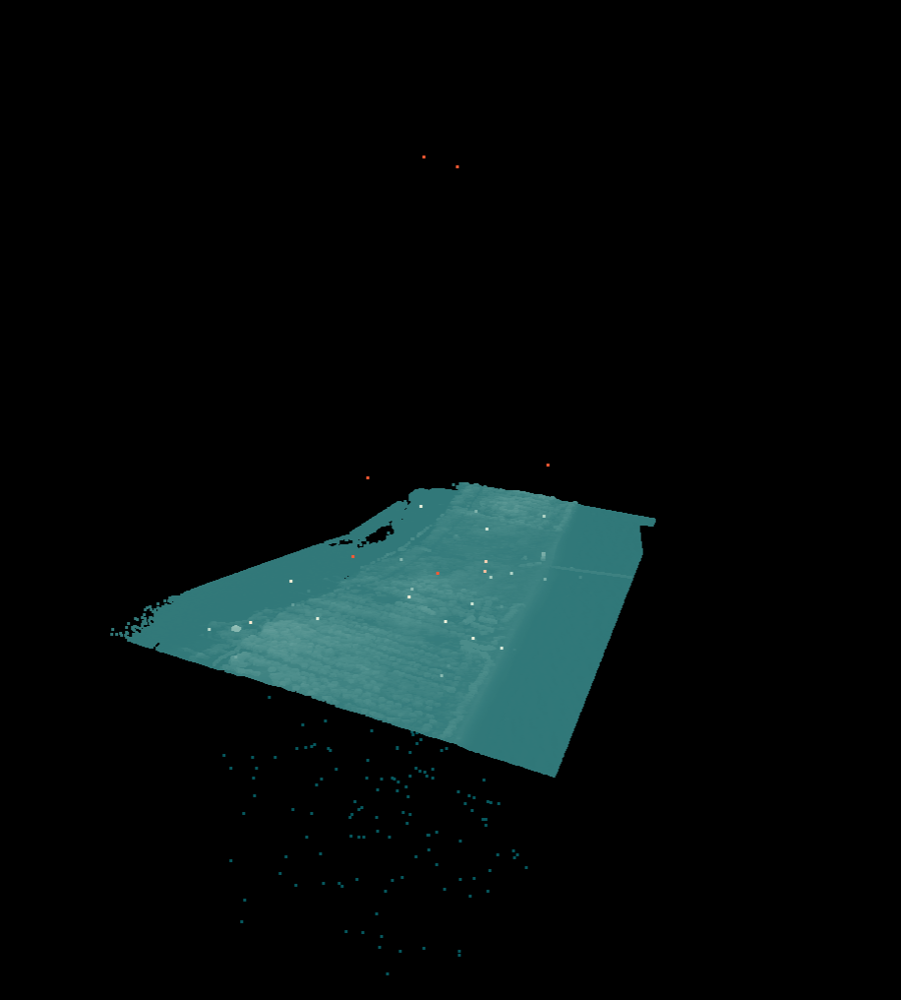

.. _filters.statisticaloutlier:

===============================================================================
filters.statisticaloutlier
===============================================================================

The Statistical Outlier filter passes data through the Point Cloud Library
(`PCL`_) StatisticalOutlierRemoval algorithm.

StatisticalOutlierRemoval uses point neighborhood statistics to filter outlier
data. The algorithm iterates through the entire input twice. During the first
iteration it will compute the average distance that each point has to its
nearest k neighbors. The value of k can be set using ``mean_k``. Next, the mean
and standard deviation of all these distances are computed in order to determine
a distance threshold. The distance threshold will be equal to:
:math:`mean + stddev_{mult} * stddev`. The multiplier for the standard deviation
can be set using ``multiplier``. During the next iteration the points will be
classified as inlier or outlier if their average neighbor distance is below or
above this threshold respectively.

    Before outlier removal, noise points can be found both above and below the scene.

.. figure:: filters.statisticaloutlier.img2.png
    :scale: 100 %
    :alt: Points after outlier removal

    After outlier removal, the noise points are removed.

See [Rusu2008]_ for more information.

.. [Rusu2008] Rusu, Radu Bogdan, et al. "Towards 3D point cloud based object maps for household environments." Robotics and Autonomous Systems 56.11 (2008): 927-941.

.. _`PCL`: http://www.pointclouds.org

Options
-------------------------------------------------------------------------------

mean_k
  Mean number of neighbors. [Default: **8**]

multiplier
  Standard deviation threshold. [Default: **2.0**]

classify
  Apply classification labels? [Default: **true**]

extract
  Extract ground returns? [Default: **false**]
