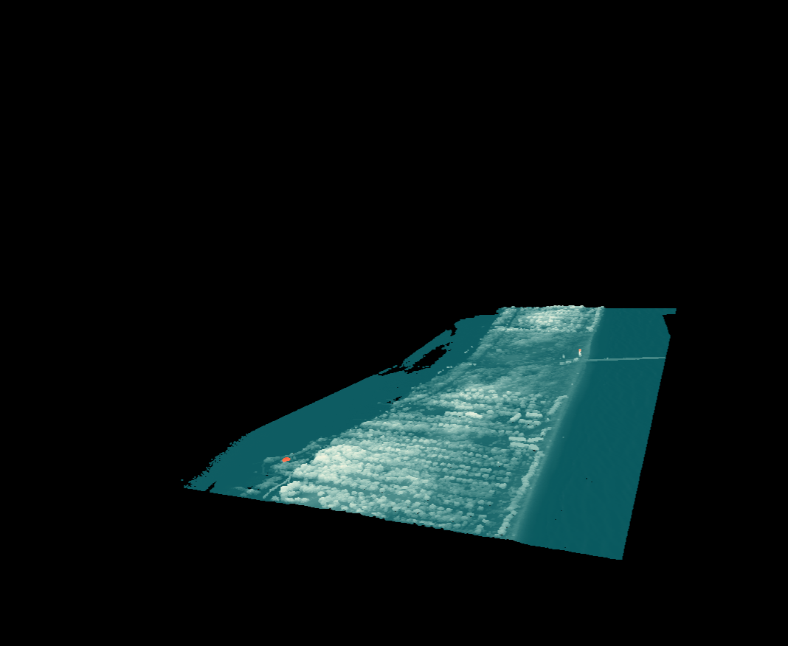

.. _filters.statisticaloutlier:

filters.statisticaloutlier
-------------------------------------------------------------------------------

The Statistical Outlier filter passes data through the Point Cloud Library
(`PCL`_) StatisticalOutlierRemoval algorithm.

``filters.statisticaloutlier`` uses point neighborhood statistics to filter
outlier data. The algorithm iterates through the entire input twice. The first
iteration is used to calculate the average of the distances from each point :math:`i`
to its :math:`k` nearest neighbors or  :math:`AD_{i}`.  The second iteration is used to
identify outliers based on the distribution of :math:`AD_{i}` values.  Points with an
average neighbor distance greater than the mean plus 2 standard deviations are
classified as outliers.  The value of :math:`k` can be set using :math:`\tt mean\_k`. By
default, the distance threshold is set to :math:`\overline{AD}_{i} + 2 \hat{\sigma}`,
but a value other than 2 can be chosen using :math:`\tt  multiplier`.

.. figure:: filters.statisticaloutlier.img1.png
    :scale: 70 %
    :alt: Points before outlier removal

    Before outlier removal, noise points can be found both above and below the scene.

    After outlier removal, the noise points are removed.

See [Rusu2008]_ for more information.

.. [Rusu2008] Rusu, Radu Bogdan, et al. "Towards 3D point cloud based object maps for household environments." Robotics and Autonomous Systems 56.11 (2008): 927-941.

.. _`PCL`: http://www.pointclouds.org

Options
................................................................................

mean_k
  Mean number of neighbors. [Default: **8**]

multiplier
  Standard deviation threshold. [Default: **2.0**]

classify
  Apply classification labels? [Default: **true**]

extract
  Extract ground returns? [Default: **false**]
