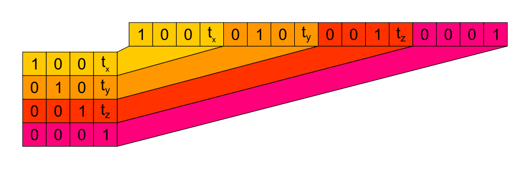

.. _filters.transformation:

filters.transformation
======================

The transformation filter applies an arbitrary rotation+translation
transformation, represented as a 4x4 matrix_, to each xyz triplet.

The filter does *no* checking to ensure the matrix is a valid affine
transformation.

.. note::

    The transformation filter does not apply or consider any spatial
    reference information.

.. embed::

.. streamable::

Example
-------

This example rotates the points around the z-axis while translating them.

.. code-block:: json

  [
      "untransformed.las",
      {
          "type":"filters.transformation",
          "matrix":"0 -1  0  1  1  0  0  2  0  0  1  3  0  0  0  1"
      },
      {
          "type":"writers.las",
          "filename":"transformed.las"
      }
  ]

Options
-------

_`matrix`
  A whitespace-delimited transformation matrix.
  The matrix is assumed to be presented in row-major order.
  Only matrices with sixteen elements are allowed.

Further details
---------------

.. note::
    This description should only give a high level overview about 3D 
    transformation abilities offered by PDAL.

For more easy understanding of how transformation will work with this 
filter please have a look at the following sketches.

Simple translation
..................

    Can be used to move all points of the pointcloud along the desired
    axis in the ammount of t:sub:`x` t:sub:`z` and t:sub:`z`.

Regarding to the figure above the following matrix will shift the 
pointcloud 10 units along x-axis, 10 units along y-axis and 10 
units along z-axis:

.. code-block:: json

  [
      "untransformed.las",
      {
          "type":"filters.transformation",
          "matrix":"1  0  0  10  0  1  0  10  0  0  1  10  0  0  0  1"
      },
      {
          "type":"writers.las",
          "filename":"transformed.las"
      }
  ]
   

