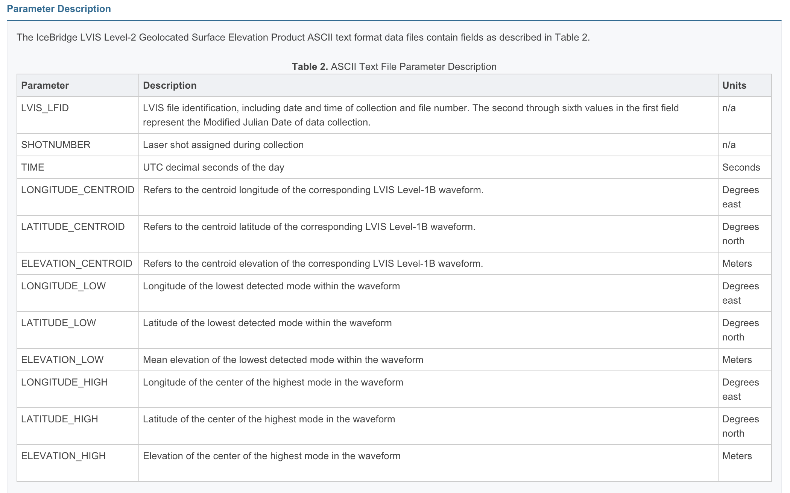

.. _readers.ilvis2:

readers.ilvis2
===============

The **ILVIS2 reader** read from files in the ILVIS2 format. See http://nsidc.org/data/docs/daac/icebridge/ilvis2/index.html
for more information

    Dimensions provided by the ILVIS2 reader

Example
-------

.. code-block:: json

    {
      "pipeline":[
        {
          "type":"readers.ilvis2",
          "filename":"ILVIS2_GL2009_0414_R1401_042504.TXT",
          "metadata":"ILVIS2_GL2009_0414_R1401_042504.xml"
        },
        {
          "type":"writers.las",
          "filename":"outputfile.las"
        }
      ]
    }

Options
-------

filename
  File to read from [Required]

mapping
  Which ILVIS2 field type to map to X, Y, Z dimensions
  'LOW', 'CENTROID', or 'HIGH' ['CENTROID']

metadata
  XML metadata file to coincidentally read [Optional]
