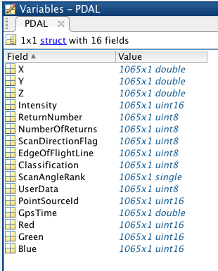

.. _writers.matlab:

writers.matlab
==============

The **Matlab Writer** supports writing Matlab `.mat` files.

The produced files has a single variable, `PDAL`, an array struct.

.. note::

    The Matlab writer requires the Mat-File API from MathWorks, and
    it must be explicitly enabled at compile time with the ``BUILD_PLUGIN_MATLAB=ON``
    variable

.. plugin::

Example
-------

.. code-block:: json

    {
      "pipeline":[
        {
          "type":"readers.las",
          "filename":"inputfile.las"
        },
        {
          "type":"writers.matlab",
          "output_dims":"X,Y,Z,Intensity",
          "filename":"outputfile.mat"
        }
      ]
    }

Options
-------

filename
  Output file name [REQUIRED]

output_dims
  Dimensions to include in the output file [OPTIONAL, defaults to all available dimensions]

struct
  Array structure name to read [OPTIONAL, defaults ``PDAL``]
