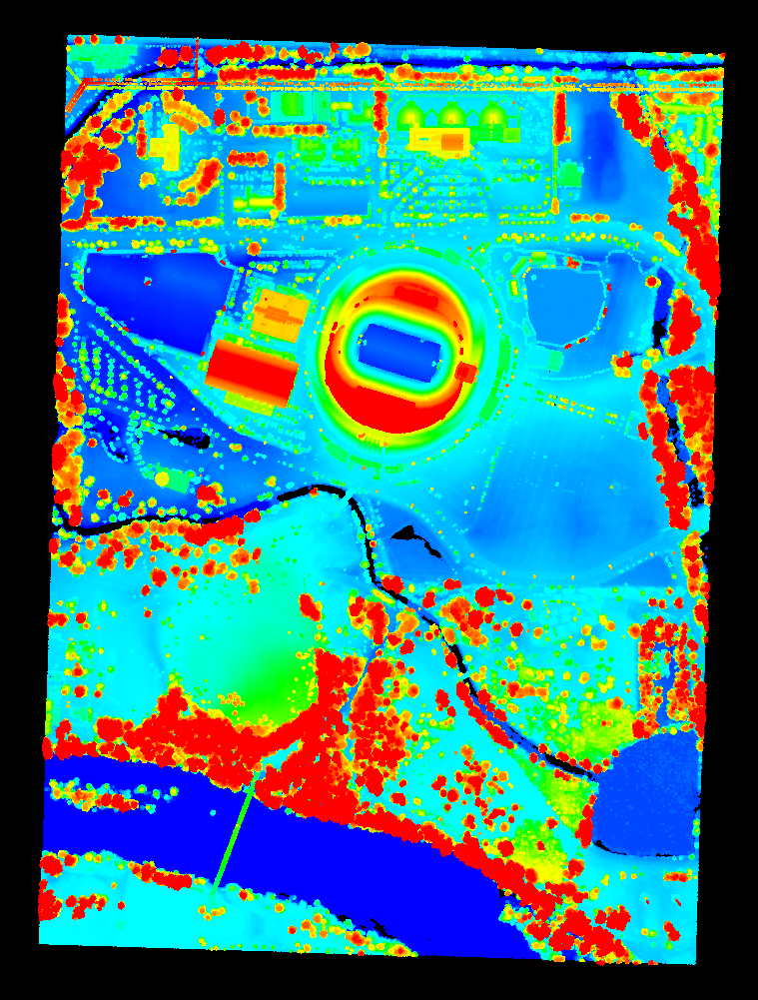

.. height:

==============================
Calculating Normalized Heights
==============================

:Author: Bradley Chambers
:Contact: brad.chambers@gmail.com
:Date: 11/11/2015

This tutorial will describe the creation of a new filter for calculating normalized heights, :ref:`filters.height`.

Introduction
-------------------------------------------------------------------------------

Normalized heights are a commonly used attribute of point cloud data. This can also be referred to as *height above ground* (HAG) or *above ground level* (AGL) heights. In the end, it is simply a measure of a point's relative height as opposed to its raw elevation value.

The process of computing normalized heights is straightforward. First, we must have an estimate of the underlying terrain model. With this we can compute the difference between each point's elevation and the elevation of the terrain model at the same XY coordinate. The quality of the normalized heights will be a function of the quality of the terrain model, which of course depends on the quality of the ground segmentation approach and any interpolation that is required to arrive at the terrain elevation for a given XY coordinate.

We will use a nearest neighbor interpolation scheme to estimate terrain elevations. While this may not be the most accurate approach, it is available in PDAL today, and we hope it will inspire you to implement your own methods!

Approach
-------------------------------------------------------------------------------

For the height filter, we only assume that our input point cloud has an already existing ``Classification`` dimension with some subset of points marked as ground (``Classification=2``). This could, for example, be generated by :ref:`filters.ground` (see :ref:`pcl_ground`), but you can use whichever method you choose, as long as the ground returns are marked.

.. note::

   We expect ground returns to have the classification value of 2 in keeping with the ASPRS Standard LIDAR Point Classes (see http://www.asprs.org/a/society/committees/standards/LAS_1_4_r13.pdf).

For the full source, please see ``HeightFilter.cpp`` in the ``plugins/pcl/filters`` folder. Below, we dissect the key aspects of the algorithm and its implementation.

The bulk of our processing is actually taking place within PCL. For convenience, we've defined:

.. code-block:: cpp

    typedef pcl::PointCloud<pcl::PointXYZ> Cloud;

Our first step is to convert the filter's incoming PDAL ``PointView`` to a PCL ``PointCloud``, which requires that we first calculate our bounds so that we can subtract our XYZ offsets in the conversion step.

.. code-block:: cpp

    BOX3D bounds;
    view.calculateBounds(bounds);

    Cloud::Ptr cloud_in(new Cloud);
    pclsupport::PDALtoPCD(std::make_shared<PointView>(view), *cloud_in, bounds);

Next, we will create two vectors of indices - one for ground returns, one for non-ground returns - and make our first pass through the point cloud to populate these.

.. code-block:: cpp

    pcl::PointIndices::Ptr ground(new pcl::PointIndices());
    ground->indices.reserve(view.size());

    std::vector<PointId> nonground;
    nonground.reserve(view.size());

    for (PointId id = 0; id < view.size(); ++id)
    {
        double c = view.getFieldAs<double>(Dimension::Id::Classification, id);

        if (c == 2)
            ground->indices.push_back(id);
        else
            nonground.push_back(id);
    }

With our ground indices identified, we can use PCL to extract the ground returns into a new ``PointCloud``.

.. code-block:: cpp

    pcl::ExtractIndices<pcl::PointXYZ> extract;
    extract.setInputCloud(cloud_in);
    extract.setIndices(ground);

    Cloud::Ptr cloud_ground(new Cloud);
    extract.setNegative(false);
    extract.filter(*cloud_ground);

We repeat the extraction now, flipping ``setNegative`` from false to true to extract the non-ground returns into a new ``PointCloud``.

.. code-block:: cpp

    Cloud::Ptr cloud_nonground(new Cloud);
    extract.setNegative(true);
    extract.filter(*cloud_nonground);

To compute the normalized height, we wish to find the nearest ground point for each non-ground point. Here, we achieve this by using a nearest neighbor interpolation scheme. One may prefer to use a more sophisticated interpolation scheme, but that is beyond the scope of this tutorial. We begin by defining model coefficients that will allow us to project the ground and non-ground clouds into the XY plane.

.. code-block:: cpp

    pcl::ModelCoefficients::Ptr coefficients(new pcl::ModelCoefficients());
    coefficients->values.resize(4);
    coefficients->values[0] = coefficients->values[1] = 0;
    coefficients->values[2] = 1.0;
    coefficients->values[3] = 0;

We can now project the ground points

.. code-block:: cpp

    pcl::ProjectInliers<pcl::PointXYZ> proj;
    proj.setModelType(pcl::SACMODEL_PLANE);

    Cloud::Ptr cloud_ground_projected(new Cloud);
    proj.setInputCloud(cloud_ground);
    proj.setModelCoefficients(coefficients);
    proj.filter(*cloud_ground_projected);

followed by the non-ground points

.. code-block:: cpp

    Cloud::Ptr cloud_nonground_projected(new Cloud);
    proj.setInputCloud(cloud_nonground);
    proj.setModelCoefficients(coefficients);
    proj.filter(*cloud_nonground_projected);

Next, we create a KdTree to accelerate our nearest neighbor search. The tree is composed of only ground returns, as our non-ground returns will serve as query points for the nearest neighbor search.

.. code-block:: cpp

    pcl::search::KdTree<pcl::PointXYZ>::Ptr ground_tree;
    ground_tree.reset(new pcl::search::KdTree<pcl::PointXYZ> (false));
    ground_tree->setInputCloud(cloud_ground_projected);

We iterate over each of our projected non-ground points, searching for our nearest neighbor in the ground points. Using the indices of each the query (non-ground) and nearest neighbor (ground), we can retrieve the Z dimension from the input cloud, compute the height, and set this field in our original ``PointView``.

.. code-block:: cpp

    for (int i = 0; i < cloud_nonground_projected->size(); ++i)
    {
        pcl::PointXYZ nonground_query = cloud_nonground_projected->points[i];
        std::vector<int> neighbors(1);
        std::vector<float> sqr_distances(1);
        ground_tree->nearestKSearch(nonground_query, 1, neighbors, sqr_distances);

        double nonground_Z = view.getFieldAs<double>(Dimension::Id::Z, nonground[i]);
        double ground_Z = view.getFieldAs<double>(Dimension::Id::Z, ground->indices[neighbors[0]]);
        double height = nonground_Z - ground_Z;

        view.setField(m_heightDim, nonground[i], height);
    }

The only thing left is to set the height field to 0.0 for each of the ground points.

.. code-block:: cpp

    for (auto const& ground_idx : ground->indices)
        view.setField(m_heightDim, ground_idx, 0.0);

Example #1
-------------------------------------------------------------------------------

Using the autzen dataset (here shown colored by elevation)

we run the following PDAL CLI command

::

    $ pdal translate autzen.laz autzen-height.bpf height \
      --writers.bpf.output_dims="X,Y,Z,HeightAboveGround"

The result, when colored by the normalized height instead of elevation is

.. image:: autzen-height.png
   :height: 400px

Example #2
-------------------------------------------------------------------------------

If you'd like to overwrite your Z values, follow the height filter with :ref:`filters.ferry`.

::

    $ pdal translate input.laz output-height-as-Z.bpf height ferry \
      --writers.bpf.output_dims="X,Y,Z" --filters.ferry.dimensions="HeightAboveGround=Z"

Example #3
-------------------------------------------------------------------------------

If you don't yet have points classified as ground, start with :ref:`filters.ground`.

::

    $ pdal translate input.laz output-ground-height.bpf ground height \
      --writers.bpf.output_dims="X,Y,Z,HeightAboveGround"
