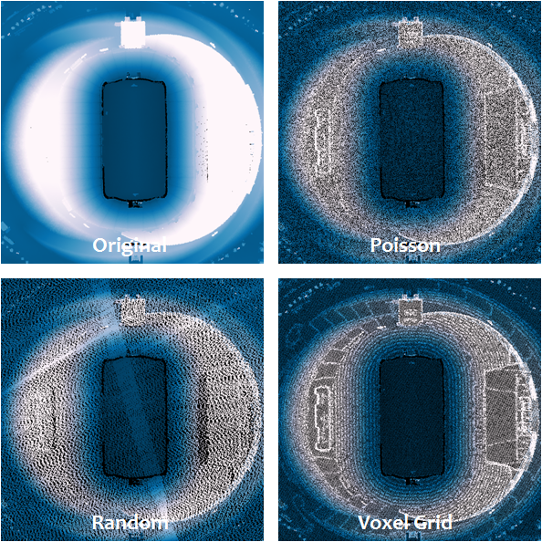

.. dart-throwing:

===============================================================
Performing Poisson Sampling of Point Clouds Using Dart Throwing
===============================================================

:Author: Bradley Chambers
:Contact: brad.chambers@gmail.com
:Date: 11/13/2015

This tutorial will describe the creation of a new filter for sampling point cloud data, :ref:`filters.dartsample`.

Introduction
-------------------------------------------------------------------------------

Sampling of point cloud data can be advantageous for a number of reasons. It can be used with care to create a lower resolution version of the point cloud for visualization, or to accelerate processing of derivative products at a coarser resolution. "Duplicate" points can be removed by subsampling. And the effects of overlapping and uneven scan patterns can be removed by sampling.

Approach
-------------------------------------------------------------------------------

We have chosen to implement the dart throwing filter as a PCL filter. The reason for this is simple. While it is often the case that we want to create a filter that can be included as stage in a PDAL pipeline, there are other, more primitive filters, that we may wish to reuse within another filter. While we may not want to subsample our point cloud, thus discarding points from our output ``PointView``, we may be perfectly content to subsample the data as a transient representation of the data within a filter - for example, to compute a coarse estimate of ground returns on 10% of the data to accelerate detection of buildings at full resolution.

Our implementation is a no frills, brute force approach (there are more advanced methods that have been published over the years).

We begin by creating a random permutation of the input ``PointView`` indices. The first point in this randomized set is appended to the output ``PointView`` and its associated octree. For the remaining points in the input cloud, we first test to see if there is a neighbor in the output cloud within the specified ``radius``. If so, we discard the point. If not, it too is added to the output ``PointView`` and octree.

That's it! It's really that simple.

Example #1
-------------------------------------------------------------------------------

We will again be working with the autzen dataset. The dart sampling filter is easily invoked via the PDAL ``translate`` command. Here, we enforce a minimum distance of three feet.

::

    $ pdal translate autzen.laz autzen-dart-sampled.laz dartsample \
    --filters.dartsample.radius=3

For comparison, we will process autzen using both :ref:`filters.decimation`, with a step size of 6, and :ref:`filters.voxelgrid`, with a leaf size of 4.5 feet in X, Y, and Z, to arrive at a subsampled point cloud of roughly 1.6 million points, which closely approximates the number of points returned in our dart sampling run.

::

    $ pdal translate autzen.laz autzen-randomly-sampled.laz decimation \
    --filters.decimation.step=6

::

    $ pdal translate autzen.laz autzen-voxelgrid-sampled.laz voxelgrid \
    --filters.voxelgrid.leaf_x=4.5 --filters.voxelgrid.leaf_y=4.5 --filters.voxelgrid.leaf_z=4.5

First, we inspect a fixture located in the middle of an open field, displaying the original point cloud, Poisson (dart sampled), voxel grid, and randomly sampled results in clockwise order from top-left.

.. image:: subsample-ex1.png
   :height: 400px

The Poisson and voxel gridded clouds both appear to do a good job retaining key elements of the structure, while significantly reducing the number of points allocated to the ground plane. The randomly sampled cloud however, exhibits the opposite behavior, noticeably degrading the structure, while heavily sampling the ground. This is not an unexpected result, as both the Poisson and voxel grid approaches take the data and its distribution into account during the subsampling process, while random sampling considers only point order (keep every N-th point).

The second example shows a very similar result, this time with a set of point pylons and power lines. The random sampling approach severely degrades the structures in the scene, while the Poisson and voxel grid techniques both preserve signal.

.. image:: subsample-ex2.png
   :height: 400px

In the next example, we can see that there is an increased number of points in a scan overlap region. This is not uncommon, as data collectors strive to avoid gaps in coverage and overlap datasets to aid in registration of multiple passes. The appearance of these denser regions can be distracting to the eye, and the Poisson and voxel grid subsampling method can both be used to make the collected points appear more uniform by culling those points that are very near other other points. The random sampling method preserves this artifact.

.. image:: subsample-ex3.png
   :height: 400px

In this top-down view of a football stadium, we again see that the random sampling technique preserves (and perhaps even accentuates) scan pattern and overlap artifacts. It also introduces a side effect to the voxel grid approach, an aliasing of the data, seen as staircasing in the sloping surfaces of the stadium.

Our last example once again demonstrates each of the issues we have identified. The random sampling result eliminates a majority of points from each of the towers and highlights a scan overlap region. The voxel grid method results in ringing in the sloped terrain. The Poisson approach preserves a good amount of detail in the original signal and does not introduce any visual artifacts.

.. image:: subsample-ex5.png
   :height: 400px
