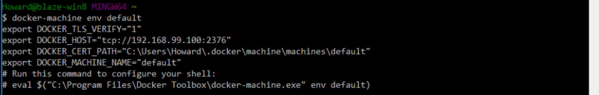
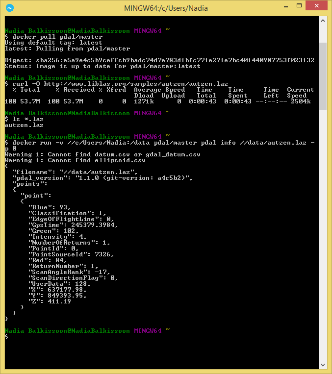

.. _docker:

******************************************************************************
Docker
******************************************************************************

:Author: Howard Butler
:Contact: howard@hobu.co
:Date: 01/07/2015

.. index:: Docker

Introduction
------------------------------------------------------------------------------

It's a giant pain to build everything yourself. To make it simpler to use PDAL, a
build based on `Docker`_ is also available. This document describes how
to use it to operate on your own data.

.. seealso::
    The `What is Docker <https://www.docker.com/what-docker>`__ document describes
    in more detail what exactly Docker is. Think of it as a virtualization platform
    that doesn't have to be "built" every time from scratch like a Vagrant build would.

Getting Started
------------------------------------------------------------------------------

Install `Docker Toolbox`_.
................................................................................

Docker starting documentation can be found at the following links. Read through
them a bit for your platform so you have an idea what to expect.

* `Windows <http://docs.docker.com/windows/started/>`__
* `OSX <http://docs.docker.com/mac/started/>`__
* `Linux <http://docs.docker.com/linux/started/>`__

.. _`Docker Toolbox`: https://www.docker.com/docker-toolbox

.. note::

    This tutorial will assume you are running on Windows, but the same commands should
    work in OSX or Linux too -- though definition of file paths might provide
    a significant difference.

Run Docker Quickstart Terminal
................................................................................

`Docker`_ is most easily accessed using a terminal window that it configures
with environment variables and such. Double-click on the "Docker Quickstart Terminal"
link on your desktop (Windows) or run the "Docker Quickstart Terminal" application
(Mac).

After some text scrolls by, you should see something like the following image
:

.. image:: docker-quickstart-terminal.png

To be sure Docker is working correctly and everything is happy,
issue the following command and confirm that it reports similar information:

::

    docker-machine env default

Fetch PDAL Image
................................................................................

The PDAL image provides a recent ``master`` branch build of PDAL. It is pushed
to `Docker Hub`_ periodically by the PDAL developers. We need to pull it
locally so we can use it to run PDAL commands. Once it is pulled, we
don't have to pull it again unless we want to refresh it for
whatever reason.

::

    docker pull pdal/master

.. note::

    Other PDAL versions are provided at the same `Docker Hub`_ location,
    with an expected tag name (ie ``pdal/1.1``, or ``pdal/1.x``) for
    major PDAL versions. The PDAL Docker hub location at
    https://hub.docker.com/u/pdal/ has images and more information
    on this topic.

.. _`Docker Hub`: http://hub.docker.com

Fetch Sample Data
................................................................................

We need some sample data to play with, so we're going to download
the ``autzen.laz`` file to your ``C:/Users/Howard`` drive. Inside the
Quickstart Terminal, issue the following ``curl`` command:

::

    curl -O http://www.liblas.org/samples/autzen/autzen.laz

.. note::

    That's a capital Oh, not a zero.

List the directory to be sure that it was downloaded

::

    ls *.laz

Print the first point
................................................................................

To test that we have a working system, we will print out the values of the
very first point of ``autzen.laz``.

::

    docker run -v //c/Users/Howard:/data pdal/master pdal info //data/autzen.laz -p 0

Here's a summary of what's going on with that command invocation

1. ``docker``: We are running PDAL within the context of docker, so all of our
   commands will start with the ``docker`` command.

2. ``run``: Tells docker we're going to run an image

3. ``-v //c/Users/Howard:/data``: Maps our home directory to a directory called
   ``/data`` inside the container.

   .. note::

       The double slash, ``//c/Users/Howard`` instead of just ``/c/Users/Howard``
       is because MSYS on Windows eats the first slash. See
       https://github.com/docker/docker/issues/12751 for a ticket describing
       this pain point in more detail. You do not need double slashes
       if you are using OSX or Linux as your Docker container host.

   .. seealso::

       The `Docker Volume <https://docs.docker.com/engine/userguide/dockervolumes/>`__
       document describes mounting volumes in more detail.

4. ``pdal/master``: This is the Docker image we are going to run. We fetched it
   with the command above. If it were not already fetched, Docker would attempt
   to fetch it when we run this command.

5. ``pdal``: We're finally going to run the ``pdal`` command :)

6. ``info``: We want to run :ref:`info_command` on the data

7. ``//data/autzen.laz``: The ``pdal`` command is now running in the context of
   our container, which we mounted a ``/data`` directory in with the volume
   mount operation in Step #3. Our ``autzen.laz`` file resides there.

   .. note::

        The same note about the double slash described in Step #3 applies here
        as well.

What you get
------------------------------------------------------------------------------

The  configuration that PDAL provides contains nearly
every possible feature except for `Oracle Point Cloud`_ support. Things it
includes are:

* :ref:`filters.hexbin`
* :ref:`filters.reprojection`
* :ref:`readers.nitf` and :ref:`writers.nitf`
* `LASzip`_ support in :ref:`readers.las` and :ref:`writers.las`
* Interpolation with `Points2Grid`_ using :ref:`writers.p2g`
* Python manipulation using :ref:`filters.predicate` and :ref:`filters.programmable`
* `PCL`_ support via :ref:`filters.pclblock`, :ref:`readers.pcd`,
  :ref:`writers.pcd`, :ref:`ground_command`, and :ref:`pcl_command`
* :ref:`writers.geowave`

Head to :ref:`pipeline` for more information on using PDAL pipelines. Two pipelines
are provided in ``/home/vagrant`` that are used to load the ``st-helens-small.las``
file into `pgpointcloud`_.

.. _`Points2Grid`: https://github.com/CRREL/points2grid
.. _`Oracle Point Cloud`: http://docs.oracle.com/cd/B28359_01/appdev.111/b28400/sdo_pc_pkg_ref.htm
.. _`pgpointcloud`: https://github.com/pramsey/pointcloud

.. _`LASzip`: http://laszip.org
.. _`VirtualBox`: https://www.virtualbox.org/
.. _`GDAL`: http://gdal.org
.. _`MapServer`: http://mapserver.org
.. _`Mapnik`: http://mapnik.org
.. _`PCL`: http://www.pointclouds.org
