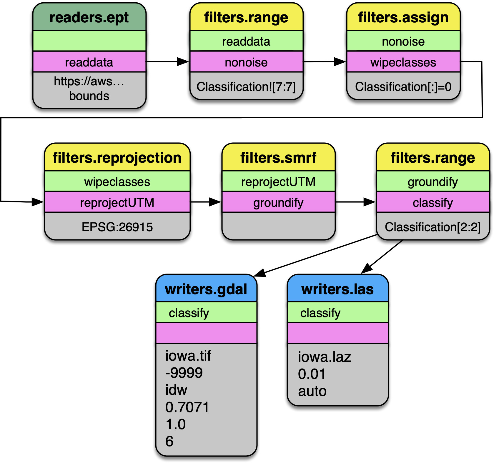
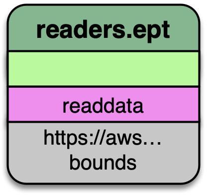
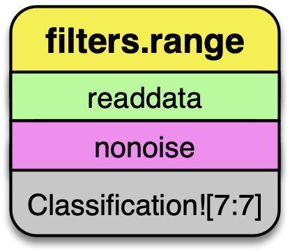
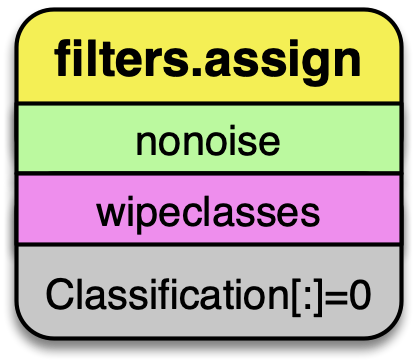
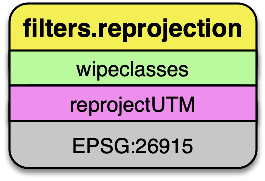
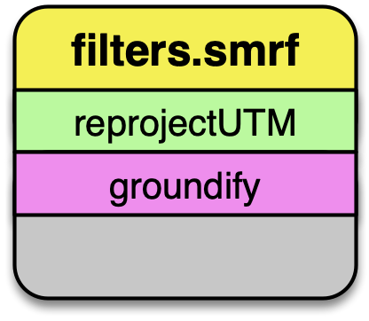
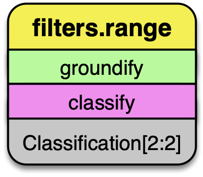
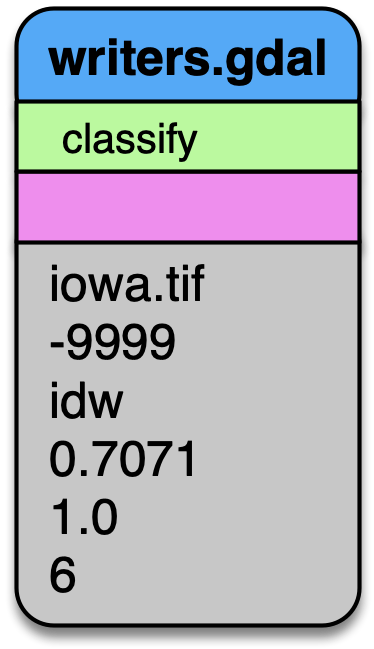
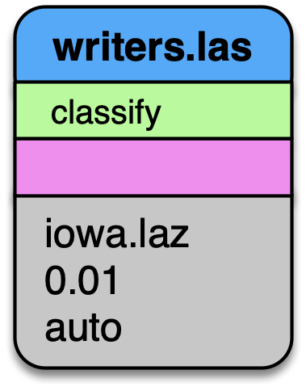

================================================================================
Reading data from EPT
================================================================================

Introduction
--------------------------------------------------------------------------------

This tutorial describes how to use `Conda`_, `Entwine`_, `PDAL`_, and `GDAL`_ to
read data from the `USGS 3DEP AWS Public Dataset`_. We will be using PDAL's
`readers.ept`_ to fetch data, we will filter it for noise using `filters.outlier`_,
we will classify the data as ground/not-ground using `filters.smrf`_, and we will
write out a digital terrain model with `writers.gdal`. Once our elevation model
is constructed, we will use GDAL `gdaldem`_ operations to create hillshade, slope,
and color relief.

Install Conda
--------------------------------------------------------------------------------

We first need to install PDAL, and the most convenient way to do that is
by installing `Miniconda`_. Select the 64-bit installer for your platform and
install it as directed.

Install PDAL
--------------------------------------------------------------------------------

Once Miniconda is installed, we can install PDAL into a new `Conda Environment`_
that we created for this tutorial. Open your Anaconda Shell and start issuing the
following commands:

1. Create the environment

   ::

      conda create -n iowa -y

2. Activate the environment

   ::

      conda activate iowa

3. Install PDAL

   ::

      conda install -c conda-forge pdal -y

4. Insure PDAL works by listing the available drivers

   ::

      pdal --drivers

   ::

      (iowa) [hobu@kasai ~]$ pdal --drivers

Once you confirmed you see output similar to that in your shell, your PDAL
installation should be good to go.

Write the Pipeline
--------------------------------------------------------------------------------

PDAL uses the concept of `pipelines`_ to describe the reading, filtering, and writing
of point cloud data. We will construct a pipeline that will do a number of things
in succession.

   Pipeline diagram. The data are read from the `Entwine Point Tile`_ resource at
   https://usgs.entwine.io for Iowa using :ref:`readers.ept` and filtered through a
   number of steps until processing is complete. The data are then written to
   an ``iowa.laz`` and ``iowa.tif`` file.

Pipeline
................................................................................

1. Create a file called ``iowa.json`` with the following content:

   .. note::

      The file is also available from
      https://gist.github.com/hobu/ee22084e24ed7e3c0d10600798a94c31 for
      convenient copy/paste)

.. literalinclude:: ./iowa.json
   :language: js

Stages
................................................................................

readers.ept
~~~~~~~~~~~~~~~~~~~~~~~~~~~~~~~~~~~~~~~~~~~~~~~~~~~~~~~~~~~~~~~~~~~~~~~~~~~~~~~~

:ref:`readers.ept` reads the point cloud data from the EPT resource on AWS. We give
it a URL to the root of the resource in the ``filename`` option, and we also
give it a ``bounds`` object to define the window in which we should select data
from.

The ``bounds`` object is in the form ``([minx, maxx], [miny, maxy])``.

.. warning::

   If you do not define a ``bounds`` option, PDAL will try to read the
   data for the entire state of Iowa, which is about 160 billion points.
   Maybe you have enough memory for this...

   The EPT reader reads data from an EPT resource with PDAL. Options available
   in PDAL 1.9+ allow users to select data at or above specified resolutions.

filters.range
~~~~~~~~~~~~~~~~~~~~~~~~~~~~~~~~~~~~~~~~~~~~~~~~~~~~~~~~~~~~~~~~~~~~~~~~~~~~~~~~

The data we are selecting may have noise properly classified, and we can use
:ref:`filters.range` to keep all data that does not have a ``Classification`` :ref:`dimensions`
value of ``7``.

   The :ref:`filters.range` filter utilizes range selection to allow users to
   select data for processing or removal. The :ref:`filters.mongoexpression`
   filter can be used for even more complex logic operations.

filters.assign
~~~~~~~~~~~~~~~~~~~~~~~~~~~~~~~~~~~~~~~~~~~~~~~~~~~~~~~~~~~~~~~~~~~~~~~~~~~~~~~~

After removing points that have noise classifications, we need to reset all
of the classification values in the point data. :ref:`filters.assign` takes the
expression ``Classification [:]=0`` and assigns the ``Classification`` for
each point to ``0``.

   :ref`filters.assign` can also take in an option to apply assignments
   based on a conditional. If you want to assign values based on a
   bounding geometry, use :ref:`filters.overlay`.

filters.reprojection
~~~~~~~~~~~~~~~~~~~~~~~~~~~~~~~~~~~~~~~~~~~~~~~~~~~~~~~~~~~~~~~~~~~~~~~~~~~~~~~~

The data on the AWS 3DEP Public Dataset are stored in `Web Mercator`_
coordinate system, which is not suitable for many operations. We need to
reproject them into an appropriate UTM coordinate system (`EPSG:26915 <https://epsg.io/32615>`__).

   :ref:`filters.reprojection` can also take override the incoming coordinate
   system using the ``a_srs`` option.

filters.smrf
~~~~~~~~~~~~~~~~~~~~~~~~~~~~~~~~~~~~~~~~~~~~~~~~~~~~~~~~~~~~~~~~~~~~~~~~~~~~~~~~

The Simple Morphological Filter (:ref:`filters.smrf`) classifies points as ground
or not-ground.

   :ref:`filters.smrf` provides a number of tuning options, but the
   defaults tend to work quite well for mixed urban environments on
   flat ground (ie, Iowa).

filters.range
~~~~~~~~~~~~~~~~~~~~~~~~~~~~~~~~~~~~~~~~~~~~~~~~~~~~~~~~~~~~~~~~~~~~~~~~~~~~~~~~

After we have executed the SMRF filter, we only want to keep points that
are actually classified as ground in our point stream. Selecting for
points with ``Classification[2:2]`` does that for us.

   Remove any point that is not ground classification for our
   DTM generation.

writers.gdal
~~~~~~~~~~~~~~~~~~~~~~~~~~~~~~~~~~~~~~~~~~~~~~~~~~~~~~~~~~~~~~~~~~~~~~~~~~~~~~~~

Having filtered our point data, we're now ready to write a raster digital
terrain model with :ref:`writers.gdal`. Interesting options we choose here are
to set the ``nodata`` value, specify only outputting the inverse distance
weighted raster, and assigning a resolution of ``1`` (m). See :ref:`writers.gdal`
for more options.

   Output a DTM at 1m resolution.

writers.las
~~~~~~~~~~~~~~~~~~~~~~~~~~~~~~~~~~~~~~~~~~~~~~~~~~~~~~~~~~~~~~~~~~~~~~~~~~~~~~~~

We can also write a LAZ file containing the same points that were used to
make the elevation model in the section above. See :ref:`writers.las` for more options.

   Also output the LAZ file as part of our processing pipeline.

Execute the Pipeline
--------------------------------------------------------------------------------

1. Save the PDAL pipeline in `Pipeline`_ to a file called ``iowa.json``

2. Invoke the `PDAL pipeline`_ command

   ::

      pdal pipeline iowa.json

   Add the ``--debug`` option if you would like information about
   how PDAL is fetching and processing the data.

   ::

      pdal pipeline iowa.json --debug

3. Save a color scheme to ``dem-colors.txt``

   ::

      # Color ramp for Iowa State Campus
      270.187,250,250,250,255,270.2
      272.059,230,230,230,255,272.1
      272.835,209,209,209,255,272.8
      273.985,189,189,189,255,274
      276.204,168,168,168,255,276.2
      277.835,148,148,148,255,277.8
      279.199,128,128,128,255,279.2
      280.964,107,107,107,255,281
      282.809,87,87,87,255,282.8
      283.745,66,66,66,255,283.7
      284.547,46,46,46,255,284.5
      286.526,159,223,250,255,286.5
      296.901,94,139,156,255,296.9

4. Invoke ``gdaldem`` to colorize a PNG file for your
   TIFF

   ::

      gdaldem color-relief iowa.tif dem-colors.txt iowa-color.png

5. View your raster

   .. figure:: ../images/pipeline-example-iowa-colors.png
      :align: left

.. _`PDAL pipeline`: https://pdal.io/pipeline.html
.. _`Web Mercator`: https://en.wikipedia.org/wiki/Web_Mercator_projection
.. _`dimension`: https://pdal.io/dimensions.html
.. _`USGS 3DEP AWS Public Dataset`: https://www.usgs.gov/news/usgs-3dep-lidar-point-cloud-now-available-amazon-public-dataset

.. _`PDAL`: https://pdal.io
.. _`Entwine`: https://entwine.io
.. _`Conda`: https://conda.io
.. _`GDAL`: https://gdal.org
.. _`readers.ept`: https://pdal.io/stages/readers.ept.html
.. _`filters.outlier`: https://pdal.io/stages/filters.outlier.html
.. _`filters.smrf`: https://pdal.io/stages/filters.smrf.html
.. _`writers.gdal`: https://pdal.io/stages/writers.gdal.html
.. _`gdaldem`: https://www.gdal.org/gdaldem.html
.. _`Miniconda`: https://docs.conda.io/en/latest/miniconda.html
.. _`Conda Environment`: https://docs.conda.io/projects/conda/en/latest/user-guide/concepts.html
.. _`pipelines`: https://pdal.io/pipeline.html
.. _`Entwine Point Tile`: https://entwine.io/entwine-point-tile.html
