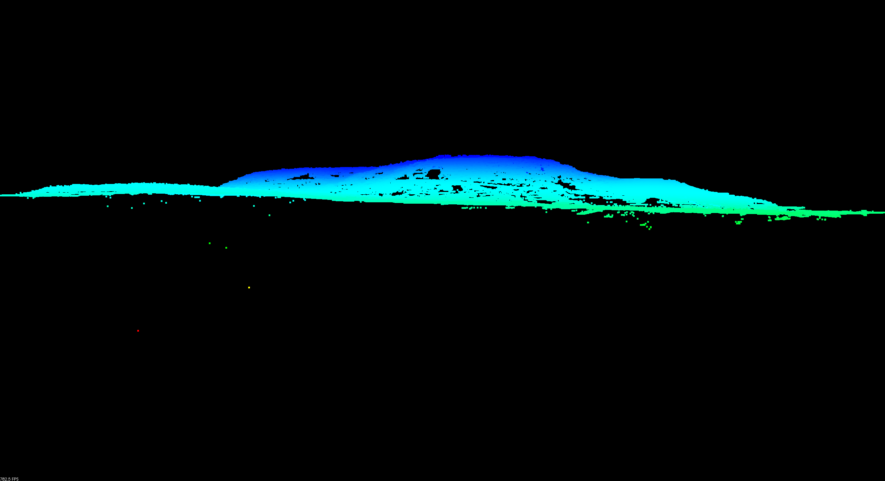
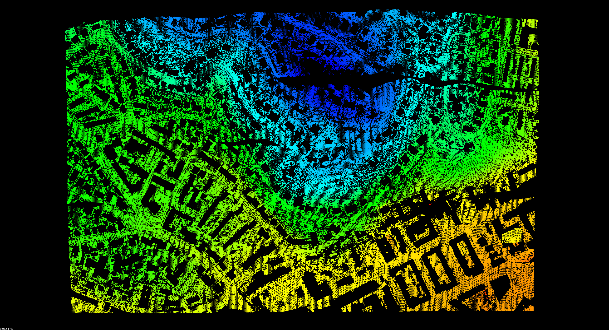
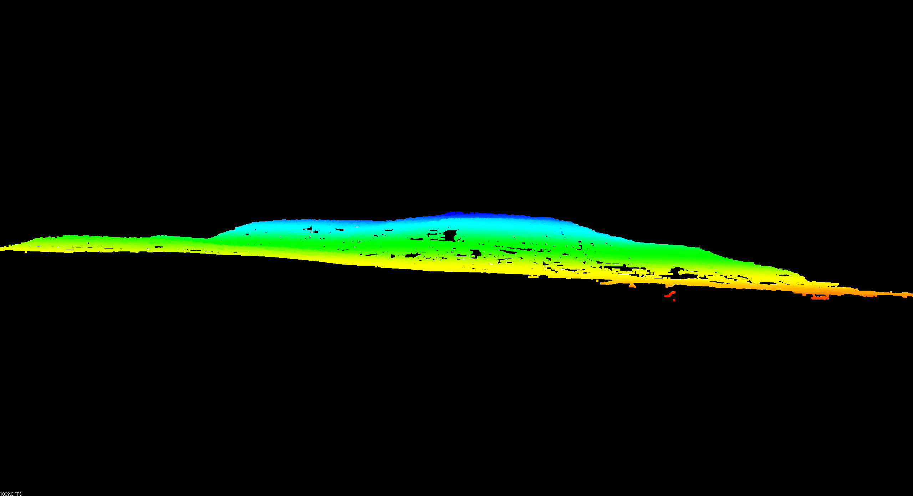

.. _pcl_ground:

===============================================================================
Identifying ground returns using ProgressiveMorphologicalFilter segmentation
===============================================================================

:Author: Bradley Chambers
:Contact: brad.chambers@gmail.com
:Date: 10/28/2015

Implements the Progressive Morphological Filter for segmentation of ground
points.

.. note::

  ``filters.ground`` required PCL and has since been replaced by
  :ref:`filters.pmf`, which is a native PDAL filter. :ref:`ground_command` has
  been retained, but now calls :ref:`filters.pmf` under the hood as opposed to
  ``filters.ground`` and is installed as a native PDAL kernel independent of the
  PCL plugin. As such, the outputs shown in this tutorial may vary slightly, but
  the underlying algorithm is identical.

Background
------------------------------------------------------------------------------

A complete description of the algorithm can be found in the article `"A
Progressive Morphological Filter for Removing Nonground Measurements from
Airborne LIDAR Data" <http://users.cis.fiu.edu/~chens/PDF/TGRS.pdf>`_ by K.
Zhang, S.  Chen, D. Whitman, M. Shyu, J. Yan, and C. Zhang.

For more information on how to invoke this PCL-based filter programmatically,
see the `ProgressiveMorphologicalFilter`_ tutorial on the PCL website.

We have chosen to demonstrate the algorithm using data from the 2003 report
"ISPRS Comparison of Filters." For more on the data and the study itself,
please see http://www.itc.nl/isprswgIII-3/filtertest/ as well as `"Experimental
comparison of filter algorithms for bare-earth extraction from airborne laser
scanning point clouds" <http://dx.doi.org/10.1016/j.isprsjprs.2004.05.004>`_ by
G. Sithole and G.  Vosselman.

First, download the dataset `CSite1_orig-utm.laz
<https://raw.github.com/PDAL/data/master/isprs/CSite1_orig-utm.laz>`_
and save it somewhere to disk.

.. image:: original.png
   :height: 400px

Using the Ground kernel
------------------------------------------------------------------------------

The :ref:`pdal ground <ground_command>` kernel can be used to filter ground
returns, allowing the user to tweak filtering parameters at the command-line.

Let's start by running ``pdal ground`` with the default parameters.

::

    $ pdal ground -i CSite1_orig-utm.laz -o CSite1_orig-utm-ground.laz

To get an idea of what's happening during each iteration, you can optionally
increase the verbosity of the output. We'll try ``-v4``.  Here we see a summary
of the parameters, along with height threshold, window size, and number of
remaining ground points.

::

    $ pdal ground -i CSite1_orig-utm.laz -o CSite1_orig-utm-ground.laz -v4

    --------------------------------------------------------------------------------
    NAME:    ()
    HELP:
    AUTHOR:
    --------------------------------------------------------------------------------
    process tile 0 through the pipeline

       Step 1) ProgressiveMorphologicalFilter

          max window size: 33
          slope: 1.000000
          max distance: 2.500000
          initial distance: 0.150000
          cell size: 1.000000
          base: 2.000000
          exponential: true
          negative: false
          Iteration 0 (height threshold = 0.150000, window size = 3.000000)...ground now has 872413  points
          Iteration 1 (height threshold = 2.150000, window size = 5.000000)...ground now has 833883 points
          Iteration 2 (height threshold = 2.500000, window size = 9.000000)...ground now has 757030 points
          Iteration 3 (height threshold = 2.500000, window size = 17.000000)...ground now has 625333 points
          Iteration 4 (height threshold = 2.500000, window size = 33.000000)...ground now has 580852 points
          1366408 points filtered to 580852 following progressive morphological filter

The resulting filtered cloud can be seen in this top-down and front view. When
viewed from the side, it is apparent that there are a number of low noise
points that have fooled the PMF filter.

.. image:: after-top1.png
   :height: 400px

To address, we introduce an alternate way to call PMF, as part of a PCL
pipeline, where we preprocess with an outlier removal step. The command is
nearly identical, replacing ``ground`` with ``pcl`` and adding a pipeline JSON
specified with ``-p``.

.. literalinclude:: sor_pmf.json

::

    $ pdal pcl -i CSite1_orig-utm.laz -o CSite1_orig-utm-ground.laz -p sor-pmf.json -v4

    --------------------------------------------------------------------------------
    NAME:   Progressive Morphological Filter with Outlier Removal (1.0)
    HELP:
    AUTHOR:
    --------------------------------------------------------------------------------
    process tile 0 through the pipeline

       Step 1) StatisticalOutlierRemoval

          8 neighbors and 3.000000 multiplier
          1366408 points filtered to 1356744 following outlier removal

       Step 2) ProgressiveMorphologicalFilter

          max window size: 33
          slope: 1.000000
          max distance: 2.500000
          initial distance: 0.150000
          cell size: 1.000000
          base: 2.000000
          exponential: true
          negative: false
          Iteration 0 (height threshold = 0.150000, window size = 3.000000)...ground now has 874094 points
          Iteration 1 (height threshold = 2.150000, window size = 5.000000)...ground now has 837141 points
          Iteration 2 (height threshold = 2.500000, window size = 9.000000)...ground now has 762213 points
          Iteration 3 (height threshold = 2.500000, window size = 17.000000)...ground now has 632827 points
          Iteration 4 (height threshold = 2.500000, window size = 33.000000)...ground now has 596620 points
          1356744 points filtered to 596620 following progressive morphological filter

The result is noticeably cleaner in both the top-down and front views.

Unfortunately, you may notice that we still have a rather large building in the
lower right of the image. By tweaking the parameters slightly, in this case,
increasing the cell size, we can do a better job of removing such features.

.. literalinclude:: sor_pmf2.json

::

    $ pdal pcl -i CSite1_orig-utm.laz -o CSite1_orig-utm-ground.laz -p sor-pmf2.json -v4

    --------------------------------------------------------------------------------
    NAME:   Progressive Morphological Filter with Outlier Removal (1.0)
    HELP:
    AUTHOR:
    --------------------------------------------------------------------------------
    process tile 0 through the pipeline

       Step 1) StatisticalOutlierRemoval

          8 neighbors and 3.000000 multiplier
          1366408 points filtered to 1356744 following outlier removal

       Step 2) ProgressiveMorphologicalFilter

          max window size: 33
          slope: 1.000000
          max distance: 2.500000
          initial distance: 0.150000
          cell size: 1.500000
          base: 2.000000
          exponential: true
          negative: false
          Iteration 0 (height threshold = 0.150000, window size = 4.500000)...ground now has 785496 points
          Iteration 1 (height threshold = 2.500000, window size = 7.500000)...ground now has 728738 points
          Iteration 2 (height threshold = 2.500000, window size = 13.500000)...ground now has 623385 points
          Iteration 3 (height threshold = 2.500000, window size = 25.500000)...ground now has 581679 points
          Iteration 4 (height threshold = 2.500000, window size = 49.500000)...ground now has 551006 points
          1356744 points filtered to 551006 following progressive morphological filter

Once again, the result is noticeably cleaner in both the top-down and front views.

.. image:: after-top3.png
   :height: 400px

.. image:: after-front3.png
   :height: 400px

.. _`ProgressiveMorphologicalFilter`: http://pointclouds.org/documentation/tutorials/progressive_morphological_filtering.php
