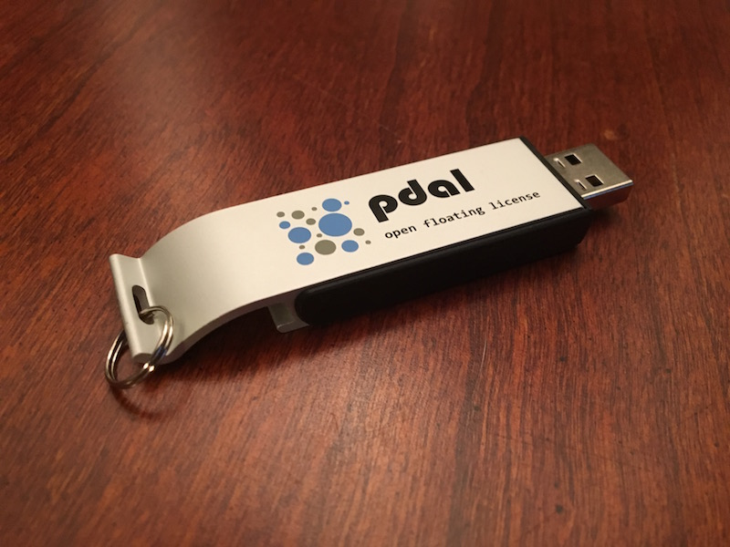

.. _introduction:

Introduction
================================================================================

1. :ref:`lidar-introduction`

2. :ref:`Introduction to PDAL <about>`

3. :ref:`software`

4. :ref:`basic-info`

5. :ref:`translation`

6. :ref:`analysisa`

7. :ref:`georeferencing`

Materials
--------------------------------------------------------------------------------

Slides
................................................................................

* `Slides <http://www.pdal.io/workshop/slides/>`__

Workshop Materials
................................................................................

These materials are available at http://pdal.io/workshop/ as both
a PDF and an HTML website.

* `PDF download <http://pdal.io/PDAL.pdf>`__
* `Website <http://pdal.io/workshop/>`__

USB Example Data Drive
................................................................................

A companion USB drive containing workshop example data is required
to follow along with these examples.

.. note::

    A drive image is available for download at
    https://s3.amazonaws.com/pdal/workshop/PDAL.zip
