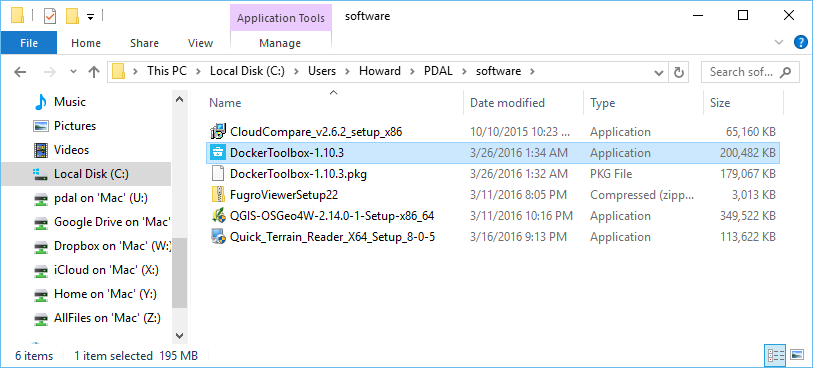
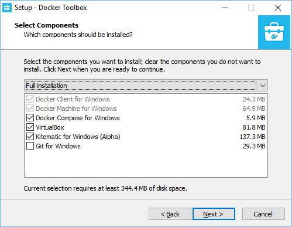
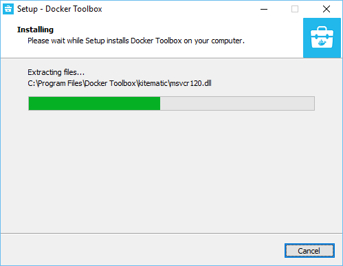
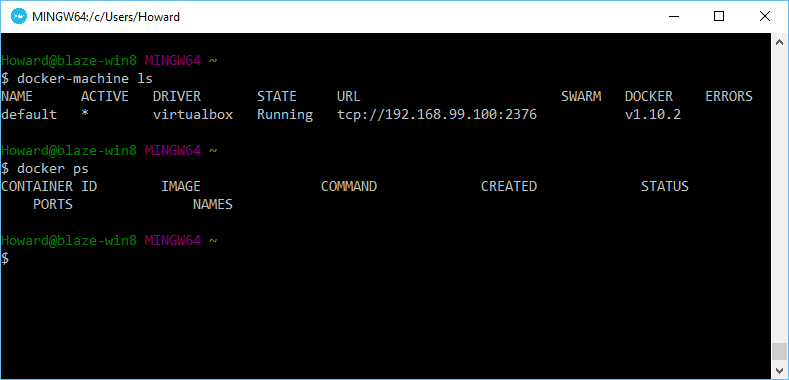
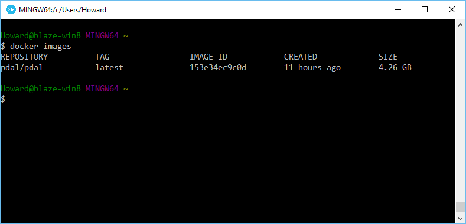
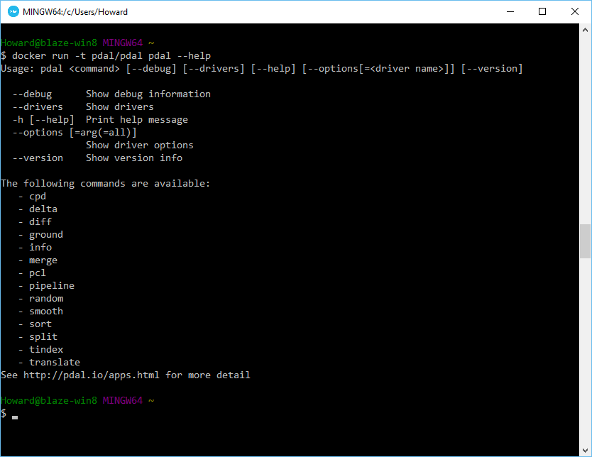

.. _workshop-docker:

Docker
================================================================================

.. index:: Docker, software installation

.. include:: ./includes/substitutions.rst

What is Docker?
--------------------------------------------------------------------------------

|Docker| is operating system virtualization. It is somewhat like a virtual
machine, but instead of the machine being abstracted, the operating system is.
The advantage it gives you is the ability to run many different things in many
different configurations and not have them collide with each other.

How will we use Docker?
--------------------------------------------------------------------------------

PDAL stands on the shoulders of giants. It uses GDAL, GEOS, and
:ref:`many other dependencies <building>`. Because of this, it is very
challenging to build it yourself. We could easily burn an entire workshop
learning the esoteric build miseries of PDAL and all of its dependencies.
Fortunately, Docker will allow us to use a fully-featured known
configuration to run our examples and exercises without having to suffer
so much.

Installing Docker
--------------------------------------------------------------------------------

1. Copy the entire contents of your workshop USB key to a ``PDAL`` directory in your
   home directory (something like ``C:\Users\Howard\PDAL``). We will refer to
   this location for the rest of the workshop materials.

   .. note::

        The workshop materials require ~5gb of local disk storage. You might
        be able to run directly from the USB drive, but this scenario
        has not been tested.

2. After your materials are copied, navigate to the
   ``c:\Users\Howard\PDAL\docker`` directory.

.. note::

    It is assumed your Hobu USB drive has all of its contents
    copied to the ``C:\Users\Howard\PDAL`` folder. Please adjust your
    locations when reading these tutorial documents accordingly.

3. Choose the install image, Windows or Mac, and install `Docker Toolbox`_ to
   prepare your machine to run the examples.

4. Once installed, choose the `Docker Quickstart Terminal` from your Desktop.
   It will scroll a bunch of text across the terminal screen as it does setup
   and configuration.  Once it is done, verify that things are working
   correctly by issuing the following commands:

    ::

        $ docker-machine ls

    ::

        $ docker ps

Images and Containers
--------------------------------------------------------------------------------

There are a few Docker concepts to understand before they are very useful. The
first and most important one is the concept of `images`. A Docker image
is kind of like an environment that frozen and not yet running. When you actually
run an image, the thing running is called a `container`. Containers are
what do the work and virtualize the operating system.

A downside to docker images is they are often really large. Gigabytes. We don't
want to swamp the bandwidth here at the workshop venue, so we're going to
load images from the Hobu workshop USB drive.

1. Load the PDAL Docker image:

    If you have a PDAL workshop USB key, you can load it
    from your workspace contained on it.

    ::

        $ docker load -i /c/Users/Howard/PDAL/docker/images/pdal.tar

    If you got your workshop materials from the internet, you
    can simply issue a ``pull`` command and Docker will fetch
    and load it for you.

    ::

        $ docker pull pdal/pdal

.. note::

    The `Docker Quickstart Terminal` is `Bash`_, not normal
    Windows ``cmd.exe``. Because of this, you will need to use double
    slashes from time to time when providing file paths.

.. _`Bash`: https://www.gnu.org/software/bash/

2. Verify that the image successfully loaded

::

    $ docker images

3. Verify PDAL can print help output

::

    $ docker run -t pdal/pdal pdal --help

.. _`Docker Toolbox`: https://www.docker.com/products/docker-toolbox

Conclusion
--------------------------------------------------------------------------------

Once you have verified that you can run the ``pdal/pdal`` container and print help
information, you are ready to begin the :ref:`exercises`.

