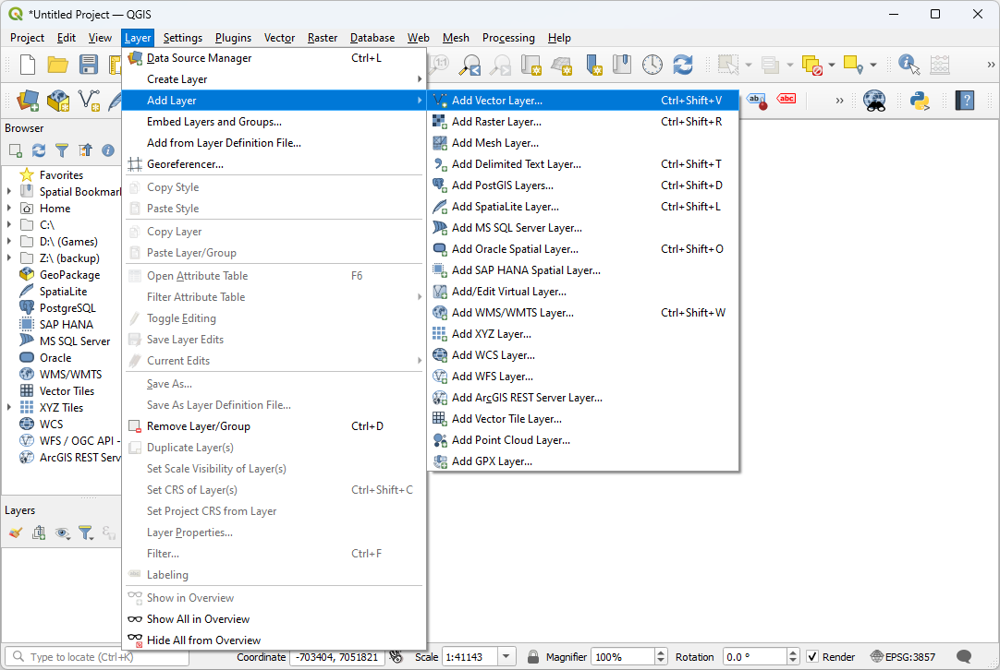

.. _boundary:

Finding the boundary
================================================================================

.. include:: ../../../includes/substitutions.rst

.. index:: boundary, QGIS, OGR

This exercise uses PDAL to find a tight-fighting boundary of an aerial scan.
Printing the coordinates of the boundary for the file is quite simple using a
single ``pdal info`` call, but visualizing the boundary is more complicated. To
complete this exercise, we are going to use :ref:`qgis` to view the
boundary, which means we must first install it on our system.

Exercise
--------------------------------------------------------------------------------

.. note::

    We are going to run using the Uncompahgre data in the ``./density``
    directory.

.. literalinclude:: ./boundary-command-boundary.txt
    :linenos:

.. image:: ../../../images/boundary-text-output.png

... a giant blizzard of coordinate output scrolls across our terminal. Not very
useful.

Instead, let's generate some kind of vector output we can visualize with
:ref:`qgis`.  The ``pdal tindex`` is the "tile index" command, and it outputs a
vector geometry file for each point cloud file it reads. It generates this
boundary using the same mechanism we invoked above -- :ref:`filters.hexbin`.
We can leverage this capability to output a contiguous boundary of the ``uncompahgre.laz``
file.

.. literalinclude:: ./boundary-command-tindex.txt
    :linenos:

.. image:: ../../../images/boundary-tindex-run.png

Once we've run the :ref:`tindex_command`, we can now visualize our output:

Open :ref:`qgis` and select `Add Vector Layer`:

Navigate to the ``exercises/analysis/boundary`` directory and
then open the ``boundary.sqlite`` file:

.. image:: ../../../images/boundary-qgis-view.png

Notes
--------------------------------------------------------------------------------

1. The PDAL boundary computation is an approximation based on a hexagon
   tessellation. It uses the software at http://github.com/hobu/hexer to do
   this task.

2. :ref:`filters.hexbin` can also be used by the :ref:`density_command` to
   generate a tessellated surface. See the :ref:`density` example for
   steps to achieve this.

3. The :ref:`tindex_command` can be used to generate boundaries for large
   collections of data. A boundary-based indexing scheme is commonly used
   in LiDAR processing, and PDAL supports it through the ``tindex``
   application. You can also use this command to merge data together
   (query across boundaries, for example).

