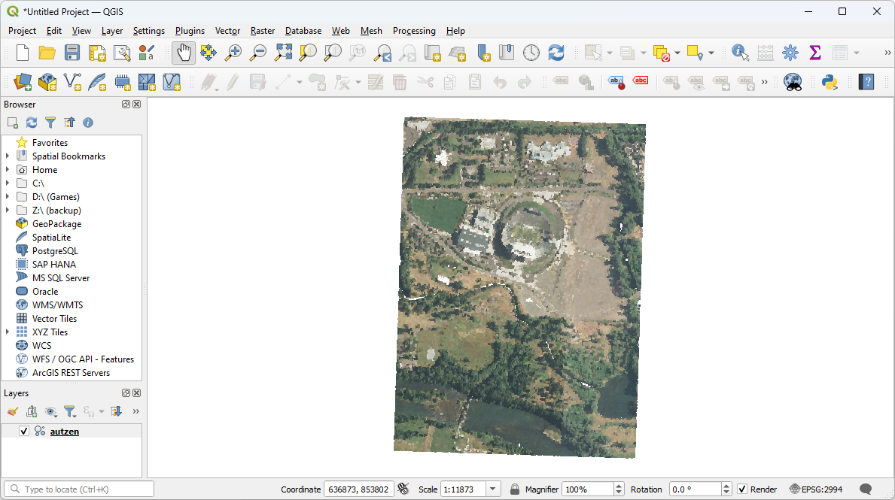

.. _workshop-clipping:

Clipping data with polygons
================================================================================

.. include:: ../../../includes/substitutions.rst

.. index:: Clipping, OGR, Vector

This exercise uses PDAL to apply to clip data with polygon geometries.

.. note::

    This exercise is an adaption of the :ref:`PDAL tutorial <clipping>`.

Exercise
--------------------------------------------------------------------------------

The ``autzen.laz`` file is a staple in PDAL and libLAS examples. We will
use this file to demonstrate clipping points with a geometry. We're going to
clip out the stadium into a new LAS file.

Data preparation
................................................................................

The data are mixed in two different coordinate systems. The :ref:`LAZ
<readers.las>` file is in `Oregon State Plane Ft.`_ and the `GeoJSON`_ defining
the polygons, ``attributes.json``, is in `EPSG:4326`_. We have two options --
project the point cloud into the coordinate system of the attribute polygons,
or project the attribute polygons into the coordinate system of the points. The
latter is preferable in this case because it will be less math and therefore
less computation. To make it convenient, we can utilize `OGR`_'s `VRT`_
capability to reproject the data for us on-the-fly:

.. code:: xml

    <OGRVRTDataSource>
        <OGRVRTWarpedLayer>
            <OGRVRTLayer name="OGRGeoJSON">
                <SrcDataSource>./exercises/analysis/clipping/attributes.json</SrcDataSource>
                <SrcLayer>attributes</SrcLayer>
                <LayerSRS>EPSG:4326</LayerSRS>
            </OGRVRTLayer>
            <TargetSRS>+proj=lcc +lat_1=43 +lat_2=45.5 +lat_0=41.75 +lon_0=-120.5 +x_0=399999.9999999999 +y_0=0 +ellps=GRS80 +units=ft +no_defs</TargetSRS>
        </OGRVRTWarpedLayer>
    </OGRVRTDataSource>

.. note::

    This VRT file is available in your workshop materials in the
    ``./exercises/analysis/clipping/attributes.vrt`` file. You will need to
    open this file, go to line 4 and replace ``./`` with
    the correct path for your machine.

    A GDAL or OGR VRT
    is a kind of "virtual" data source definition type that combines a
    definition of data and a processing operation into a single, readable data
    stream.

.. note::

    The GeoJSON file does not have an externally-defined coordinate system,
    so we are explictly setting one with the LayerSRS parameter. If your
    data does have coordinate system information, you don't need to do that.
    See the `OGR VRT documentation`_ for more details.

.. _`OGR VRT documentation`: http://www.gdal.org/drv_vrt.html

Pipeline breakdown
................................................................................

.. include:: ./clipping.json
    :code: json

.. note::

    This pipeline is available in your workshop materials in the
    ``./exercises/analysis/clipping/clipping.json`` file. Remember
    to replace each of the three occurrences of ``./``
    in this file with the correct location for your machine.

1. Reader
~~~~~~~~~~~~~~~~~~~~~~~~~~~~~~~~~~~~~~~~~~~~~~~~~~~~~~~~~~~~~~~~~~~~~~~~~~~~~~~~

``autzen.laz`` is the `LASzip`_ file we will clip.

2. :ref:`filters.overlay`
~~~~~~~~~~~~~~~~~~~~~~~~~~~~~~~~~~~~~~~~~~~~~~~~~~~~~~~~~~~~~~~~~~~~~~~~~~~~~~~~

The :ref:`filters.overlay` filter allows you to assign values for coincident
polygons. Using the VRT we defined in `Data preparation`_,
:ref:`filters.overlay` will
assign the values from the ``CLS`` column to the ``Classification`` field.

3. :ref:`filters.range`
~~~~~~~~~~~~~~~~~~~~~~~~~~~~~~~~~~~~~~~~~~~~~~~~~~~~~~~~~~~~~~~~~~~~~~~~~~~~~~~~

The attributes in the ``attributes.json`` file include polygons with values
``2``, ``5``, and ``6``. We will use :ref:`filters.range` to keep points with
``Classification`` values in the range of ``6:6``.

4. Writer
~~~~~~~~~~~~~~~~~~~~~~~~~~~~~~~~~~~~~~~~~~~~~~~~~~~~~~~~~~~~~~~~~~~~~~~~~~~~~~~~

We will write our content back out using a :ref:`writers.las`.

Execution
................................................................................

Invoke the following command, substituting accordingly, in your `Conda Shell`:

The `--nostream` option disables stream mode. The point-in-polygon check (see notes)
performs poorly in stream mode currently.

.. literalinclude:: ./clipping-run-command.txt
    :linenos:

.. image:: ../../../images/clipping-run-command.png
    :target: ../../../../_images/clipping-run-command.png

Visualization
................................................................................

Use one of the point cloud visualization tools you installed to take a look at
your ``./exercises/analysis/clipping/stadium.las`` output.
In the example below, we opened the file to view it using the http://plas.io
website.

Notes
--------------------------------------------------------------------------------

1. :ref:`filters.overlay` does point-in-polygon checks against every point
   that is read.

2. Points that are *on* the boundary are included.

.. _`CloudCompare`: http://www.danielgm.net/cc/

.. _`ASPRS LAS`: http://www.asprs.org/Committee-General/LASer-LAS-File-Format-Exchange-Activities.html
.. _`LASzip`: http://laszip.org

.. _`VRT`: http://www.gdal.org/drv_vrt.html

.. _`EPSG:4326`: http://epsg.io/4326
.. _`GeoJSON`: http://geojson.org

.. _`Oregon State Plane Ft.`: http://www.oregon.gov/DAS/CIO/GEO/pages/coordination/projections/projections.aspx

.. _`OGR`: http://www.gdal.org
.. _`Shapefiles`: https://en.wikipedia.org/wiki/Shapefile
