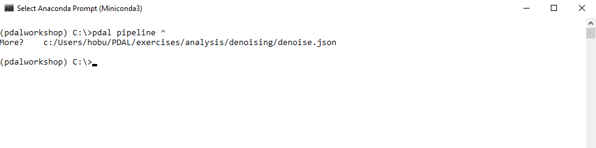
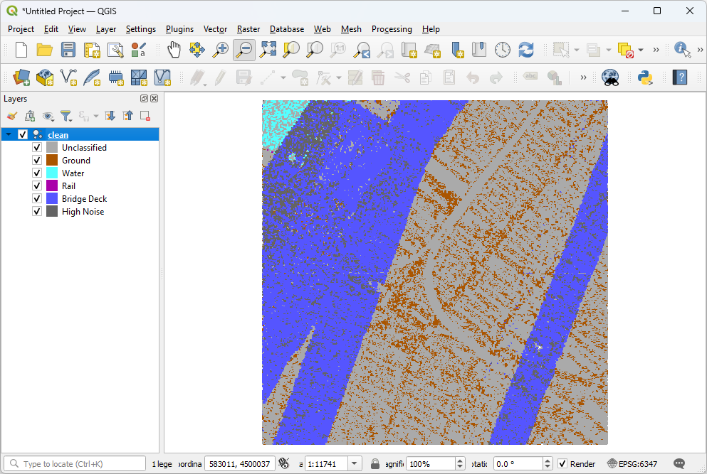

.. _workshop-denoising:

Removing noise
================================================================================

.. include:: ../../../includes/substitutions.rst

.. index:: Denoising, outliers

This exercise uses PDAL to remove unwanted noise in an airborne LiDAR collection.

Exercise
--------------------------------------------------------------------------------

PDAL provides the :ref:`outlier filter<filters.outlier>` to apply a statistical
filter to data.

Because this operation is somewhat complex, we are going to use a pipeline to
define it.

.. include:: ./denoise.json
    :literal:

.. note::

    This pipeline is available in your workshop materials in the
    ``./exercises/analysis/denoising/denoise.json`` file.

Pipeline breakdown
................................................................................

1. Reader
~~~~~~~~~~~~~~~~~~~~~~~~~~~~~~~~~~~~~~~~~~~~~~~~~~~~~~~~~~~~~~~~~~~~~~~~~~~~~~~~

After our pipeline errata, the first item we define in the pipeline is the
point cloud file we're going to read.

::

    "./exercises/analysis/denoising/18TWK820985.laz",

2. :ref:`filters.outlier`
~~~~~~~~~~~~~~~~~~~~~~~~~~~~~~~~~~~~~~~~~~~~~~~~~~~~~~~~~~~~~~~~~~~~~~~~~~~~~~~~

The PDAL :ref:`outlier filter<filters.outlier>` does most of the work for this
operation.

::

    {
        "type": "filters.outlier",
        "method": "statistical",
        "multiplier": 3,
        "mean_k": 8
    },

3. :ref:`filters.range`
~~~~~~~~~~~~~~~~~~~~~~~~~~~~~~~~~~~~~~~~~~~~~~~~~~~~~~~~~~~~~~~~~~~~~~~~~~~~~~~~

At this point, the outliers have been classified per the LAS specification as
low/noise points with a classification value of 7. The :ref:`range
filter<filters.range>` can remove these noise points by constructing a
:ref:`range <ranges>` with the value ``Classification![7:7]``, which passes
every point with a ``Classification`` value **not** equal to 7.

Even with the :ref:`filters.outlier` operation, there is still a cluster of
points with extremely negative ``Z`` values. These are some artifact or
miscomputation of processing, and we don't want these points. We can construct
another :ref:`range <ranges>` to keep only points that are within the range
:math:`-100 <= Z <= 3000`.

Both :ref:`ranges <ranges>` are passed as a comma-separated list to the
:ref:`range filter<filters.range>` via the ``limits`` option.

::

    {
        "type": "filters.range",
        "limits": "Classification![7:7],Z[-100:3000]"
    },

.. index:: range filter, classifications

4. :ref:`writers.las`
~~~~~~~~~~~~~~~~~~~~~~~~~~~~~~~~~~~~~~~~~~~~~~~~~~~~~~~~~~~~~~~~~~~~~~~~~~~~~~~~

We could just define the ``clean.laz`` filename, but we want to
add a few options to have finer control over what is written. These include:

::

    {
        "type": "writers.las",
        "compression": "true",
        "minor_version": "2",
        "dataformat_id": "0",
        "filename":"./exercises/analysis/denoising/clean.laz"
    }

1. ``compression``: |LASzip| data is ~6x smaller than ASPRS LAS.
2. ``minor_version``: We want to make sure to output LAS 1.2, which will
   provide the widest compatibility with other softwares that can
   consume LAS.
3. ``dataformat_id``: Format 3 supports both time and color information

.. note::

    :ref:`writers.las` provides a number of possible options to control
    how your LAS files are written.

Execution
................................................................................

Invoke the following command, substituting accordingly, in your ` Shell`:

.. literalinclude:: ./denoising-run-command.txt

Visualization
................................................................................

Use one of the point cloud visualization tools you installed to take a look at
your ``clean.laz`` output. In the example below, we simply
opened the file using the `Fugro Viewer`_

.. _`Fugro Viewer`: http://www.fugroviewer.com/

Notes
--------------------------------------------------------------------------------

1. Control the aggressiveness of the algorithm with the ``mean_k`` parameter.

2. :ref:`filters.outlier` requires the entire set in memory to
   process. If you have really large files, you are going to need to
   :ref:`split <filters.splitter>` them in some way.
