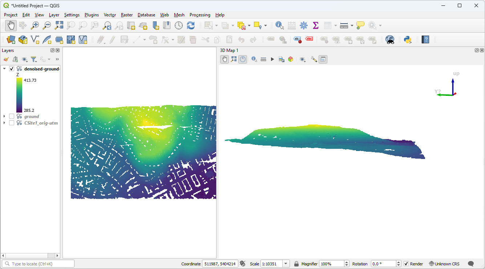

.. _ground:

Identifying ground
================================================================================

.. include:: ../../../includes/substitutions.rst

.. index:: ground, classification, filtering

This exercise uses PDAL to classify ground returns using the `Progressive
Morphological Filter (PMF)` technique.

.. note::

    This excerise is an adaptation of the :ref:`pcl_ground` tutorial on the
    PDAL website by Brad Chambers. You can find more detail and example
    invocations there.

Exercise
--------------------------------------------------------------------------------

The primary input for `Digital Terrain Model`_ generation is a point cloud with
ground vs. not-ground classifications. In this example, we will use an
algorithm provided by PDAL, the `Progressive Morphological Filter` technique to
generate a ground surface.

.. seealso::

    You can read more about the specifics of the PMF algorithm from the `paper
    <http://users.cis.fiu.edu/~chens/PDF/TGRS.pdf>`__, and you can read more
    about the PDAL implementation in the source code on `github
    <https://github.com/PDAL/PDAL/blob/master/filters/PMFFilter.cpp>`__.

.. _`Digital Terrain Model`: https://en.wikipedia.org/wiki/Digital_elevation_model

Command
................................................................................

Invoke the following command, substituting accordingly, in your `Docker
Quickstart Terminal`:

.. literalinclude:: ./ground-run-no-filter.txt
    :linenos:

.. image:: ../../../images/ground-run-command.png

As we can see, the algorithm does a great job of discriminating the points, but
there's a few issues.

.. image:: ../../../images/ground-classified-included.png

There's noise underneath the main surface that will cause us trouble when we
generate a terrain surface.

.. image:: ../../../images/ground-classified-included-side.png

Filtering
................................................................................

We do not yet have a satisfactory surface for generating a DTM.  When we
visualize the output of this ground operation, we notice there's still some
noise. We can stack the call to PMF with a call to a the `filters.outlier`
technique we learned about in :ref:`denoising`.

1. Let us start by removing the non-ground data:

.. literalinclude:: ./ground-run-ground-only.txt
    :linenos:
    :emphasize-lines: 5

.. note::

    The ``--extract=true`` option causes all data except ground-classified
    points to be removed from the set.

2. Now we will instead use the :ref:`translate_command` command to stack the
:ref:`filters.outlier` and :ref:`filters.pmf` stages:

.. literalinclude:: ./translate-run-ground-only.txt
   :linenos:
   
In this invocation, we have more control over the process. First the outlier
filter merely classifies outliers with a ``Classification`` value of 7. These
outliers are then ignored during PMF processing with the ``ignore`` option.
Finally, we add a range filter to extract only the ground returns (i.e.,
``Classification`` value of 2).
   
The result is a more accurate representation of the ground returns.

.. image:: ../../../images/ground-filtered.png
