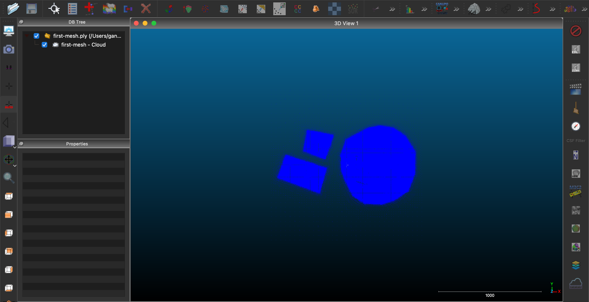

.. _workshop-meshing:

Creating surface meshes
================================================================================

.. include:: ../../../includes/substitutions.rst

.. index:: ground, classification, filtering

This exercise uses PDAL to create surface meshes. PDAL is able to use a number
of meshing filters: https://pdal.io/stages/filters.html#mesh. Three of these
are 'in the box', without needing plugins compiled. These are 2D Delaunay
triangulation, Greedy projection meshing and Poisson surface meshing.

In this exercise we'll create a Poisson surface mesh - a watertight isosurface
- from our input point cloud.

Exercise
--------------------------------------------------------------------------------

We will create mesh models of a building and its surrounds using an entwine
data input source.

After running each command, the output `.ply` file can be viewed in Meshlab or
CloudCompare.

.. seealso::

    PDAL implements Mischa Kazhdan's Poisson surface reconstruction algorithm.
    For details see `[Kazhdan2006]_`

.. note::

    This example will be using the output of using :ref:`workshop-clipping`
    exercise, specifically using ``stadium.las`` file.  Please produce that
    file by following that exercise before starting this one.

.. note::

    `writers.ply` will write out mesh vertices by default. In this exercise we
    set the attribute `faces="true"`. Try using the ply writer without it. Also,
    if you're using a machine with a lot of processing power, try increasing the
    `depth` parameter for a more detailed mesh.

Mesh Command
................................................................................

Invoke the following command, substituting accordingly, in your `Conda Shell`:

.. code-block:: console

    $ pdal translate -i ./exercises/analysis/clipping/stadium.las \
    -o ./exercises/analysis/meshing/first-mesh.ply \
    poisson --filters.poisson.depth=16 \
    --verbose 4

.. code-block:: doscon

    > pdal translate -i ./exercises/analysis/clipping/stadium.las ^
    -o ./exercises/analysis/meshing/first-mesh.ply ^
    poisson --filters.poisson.depth=16 ^
    --verbose 4

.. code-block:: console

    (PDAL Debug) Debugging...
    (pdal translate Debug) Executing pipeline in standard mode.
    (pdal translate filters.poisson Debug) Computing normal vectors

You can view the mesh in Cloud Compare, you should see something similar to

Filtering
................................................................................

If we want to just mesh a building, or just terrain, or both we can apply a
`range` filter based on point classification. These data have ground labeled as
class 2, and buildings as 6.

In this exercise we will create a poisson mesh surface of a building and the
ground surrounding it, using the same data subset as above and adding a
:ref:`filters.range` stage to limit the set of points used in mesh creation.

Command
................................................................................

Invoke the following command, substituting accordingly, in your `Conda Shell`:

.. code-block:: console

    $ pdal translate -i ./exercises/analysis/clipping/stadium.las \
    -o ./exercises/analysis/meshing/building-exercise.ply \
    range poisson \
    --filters.range.limits="Classification[2:2],Classification[6:6]" \
    --filters.poisson.depth=16 \
    --verbose 4

.. code-block:: doscon

    > pdal translate -i ept://http://act-2015-rgb.s3.amazonaws.com ^
    -o ./exercises/analysis/meshing/building-exercise.ply ^
    range poisson ^
    --filters.range.limits="Classification[2:2],Classification[6:6]" ^
    --filters.poisson.depth=16 ^
    --verbose 4

.. code-block:: console

    (PDAL Debug) Debugging...
    (pdal translate Debug) Executing pipeline in standard mode.
    (pdal translate filters.poisson Debug) Computing normal vectors
