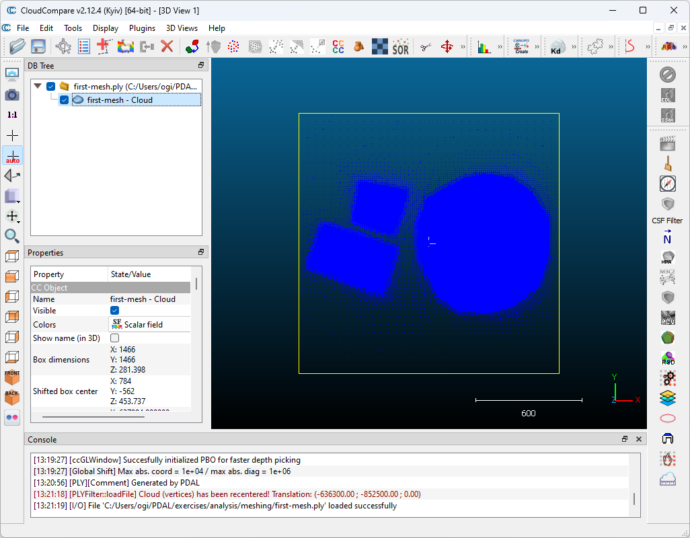

.. _workshop-meshing:

Creating surface meshes
================================================================================

.. include:: ../../../includes/substitutions.rst

.. index:: ground, classification, filtering

This exercise uses PDAL to create surface meshes. PDAL is able to use a number of
meshing filters: https://pdal.io/stages/filters.html#mesh. Three of these are 'in
the box', without needing plugins compiled. These are 2D Delaunay triangulation,
Greedy projection meshing and Poisson surface meshing.

In this exercise we'll create a Poisson surface mesh - a watertight isosurface -
from our input point cloud.

Exercise
--------------------------------------------------------------------------------

We will create mesh models of a building and its surrounds using an entwine data
input source.

After running each command, the output `.ply` file can be viewed in Meshlab or
CloudCompare.

.. seealso::

  PDAL implements Mischa Kazhdan's Poisson surface reconstruction algorithm. For
  details see `[Kazhdan2006]_`

.. note::

  `writers.ply` will write out mesh vertices by default. In this exercise we
  set the attribute `faces="true"`. Try using the ply writer without it. Also,
  if you're using a machine with a lot of processing power, try increasing the
  `depth` parameter for a more detailed mesh.

Command
................................................................................

Invoke the following command, substituting accordingly, in your `Conda Shell`:

.. literalinclude:: ./meshing.txt
    :linenos:

.. literalinclude:: ./meshing-win.txt
    :linenos:    

.. image:: ../../../images/meshing.png
    :target: ../../../../_images/meshing.png

You can view the mesh in Cloud Compare, you should see something similar to

Filtering
................................................................................

If we want to just mesh a building, or just terrain, or both we can apply a `range`
filter based on point classification. These data have ground labelled as class 2,
and buildings as 6.

In this exercise we will create a poisson mesh surface of a building and the ground
surrounding it, using the same data subset as above and adding a :ref:`filters.range`
stage to limit the set of points used in mesh creation.

Command
................................................................................

Invoke the following command, substituting accordingly, in your `Conda Shell`:

.. literalinclude:: ./meshing-buildings.txt
    :linenos:

.. literalinclude:: ./meshing-buildings-win.txt
    :linenos:

.. image:: ../../../images/meshing-buildings.png
    :target: ../../../../_images/meshing-buildings.png
