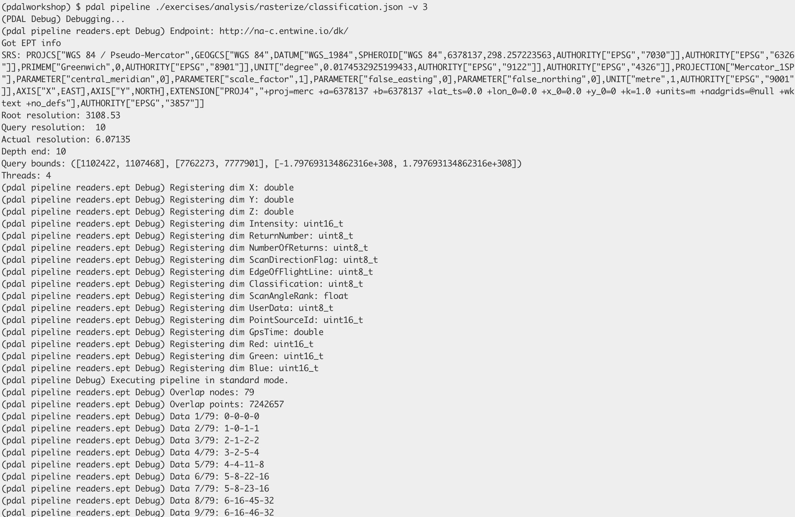
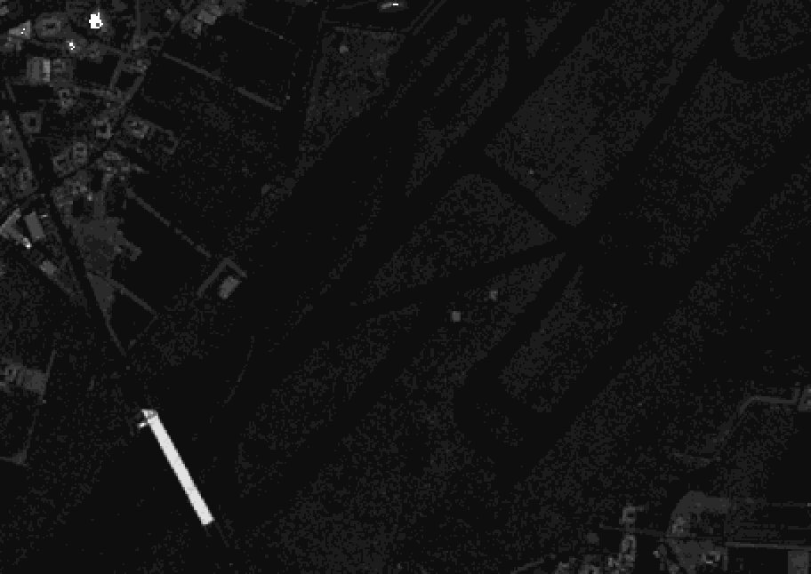
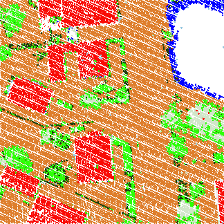
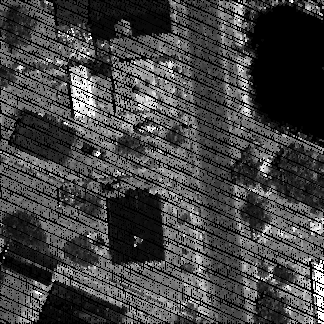

.. _workshop-rasterize:

Rasterizing Attributes
================================================================================

.. include:: ../../../includes/substitutions.rst

.. index:: classification, intensity, rasterization

This exercise uses PDAL to generate a raster surface using a fully classified
point cloud with PDAL's :ref:`writers.gdal`.

Exercise
--------------------------------------------------------------------------------

.. note::
    The exercise fetches its data from a `Greyhound`_ service that organizes the
    point cloud collection for the entire country of Denmark. You can view the
    data online at http://potree.entwine.io/data/denmark.html

.. _`Digital Terrain Model`: https://en.wikipedia.org/wiki/Digital_elevation_model

Command
................................................................................

Invoke the following command, substituting accordingly, in your `OSGeo4W Shell`:

PDAL capability to generate rasterized output is provided by the :ref:`writers.gdal` stage.
There is no :ref:`application <apps>` to drive this stage, and we must use a pipeline.

Pipeline breakdown
................................................................................

.. literalinclude:: ./classification.json
    :highlight-lines: 3-7

.. note::

    This pipeline is available in your workshop materials in the
    ``./exercises/analysis/dtm/dtm.json`` file. Make sure to edit the
    filenames to match your paths.

1. Reader
~~~~~~~~~~~~~~~~~~~~~~~~~~~~~~~~~~~~~~~~~~~~~~~~~~~~~~~~~~~~~~~~~~~~~~~~~~~~~~~~

.. literalinclude:: ./classification.json
    :lines: 3-7

The data is read from a readers.greyhound server that hosts the Denmark data.
We’re going to download a small patch of data by the Copenhagen airport that is
the “full depth” of the tree.

2. :ref:`writers.gdal`
~~~~~~~~~~~~~~~~~~~~~~~~~~~~~~~~~~~~~~~~~~~~~~~~~~~~~~~~~~~~~~~~~~~~~~~~~~~~~~~~

The :ref:`writers.gdal` writer that bins the point cloud data with classification
values.

.. literalinclude:: ./classification.json
    :lines: 7-14

Execution
................................................................................

Issue the :ref:`pipeline <pipeline>` operation to execute the interpolation:

.. literalinclude:: ./classify-command.txt

.. literalinclude:: ./classification.json

Visualization
................................................................................

    Basic interpolation of data with :ref:`writers.gdal` will output raw
    classification values into the resulting raster file. We will need to add a
    color ramp to the data for a satisfactory preview.

Unfortunately, this doesn’t give us a very satisfactory image to view. The
reason is there is no color ramp associated with the file, and we’re looking at
pixel values with values from 0-31 according to the ASPRS LAS specification.

We want colors that correspond to the classification values a bit more
directly. We can use a color ramp to assign explicit values. :ref:`qgis` allows us to
create a text file color ramp that gdaldem can consume to apply colors to the
data.

.. literalinclude:: ./ramp.txt
   :linenos:

With the ramp, we can use `gdaldem`_ to apply it to a new image:

.. literalinclude:: ./gdaldem-run-command.txt
   :linenos:

    The use of ``-exact_color_entry`` for gdaldem ensures that specific
    classification values are given the requested color. For categorical
    data such as a classification surface, interpolated output would look
    poor.

Intensity
~~~~~~~~~~~~~~~~~~~~~~~~~~~~~~~~~~~~~~~~~~~~~~~~~~~~~~~~~~~~~~~~~~~~~~~~~~~~~~~~

With PDAL’s ability to override pipeline via commands, we can generate a
relative intensity image:

.. literalinclude:: ./intensity-run-command.txt
   :linenos:

    The same pipeline can be used to generate a preview image of the Intensity
    channel of the data by overriding pipeline arguments at the command line.

Notes
--------------------------------------------------------------------------------

1. :ref:`writers.gdal`  can output any dimension PDAL can provide, but it is is
   up to the user to interpolate the values. For categorical data, neighborhood
   smoothing might produce undesirable results, for example.

2. :ref:`pipeline` contains more information about overrides and organizing complex pipelines.

.. _`TIN`: https://en.wikipedia.org/wiki/Triangulated_irregular_network
.. _`gdaldem`: http://www.gdal.org/gdaldem.html
.. _`Greyhound`: https://greyhound.io
