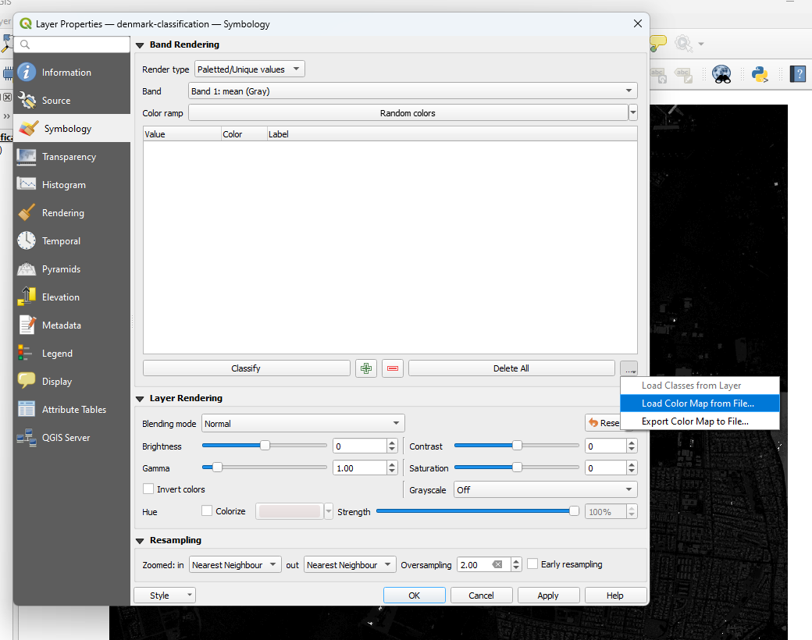
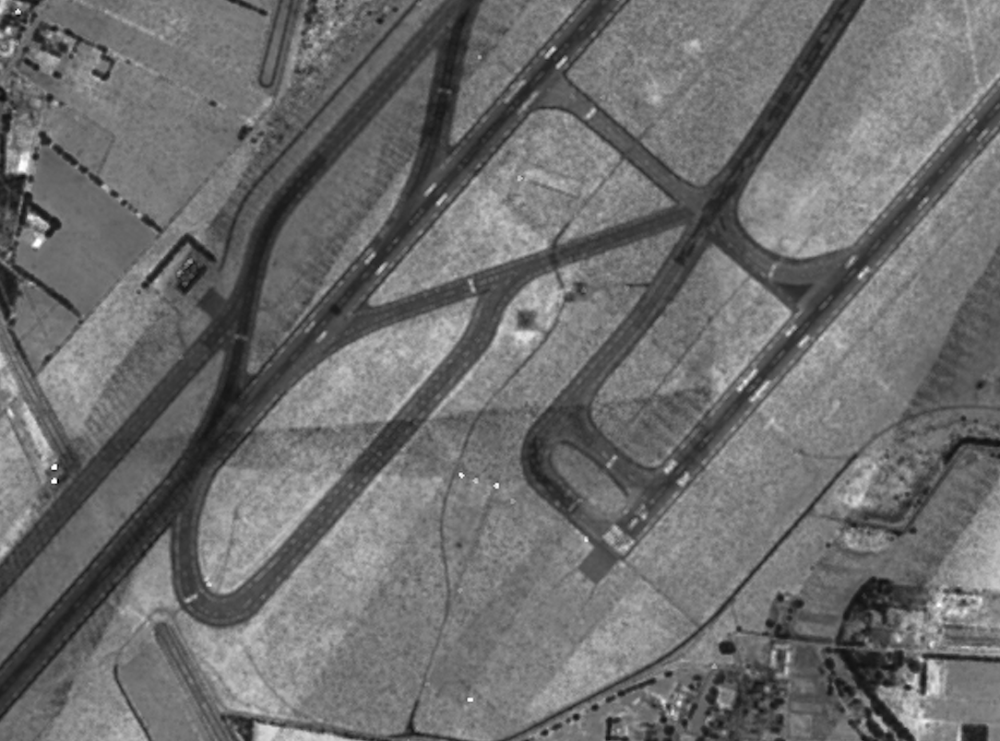

.. _workshop-rasterize:

Rasterizing Attributes
================================================================================

.. include:: ../../../includes/substitutions.rst

.. index:: classification, intensity, rasterization

This exercise uses PDAL to generate a raster surface using a fully classified
point cloud with PDAL's :ref:`writers.gdal`.

Exercise
--------------------------------------------------------------------------------

.. note::
    The exercise fetches its data from a `Entwine`_ service that organizes the
    point cloud collection for the entire country of Denmark. You can view the
    data online at http://potree.entwine.io/data/denmark.html

.. _`Digital Terrain Model`: https://en.wikipedia.org/wiki/Digital_elevation_model

Command
................................................................................

PDAL capability to generate rasterized output is provided by the
:ref:`writers.gdal` stage. There is no :ref:`application <apps>` to drive this
stage, and we must use a pipeline.

Pipeline breakdown
................................................................................

.. literalinclude:: ./classification.json

.. note::

    This pipeline is available in your workshop materials in the
    ``./exercises/analysis/rasterize/classification.json`` file. Make sure to
    edit the filenames to match your paths.

1. Reader
~~~~~~~~~~~~~~~~~~~~~~~~~~~~~~~~~~~~~~~~~~~~~~~~~~~~~~~~~~~~~~~~~~~~~~~~~~~~~~~~

.. literalinclude:: ./classification.json
    :lines: 3-8

The data is read from a EPT resource that contains the Denmark data.
We're going to download a small patch of data by the Copenhagen airport area
that is the limited to a spatial resolution of 5m.

2. :ref:`writers.gdal`
~~~~~~~~~~~~~~~~~~~~~~~~~~~~~~~~~~~~~~~~~~~~~~~~~~~~~~~~~~~~~~~~~~~~~~~~~~~~~~~~

The :ref:`writers.gdal` writer that bins the point cloud data with
classification values.

.. literalinclude:: ./classification.json
    :lines: 9-16

Execution
................................................................................

Issue the :ref:`pipeline <pipeline>` operation to execute the interpolation:

.. code-block:: console

    $ pdal pipeline ./exercises/analysis/rasterize/classification.json -v 3
    (PDAL Debug) Debugging...
    (pdal pipeline readers.ept Debug) Root resolution: 3108.53
    Query resolution:  5
    Actual resolution: 3.03568
    Depth end: 11
    Query bounds: ([1402800, 1408800], [7478000, 7483000], [-1.797693134862316e+308, 1.797693134862316e+308])
    Threads: 15
    (pdal pipeline Debug) Executing pipeline in stream mode.

Visualization
................................................................................

Basic interpolation of data with :ref:`writers.gdal` will output raw
classification values into the resulting raster file. We will need to add a
color ramp to the data for a satisfactory preview.

Unfortunately, this does not give us a very satisfactory image to view. The
reason is there is no color ramp associated with the file, and we're looking at
pixel values with values from 0-31 according to the ASPRS LAS specification.

We want colors that correspond to the classification values a bit more
directly. We can use a color ramp to assign explicit values. :ref:`qgis` allows
us to create a text file color ramp that gdaldem can consume to apply colors to
the data.

.. literalinclude:: ./ramp.txt
   :linenos:

With this ramp, you can load the color values into QGIS as a color ramp if you
change the layer to Palatted/Unique Values, and then load the color ramp file:

With the ramp, we can also use `gdaldem`_ to apply it to a new image:

.. code-block:: console

    $ gdaldem color-relief denmark-classification.tif ramp.txt classified-color.png -of PNG

.. image:: ../../../images/rasterization-colored-classification.png
    :target: ../../../../_images/rasterization-colored-classification.png

Intensity
~~~~~~~~~~~~~~~~~~~~~~~~~~~~~~~~~~~~~~~~~~~~~~~~~~~~~~~~~~~~~~~~~~~~~~~~~~~~~~~~

With PDAL's ability to override pipeline via commands, we can generate a
relative intensity image:

.. code-block:: console

    $ pdal pipeline ./exercises/analysis/rasterize/classification.json \
    --writers.gdal.dimension="Intensity" \
    --writers.gdal.data_type="float" \
    --writers.gdal.filename="intensity.tif" \
    -v 3
    (PDAL Debug) Debugging...
    (pdal pipeline readers.ept Debug) Root resolution: 3108.53
    Query resolution:  5
    Actual resolution: 3.03568
    Depth end: 11
    Query bounds: ([1402800, 1408800], [7478000, 7483000], [-1.797693134862316e+308, 1.797693134862316e+308])
    Threads: 15
    (pdal pipeline Debug) Executing pipeline in stream mode.
    $ gdal_translate intensity.tif intensity.png -of PNG
    Input file size is 1201, 1001
    Warning 6: PNG driver doesn't support data type Float32. Only eight bit (Byte) and sixteen bit (UInt16) bands supported. Defaulting to Byte

    0...10...20...30...40...50...60...70...80...90...100 - done.

.. code-block:: doscon

    > pdal pipeline ./exercises/analysis/rasterize/classification.json ^
    --writers.gdal.dimension="Intensity" ^
    --writers.gdal.data_type="float" ^
    --writers.gdal.filename="intensity.tif" ^
    -v 3
    (PDAL Debug) Debugging...
    (pdal pipeline readers.ept Debug) Root resolution: 3108.53
    Query resolution:  5
    Actual resolution: 3.03568
    Depth end: 11
    Query bounds: ([1402800, 1408800], [7478000, 7483000], [-1.797693134862316e+308, 1.797693134862316e+308])
    Threads: 15
    (pdal pipeline Debug) Executing pipeline in stream mode.
    > gdal_translate intensity.tif intensity.png -of PNG
    Input file size is 1201, 1001
    Warning 6: PNG driver doesn't support data type Float32. Only eight bit (Byte) and sixteen bit (UInt16) bands supported. Defaulting to Byte

    0...10...20...30...40...50...60...70...80...90...100 - done.

The same pipeline can be used to generate a preview image of the Intensity
channel of the data by overriding pipeline arguments at the command line.

Notes
--------------------------------------------------------------------------------

1. :ref:`writers.gdal`  can output any dimension PDAL can provide, but it is is
   up to the user to interpolate the values. For categorical data, neighborhood
   smoothing might produce undesirable results, for example.

2. :ref:`pipeline` contains more information about overrides and organizing
   complex pipelines.

.. _`TIN`: https://en.wikipedia.org/wiki/Triangulated_irregular_network
.. _`gdaldem`: http://www.gdal.org/gdaldem.html
.. _`Entwine`: https://entwine.io
