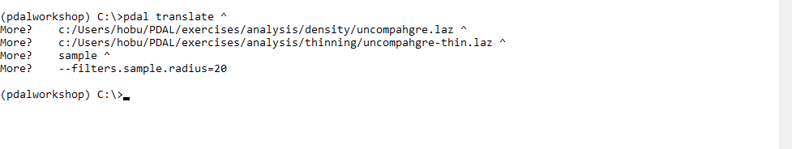
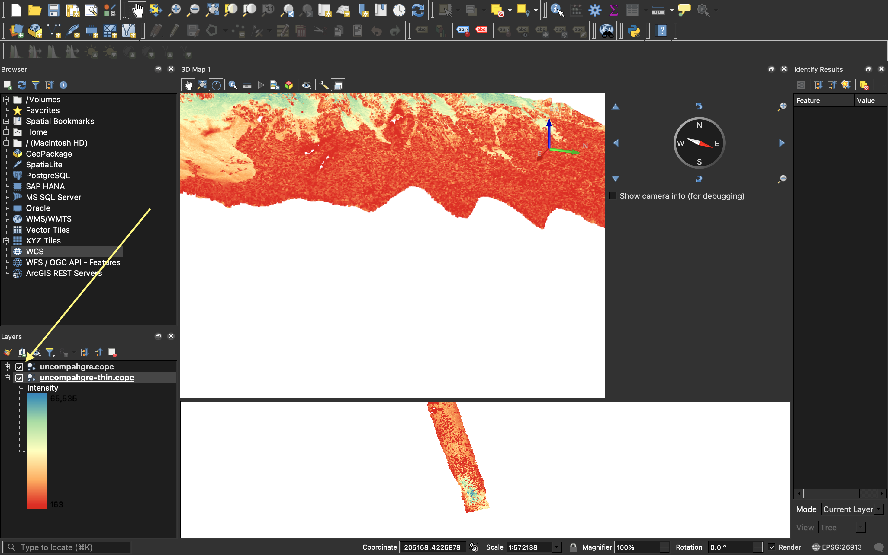
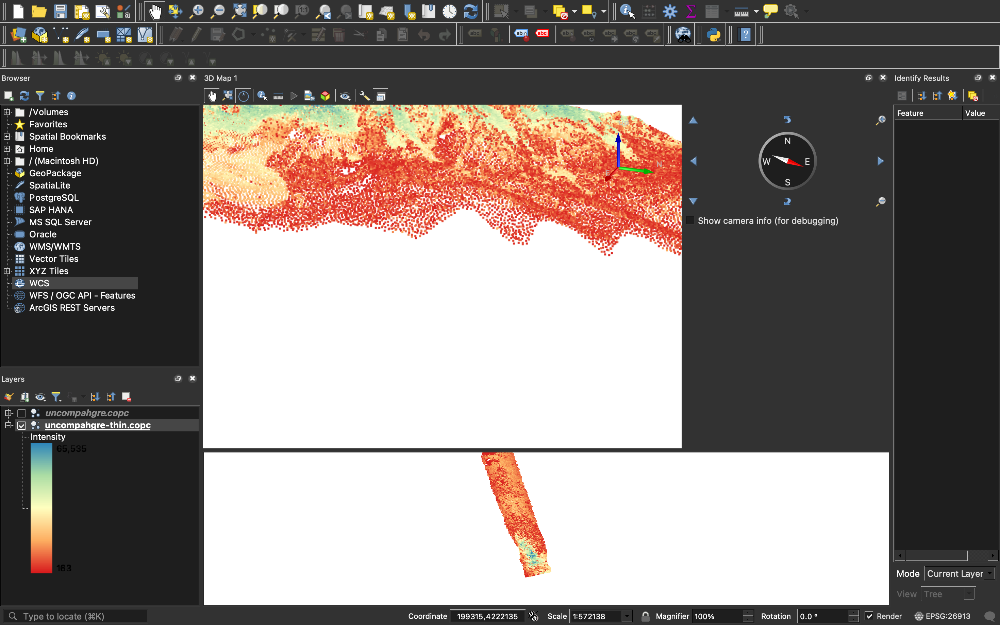

.. _workshop-thinning:

Thinning
================================================================================

.. include:: ../../../includes/substitutions.rst

.. index:: sample, thinning, poisson, voxel sampling, density

This exercise uses PDAL to subsample or thin point cloud data. This might be
done to accelerate processing (less data), normalize point density, or ease
visualization.

Exercise
--------------------------------------------------------------------------------

As we showed in the :ref:`density` exercise, the points in the `uncompahgre.laz` file
are not evenly distributed across the entire collection. While we will not get into
reasons why that particular property is good or bad, we note there are three different
sampling strategies we could choose. We can attempt to preserve shape, we can try to
randomly sample, and we can attempt to normalize posting density. PDAL
provides capability for all three:

* Poisson using the :ref:`filters.sample`

* Random using a combination of :ref:`filters.decimation` and :ref:`filters.randomize`

* Voxel using :ref:`filters.voxelgrid`

In this exercise, we are going to thin with the Poisson method, but the concept
should operate similarly for the :ref:`filters.voxelgrid` approach too.

.. figure:: ../../../images/thinning-overview.png
    :target: ../../../../_images/thinning-overview.png

    Thinning strategies available in PDAL

Command
................................................................................

Invoke the following command, substituting accordingly, in your `Docker
Quickstart Terminal`:

.. literalinclude:: ./thinning-run-dartsample.txt
    :linenos:

Visualization
................................................................................

http://plas.io has the ability to switch on/off multiple data sets, and we
are going to use that ability to view both the ``uncompahgre.laz`` and the
``uncompahgre-thin.laz`` file.

    Selecting multiple data sets in http://plas.io

.. figure:: ../../../images/thinning-full-res.png
    :target: ../../../../_images/thinning-select-data.png

    Full resolution Uncompahgre data set

    Uncompahgre thinned at a radius of 20m

Notes
--------------------------------------------------------------------------------

1. Poisson sampling is non-destructive. Points that are filtered with
   :ref:`filters.sample` will retain all attribute information.
