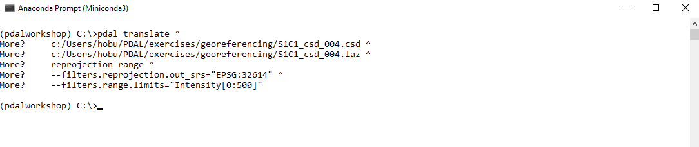
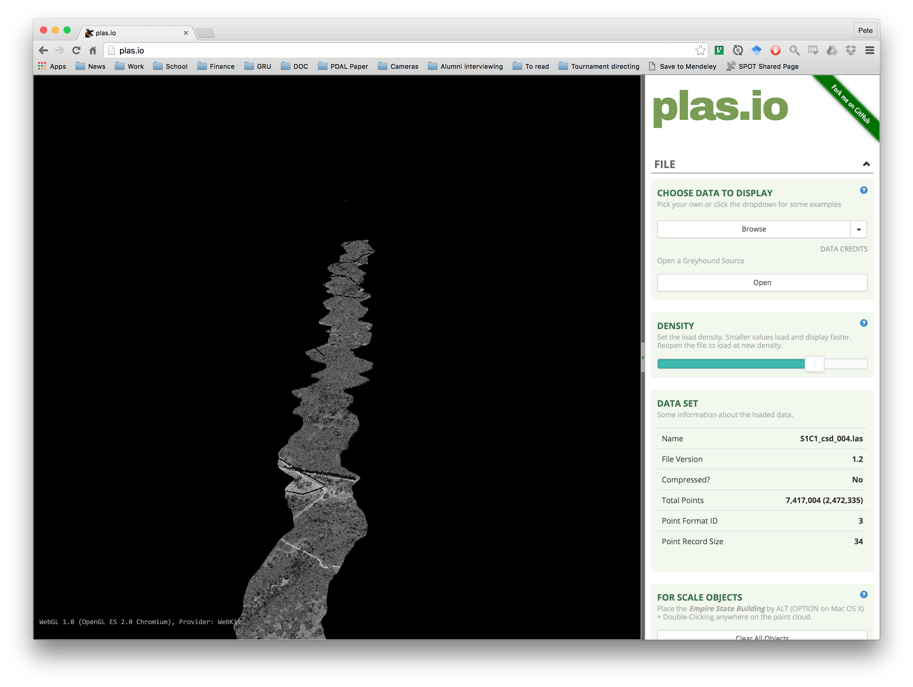

.. _georeferencing:

Georeferencing
=================

.. index:: georeferencing, Optech, RIEGL, GNSS/IMU, csd, UTM, WGS84

.. include:: ../../includes/substitutions.rst

As discussed :ref:`in the introduction <georeferencing-introduction>`, laser
returns from a mobile |LiDAR| system must be georeferenced, i.e. placed into a
local or global coordinate system by combining data from the laser and from a
GNSS/IMU.  As of this writing, PDAL does **not** include generic georeferencing
tools — this is considered future work.  However, the |Optech| csd file format
includes both laser return and GNSS/IMU data in the same file, and the PDAL csd
reader includes built in georeferencing support.

In this section, we will demonstrate how to georeference an |Optech| csd file
and reproject that file into a UTM projection.

.. note::

   `Optech's <http://www.teledyneoptech.com/>`__ csd format is just one of
   several vendor-specific data formats PDAL supports; we also support data
   files directly from |RIEGL| sensors and from several project-specific
   government platforms.

Exercise
-----------

The file `S1C1_csd_004.csd` contains airborne data from an |Optech| sensor.
Without georeferencing these points, they would be impossible to interpret —
once they are georeferenced, we will be able to inspect and analyze these
points like any other point cloud.

In addition to georeferencing, we are going to make two other tweaks to our
point cloud:

- The point cloud is, by default, in |WGS84|, but we will reproject these
  points to a |UTM| coordinate system for visualization purposes.

- Because these are raw data coming from the sensor, these data are noisy.  In
  particular, there are a few points *very* close to the sensor which were
  probably caused by air returns or laser light reflecting off of part of the
  airplane or sensor.  These points have very high intensity values, which will
  screw up our visualization.  We will use the :ref:`filters.range` PDAL filter
  to drop all points with very high intensity values.

.. note::

    These data were provided by Dr. Craig Glennie and were collected by
    |NCALM|, the National Center for Airborne Laser Mapping.  The collect area
    is southwest of Austin, TX.

Command
.............

Invoke the following command, substituting accordingly, into your `OSGeo4W
Shell`:

.. literalinclude:: georeferencing-command.txt

Visualization
.................

View your georeferenced point cloud in http://plas.io.

    Our airborne laser point cloud after georeferencing, reprojection, and
    intensity filtering.
