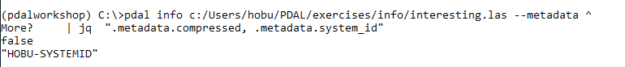

.. _workshop-metadata:

Printing file metadata
================================================================================

.. include:: ../../includes/substitutions.rst

.. index:: metadata, coordinate system, spatial reference system

Exercise
--------------------------------------------------------------------------------

This exercise uses PDAL to print metadata information. Issue the
following command in your `Conda Shell`.

.. literalinclude:: ./metadata-command.txt
    :linenos:

.. image:: ../../images/info-interesting-metadata.png

.. note::

    PDAL :ref:`metadata <metadata>` is returned a in a tree
    structure corresponding to processing pipeline that produced
    it.

.. seealso::

    Use the |JSON| processing capabilities of your favorite processing
    software to selectively access and manipulate values.

    * `Python JSON library`_
    * `jsawk`_ (like ``awk`` but for JSON data)
    * `jq`_ (command line processor for JSON)
    * `Ruby JSON library`_

.. _`Python JSON library`: https://docs.python.org/2/library/json.html
.. _`jsawk`: https://github.com/micha/jsawk
.. _`jq`: https://stedolan.github.io/jq/
.. _`Ruby JSON library`: http://ruby-doc.org/stdlib-2.0.0/libdoc/json/rdoc/JSON.html

Structured Metadata Output
................................................................................

Many command-line utilities output their data in a human-readable custom
format. The downsides to this approach are significant. PDAL was designed to be
used in the context of other software tools driving it. For example, it is
quite common for PDAL to be used in data validation scenarios. Other programs
might need to inspect information in PDAL's output and then act based on the
values. A human-readable format would mean that downstream program would need
to write a parser to consume PDAL's special format.

|JSON| provides a nice balance between human- and machine- readable, but
even then it can be quite hard to find what you're looking for, especially
if the output is long. ``pdal`` command output used in conjunction with a
JSON parsing tool like ``jq`` provide a powerful inspection combination.

For example, we might only care about the ``system_id`` and ``compressed``
flag for this particular file. Our simple ``pdal info --metadata`` command
gives us that, but it also gives us a bunch of other stuff we don't need
at the moment either. Let's focus on extracting what we want using the
``jq`` command.

.. literalinclude:: ./metadata-command-jq.txt
    :linenos:

.. literalinclude:: ./metadata-command-jq-win.txt
    :linenos:

.. note::

    PDAL's JSON output is very powerfully combined with the processing
    capabilities of other programming languages such as JavaScript or Python.
    Both of these languages have excellent built-in tools for consuming
    JSON, along with plenty of other features to allow you to do something
    with the data inside the data structures. As we will see later
    in the workshop, this PDAL feature is one that makes construction
    of custom data processing workflows with PDAL very convenient.

Notes
--------------------------------------------------------------------------------

1. PDAL uses |JSON| as the exchange format when printing information from :ref:`info_command`.  JSON provides human and machine-readable text data.

2. The PDAL :ref:`metadata document <metadata>` contains background and
   information about specific metadata entries and what they mean.

3. Metadata available for a given file depends on the stage that produces the data.
   :ref:`Readers <readers>` produce same-named values where possible, but it is
   common that variables are different. :ref:`Filters <filters>` and even
   :ref:`writers <writers>` can also produce metadata entries.

4. Spatial reference system or coordinate system information is a kind of
   special metadata.  Spatial references are come directly from source data
   or are provided via options in PDAL.
