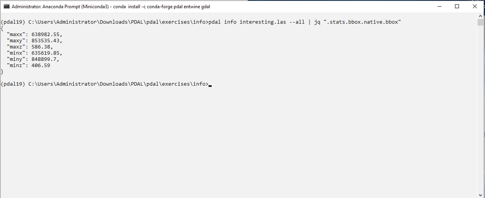

.. _near:

Searching near a point
================================================================================

.. include:: ../../includes/substitutions.rst

.. index:: nearest, nearby, query, search

Exercise
--------------------------------------------------------------------------------

This exercise uses PDAL to find points near a given search location. Our
scenario is a simple one -- we want to find the two points nearest the midpoint
of the bounding cube of our ``interesting.las`` data file.

First we need to find the midpoint of the bounding cube. To do that, we need to
print the ``--all`` info for the file and look for the ``bbox`` output:

.. literalinclude:: ./near-command-1.txt

Find the average the ``X``, ``Y``, and ``Z`` values:

::

    x = 635619.85 + (638982.55 - 635619.85)/2 = 637301.20
    y = 848899.70 + (853535.43 - 848899.70)/2 = 851217.57
    z = 406.59 + (586.38 - 406.59)/2 = 496.49

With our "center point", issue the ``--query`` option to ``pdal info``
and return the three nearest points to it:

.. literalinclude:: ./near-command-2.txt

.. note::

    The ``/3`` portion of our query string tells the ``query``
    command to give us the 3 nearest points. Adjust this value to
    return data in closest-distance ordering.

.. image:: ../../images/info-near-point.png

Notes
--------------------------------------------------------------------------------

1. PDAL uses `JSON`_ as the exchange format when printing information from
   :ref:`info_command`.  JSON is a structured, human-readable format that is
   much simpler than its `XML`_ cousin.

2. The ``--query`` option of :ref:`info_command` constructs a `KD-tree`_ of the
   entire set of points in memory. If you have really large data sets, this
   isn't going to work so well, and you will need to come up with a different
   solution.

.. _`KD-tree`: https://en.wikipedia.org/wiki/K-d_tree

.. _`CSV`: https://en.wikipedia.org/wiki/Comma-separated_values
.. _`JSON`: https://en.wikipedia.org/wiki/JSON
.. _`XML`: https://en.wikipedia.org/wiki/XML
