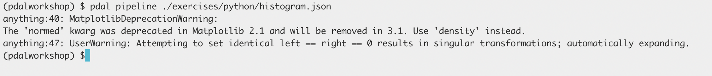
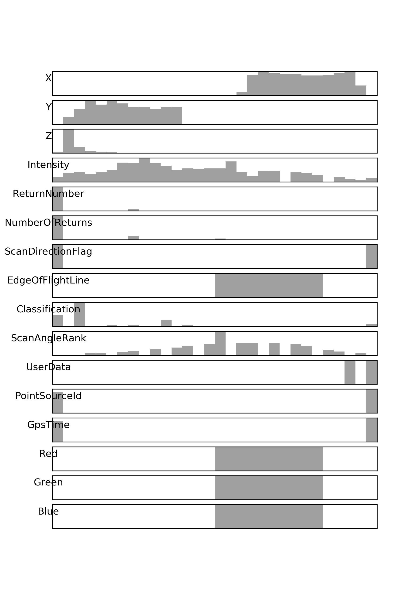

.. _workshop-histogram:

Plotting a histogram
================================================================================

.. include:: ../../includes/substitutions.rst

Exercise
--------------------------------------------------------------------------------

PDAL doesn't provide every possible analysis option, but it strives to make it
convenient to link PDAL to other places with substantial functionality.  One of
those is the Python/Numpy universe, which is accessed through PDAL's
:ref:`python` bindings and the :ref:`filters.programmable` and
:ref:`filters.predicate` filters. These tools allow you to manipulate point
cloud data with convenient Python tools rather than constructing substantial
C/C++ software to achieve simple tasks, compute simple statistics, or
investigate data quality issues.

This exercise uses PDAL to create a histogram plot of all of the dimensions of
a file. `matplotlib`_ is a Python package for plotting graphs and figures, and
we can use it in combination with the :ref:`python` bindings for PDAL to create
a nice histogram. These histograms can be useful diagnostics in an analysis
pipeline. We will combine a Python script to make a histogram plot with a
:ref:`pipeline_command`.

.. note::

    Python allows you to enhance and build functionality that you can use
    in the context of other :ref:`pipeline` operations.

PDAL Pipeline
................................................................................

We're going to create a PDAL :ref:`pipeline` to tell PDAL to run our Python
script in a :ref:`filters.programmable` stage.

.. literalinclude:: ./histogram.json
   :linenos:

.. note::

    This pipeline is available in your workshop materials in the
    ``./exercies/python/histogram.json`` file.

Python script
................................................................................

The following Python script will do the actual work of creating the histogram
plot with `matplotlib`_. Store it as ``histogram.py`` next to the
``histogram.json`` :ref:`pipeline` file above.  The script is mostly regular
Python except for the ``ins`` and ``outs`` arguments to the function -- those
are special arguments that PDAL expects to be a dictionary of Numpy
dictionaries.

.. note::

    This Python file is available in your workshop materials in the
    ``./exercies/python/histogram.py`` file.

.. literalinclude:: ./histogram.py
   :linenos:
   :emphasize-lines: 34-40

Run ``pdal pipeline``
................................................................................

.. literalinclude:: ./histogram-command.txt
   :linenos:

Output
................................................................................

Notes
--------------------------------------------------------------------------------

.. index:: histogram, Python, matplotlib, Numpy

1. :ref:`writers.null` simply swallows the output of the pipeline. We
   don't need to write any data.

2. The ``pdalargs`` JSON needs to be escaped because a valid Python
   dictionary entry isn't always valid JSON.

.. _`matplotlib`: https://matplotlib.org/
