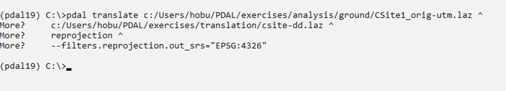
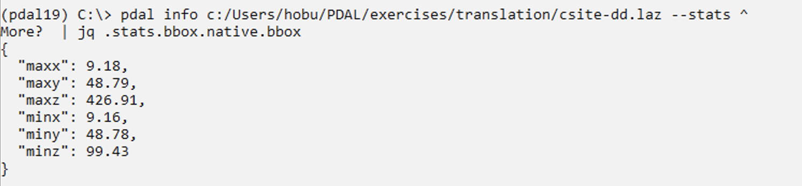
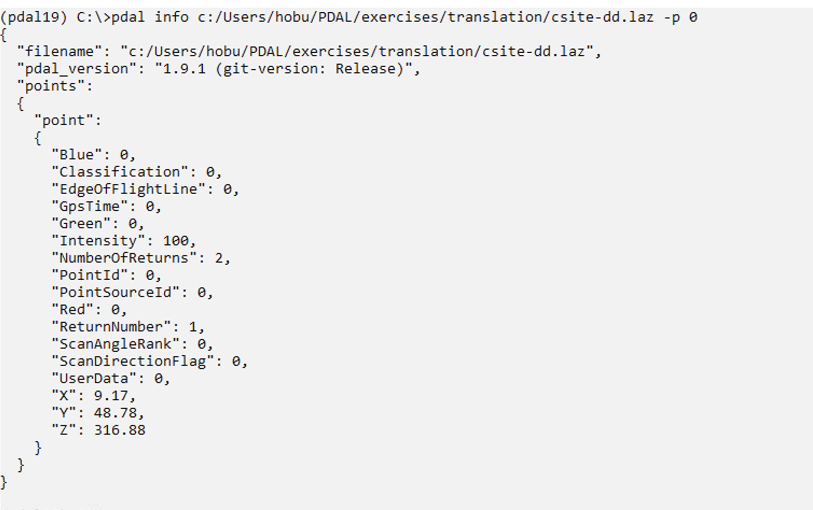
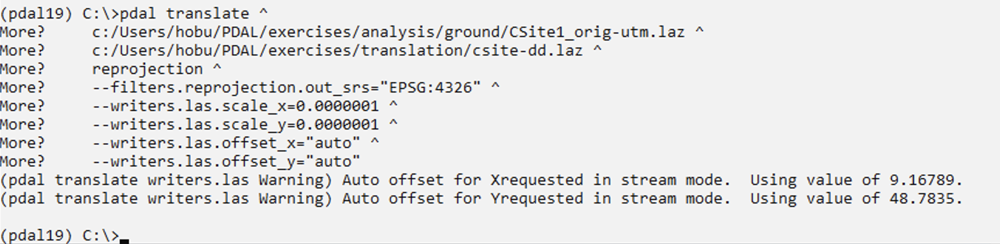
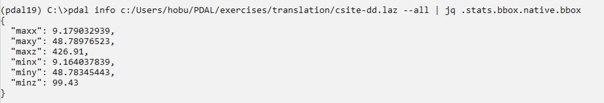

.. _reprojection:

Reprojection
================================================================================

.. index:: Reprojection, WGS84, UTM

.. include:: ../../includes/substitutions.rst

Exercise
--------------------------------------------------------------------------------

This exercise uses PDAL to reproject |ASPRSLAS| data

.. _`LASzip`: http://laszip.org
.. _`ASPRS LAS`: http://www.asprs.org/Committee-General/LASer-LAS-File-Format-Exchange-Activities.html

Issue the following command in your |Terminal|:

.. literalinclude:: ./reprojection-command-1.txt
    :linenos:

.. literalinclude:: ./reprojection-command-1-win.txt
    :linenos:

Unfortunately this doesn't produce the intended results for us. Issue the following
``pdal info`` command to see why:

::

        pdal info ./exercises/translation/csite-dd.laz --all \
            | jq .stats.bbox.native.bbox

::

        pdal info ./exercises/translation/csite-dd.laz --all ^
            | jq .stats.bbox.native.bbox

``--all`` dumps all :ref:`info_command` information about the file, and we
can then use the |jq| command to extract out the "native" (same coordinate
system as the file itself) bounding box. As we can see, the problem is
we only have two decimal places of precision on the bounding box. For
geographic coordinate systems, this isn't enough precision.

Printing the first point confirms this problem:

Some formats, like :ref:`writers.las` do not automatically set scaling
information. PDAL cannot really do this for you because there are a number
of ways to trip up. For latitude/longitude data, you will need to set
the scale to smaller values like ``0.0000001``. Additionally, LAS uses
an offset value to move the origin of the value. Use PDAL to set that
to ``auto`` so you don't have to compute it.

.. literalinclude:: ./reprojection-command-2.txt
    :linenos:

.. literalinclude:: ./reprojection-command-2-win.txt
    :linenos:

Run the `pdal info` command again to verify the ``X``, ``Y``, and ``Z``
dimensions:

Notes
--------------------------------------------------------------------------------

1. :ref:`filters.reprojection` will use whatever coordinate system is defined
   by the point cloud file, but you can override it using the ``in_srs``
   option. This is useful in situations where the coordinate system
   is not correct, not completely specified, or your system doesn't have
   all of the required supporting coordinate system dictionaries.

2. PDAL uses |Proj.4| library for reprojection. This library includes
   the capability to do both vertical and horizontal datum transformations.
