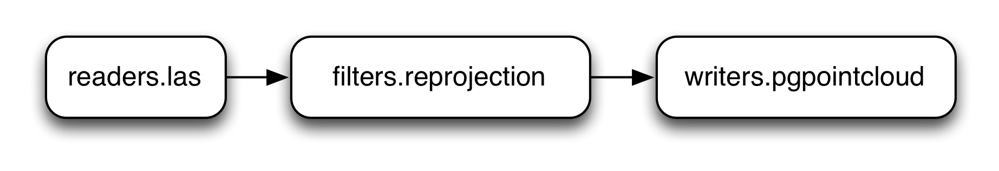

.. _pdal-introduction:

Introduction to PDAL
================================================================================

.. include:: ./includes/substitutions.rst

What is PDAL?
--------------------------------------------------------------------------------

|PDAL| is Point Data Abstraction Library, and it is an open source software for
translating and processing point cloud data. It is not limited to just |LiDAR|
data, although the focus and impetus for many of the tools have their origins
in LiDAR.

What is its big idea?
................................................................................

Say you wanted to load some `ASPRS LAS`_ (the most common LiDAR binary format)
data into a database, but you wanted to transform it into a common coordinate
system along the way. One option would be to write a specialized program that
reads LAS data, reprojects it as necessary, and then handles the necessary
operations to insert the data in the appropriate format in the database.

This approach has a distinct disadvantage. It is a kind of one-off, and it
could quickly spiral out of control as you look to add new little tweaks and
features to the operation. It ends up being very specific, and it
does not allow you to easily reuse the component that reads the LAS data
separately from the component that transforms the data.

Little programs that encapsulate specific functionality that can be composed
together provide a more streamlined approach to the problem. They allow for
reuse, composition, and separation of concerns.  PDAL views point cloud
processing operations as a pipeline composed as a series of stages.  You might
have a simple pipeline composed of a :ref:`LAS Reader <readers.las>` stage, a
:ref:`Reprojection <filters.reprojection>` stage, and a :ref:`PostgreSQL Writer
<writers.pgpointcloud>`, for example. Rather than writing a single, monolithic
specialized program to perform this operation, you can dynamically compose it
as a sequence of steps or operations.

    A simple PDAL pipeline composed of a reader, filter, and writer
    stages.

PDAL can compose intermediate stages, for operations such as filtering,
clipping, tiling, transforming into a processing pipeline and reuse as
necessary. It allows you to define these pipelines as `JSON`_ or `XML`_, and it
provides a command, :ref:`pipeline_command`, to allow you to execute them.

.. note::

    Raster processing tools often compose operations with this approach.
    PDAL conceptually steals its pipeline modeling from |GDAL|'s
    `Virtual Raster Format`_.

.. _`Virtual Raster Format`: http://www.gdal.org/gdal_vrttut.html
.. _`JSON`: https://en.wikipedia.org/wiki/JSON
.. _`XML`: https://en.wikipedia.org/wiki/XML

How is it different than other tools?
................................................................................

LAStools
~~~~~~~~~~~~~~~~~~~~~~~~~~~~~~~~~~~~~~~~~~~~~~~~~~~~~~~~~~~~~~~~~~~~~~~~~~~~~~~~

.. index:: LAStools

One of the most common open source processing tool suites available is `LAStools`_
from `Martin Isenburg`_. PDAL is different in philosophy in a number of important
ways:

1. All components of PDAL are released as open source software under an `OSI`_-approved
   license.
2. PDAL allows application developers to provide proprietary extensions that
   act as stages in processing pipelines. These might be things like custom format
   readers, specialized exploitation algorithms, or entire processing pipelines.
3. PDAL must be able to generically operate on point cloud data of any format --
   not just `ASPRS LAS`_. `LAStools`_ can read and write formats other than LAS, but
   its view of formats it understands is within the context of the dimension
   types provided by the LAS format.

PCL
~~~~~~~~~~~~~~~~~~~~~~~~~~~~~~~~~~~~~~~~~~~~~~~~~~~~~~~~~~~~~~~~~~~~~~~~~~~~~~~~

.. index:: PCL

`PCL`_ is a complementary, rather than substitute, open source software
processing suite for point cloud data. The developer community of the PCL
library is focused on algorithm development, robotic and computer vision, and
real-time laser scanner processing. PDAL links and uses PCL, and PDAL provides a
convenient pipeline mechanism to orchestrate PCL operations.

.. note::

    See :ref:`pcl_block_tutorial` for more detail on how to take advantage of
    PCL capabilities within PDAL operations.

Greyhound and Entwine
~~~~~~~~~~~~~~~~~~~~~~~~~~~~~~~~~~~~~~~~~~~~~~~~~~~~~~~~~~~~~~~~~~~~~~~~~~~~~~~~

.. index:: Greyhound, Entwine

`Greyhound`_ is an open source software from Hobu, Inc. that allows clients
over the internet to query and stream progressive point cloud data.  `Entwine`_
is an open source software from Hobu, Inc. that organizes massive point cloud
collections into `Greyhound`_-streamable data services. These two software
projects allow province-scale LiDAR collections to be organized and served
via HTTP clients over the internet.

.. _`Entwine`: http://github.com/connormanning/entwine
.. _`Greyhound`: http://github.com/hobu/greyhound

plas.io and Potree
~~~~~~~~~~~~~~~~~~~~~~~~~~~~~~~~~~~~~~~~~~~~~~~~~~~~~~~~~~~~~~~~~~~~~~~~~~~~~~~~

`plas.io`_ is a `WebGL`_ HTML5 point cloud renderer that speaks `ASPRS LAS`_ and
`LASzip`_ compressed LAS.

`Potree`_ is a `WebGL`_ HTML5 point cloud renderer that speaks `ASPRS LAS`_ and
`LASzip`_ compressed LAS.

.. note::

    Both renderers can now consume data from Greyhound. See them in action at
    http://speck.ly and http://potree.entwine.io

.. _`plas.io`: http://plas.io
.. _`WebGL`: https://en.wikipedia.org/wiki/WebGL
.. _`Potree`: http://potree.org
.. _`LASzip`: http://laszip.org

Others
~~~~~~~~~~~~~~~~~~~~~~~~~~~~~~~~~~~~~~~~~~~~~~~~~~~~~~~~~~~~~~~~~~~~~~~~~~~~~~~~

.. index:: OrfeoToolbox, libLAS, CloudCompare, Fusion

Other open source point cloud softwares tend to be GUI, rather than library,
focused.  They include some processing operations, and sometimes they even
embed tools such as PDAL. We're obviously biased toward PDAL, but you might
find useful bits of functionality in them. These other tools include:

* `libLAS`_
* `CloudCompare`_
* `Fusion`_
* `OrfeoToolbox`_

.. _`PCL`: http://pointclouds.org
.. _`Fusion`: http://www.idaholidar.org/tools/fusion-ldv/
.. _`OrfeoToolbox`: https://www.orfeo-toolbox.org/
.. _`CloudCompare`: http://www.danielgm.net/cc/
.. _`libLAS`: http://liblas.org

.. note::

    The `libLAS`_ project is an open source project that pre-dates PDAL, and
    provides some of the processing capabilities provided by PDAL. It is
    currently in maintenance mode due to its dependence on LAS, the release of
    relevant LAStools capabilities as open source, and the completion of
    `Python LAS`_ software.

.. _`Python LAS`: https://pypi.python.org/pypi/laspy/1.4.1
.. _`ASPRS LAS`: http://www.asprs.org/Committee-General/LASer-LAS-File-Format-Exchange-Activities.html
.. _`OSI`: https://opensource.org/licenses

.. _`LAStools`: http://lastools.org
.. _`Martin Isenburg`: https://www.cs.unc.edu/~isenburg/

Where did PDAL come from?
................................................................................

PDAL takes its cue from another very popular open source project -- |GDAL|.
GDAL is Geospatial Data Abstraction Library, and it is used throughout the geospatial
software industry to provide translation and processing support for a variety
of raster and vector formats. PDAL provides the same capability for point
cloud data types.

PDAL evolved out of the development of database storage and access capabilities
for the |USACE| CRREL |GRiD| project. Functionality that was creeping into libLAS
was pulled into a new library, and it was designed from the ground up to mimic
successful extract, transform, and load libraries in the geospatial software
domain. PDAL has steadily attracted more contributors as other software developers
use it to provide point cloud data translation and processing capability to
their software.

How is point cloud data different than raster or vector geo data?
................................................................................

Point cloud data are indeed very much like the typical vector point data type
of which many geospatial practitioners are familiar, but their volume causes some
significant challenges. Besides their `X`, `Y`, and `Z` locations, each point
often has full attribute information of other things like `Intensity`, `Time`,
`Red`, `Green`, and `Blue`.

Typical vector coverages of point data might max out at a million or so
features. Point clouds quickly get into the billions and even trillions, and
because of this specialized processing and management techniques must be used
to handle so much data efficiently.

The algorithms used to extract and exploit point cloud data are also significantly
different than typical vector GIS work flows, and data organization is extremely
important to be able to efficiently leverage the available computing. These
characteristics demand a library oriented toward these approaches and PDAL
achieves it.

What tasks are PDAL good at?
................................................................................

PDAL is great at point cloud data translation work flows. It allows users to
apply algorithms to data by providing an abstract API to the content -- freeing
users from worrying about many data format issues.  PDAL's format-free worry
does come with a bit of overhead cost. In most cases this is not significant,
but for specific processing work flows with specific data, specialized tools
will certainly outperform it.

In exchange for possible performance penalty or data model impedance, developers
get the freedom to access data over an abstract API, a multitude of algorithms
to apply to data within easy reach, and the most complete set of
point cloud format drivers in the industry. PDAL also provides a straightforward
command line, and it extends simple generic Python processing through Numpy. These
features make it attractive to software developers, data managers, and
scientists.

What are PDAL's weak points?
................................................................................

PDAL doesn't provide a friendly GUI interface, it expects that you have the
confidence to dig into a command-line interface, and it sometimes forgets that
you don't always want to read source code to figure out what exactly is
happening.  PDAL is an open source project in active development, and because
of that, we're always working to improve it. Please visit :ref:`community` to
find out how you can participate if you are interested. The project is always
looking for contribution, and the mailing list is the place to ask for help if
you are stuck.

High Level Overview
--------------------------------------------------------------------------------

PDAL is first and foremost a software library. A successful software library
must meet the needs of software developers who use it to provide its software
capabilities to their own software. In addition to its use as a software
library, PDAL provides some :ref:`command line applications <apps>` users can
leverage to conveniently translate, filter, and process data with PDAL.
Finally, PDAL provides |Python| support in the form of embedded operations
and Python extensions.

Core C++ Software Library
................................................................................

PDAL provides a :ref:`C++ API <api>` software developers can use to provide
point cloud processing capabilities in their own software. PDAL is cross-platform
C++, and it can compile and run on Linux, OS X, and Windows.

.. seealso::

    PDAL :ref:`software <reading>` :ref:`development <writing>`
    :ref:`tutorials <writing-reader>` have more information on how to
    use the library from a software developer's perspective. We won't
    get very deep in the C++ swamp in this workshop.

Command Line Utilities
................................................................................

.. index:: Command line, Apps

PDAL provides a number of :ref:`applications <apps>` that allow users to
coordinate and construct point cloud processing work flows. Some key tasks
users can achieve with these applications include:

* Print :ref:`info <info_command>` about a data set
* Data :ref:`translation <translate_command>` from one point cloud format to another
* Application of exploitation algorithms

  * Generate a DTM
  * Remove noise
  * Reproject from one coordinate system to another
  * Classify points as :ref:`ground/not ground <ground_command>`

* :ref:`Merge <merge_command>` or :ref:`split <split_command>` data
* :ref:`Catalog <tindex_command>` collections of data

Python API
................................................................................

.. index:: Numpy, Python

PDAL supports both embedding |Python| and extending with |Python|. These
allow you to dynamically interact with point cloud data in a more
comfortable and familiar language environment for geospatial practitioners

Embed
~~~~~~~~~~~~~~~~~~~~~~~~~~~~~~~~~~~~~~~~~~~~~~~~~~~~~~~~~~~~~~~~~~~~~~~~~~~~~~~~

.. index:: Embed, Python

By embedding Python, PDAL allows you to interact with point cloud data using
typical `Numpy`_ features. PDAL embeds |Python| scripts in your processing work
flows with the :ref:`filters.programmable` and :ref:`filters.predicate`
filters. Your Python scripts can process and interact with point cloud data
during the execution of a :ref:`PDAL pipeline <pipeline>`, and you are free to
dynamically do whatever you want in your scripts.

Extension
~~~~~~~~~~~~~~~~~~~~~~~~~~~~~~~~~~~~~~~~~~~~~~~~~~~~~~~~~~~~~~~~~~~~~~~~~~~~~~~~

.. index:: Extension

PDAL also provides a Python extension for software developers who simply
want to use data as a mechanism to abstract data formats. This approach
works really well in algorithm work bench scenarios, simple data testing
and validation challenges, or situations where full C++ applications would be
too much effort or complexity.

.. seealso::

    The :ref:`python_installation` document contains information on how to
    install and use the PDAL Python extension.

.. _`Numpy`: http://www.numpy.org/

Conclusion
--------------------------------------------------------------------------------

PDAL is an open source project for translating, filtering, and processing
point cloud data. It provides a C++ API, command line utilities, and Python
extensions. There are many open source software projects for interacting
with point cloud data, and PDAL's niche is in processing, translation,
and automation.
