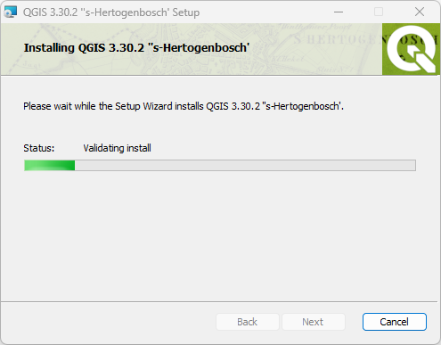
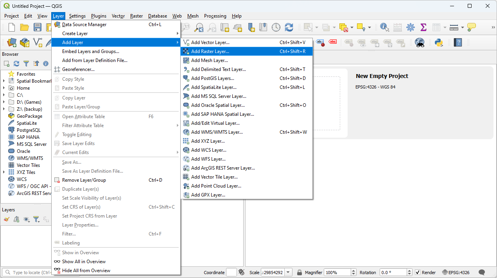
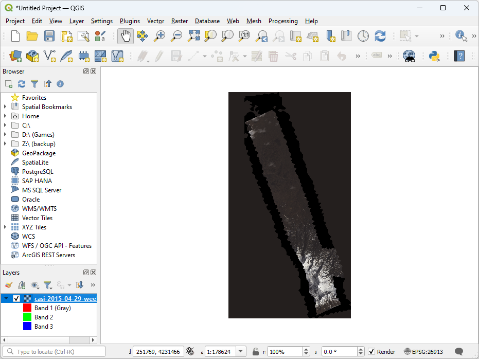

.. _qgis:

QGIS
================================================================================

.. index:: QGIS

.. include:: ./includes/substitutions.rst

What is |QGIS|?
--------------------------------------------------------------------------------

|QGIS| is an open source GIS. It is extensible with |Python|, it integrates
the `GRASS`_ analytic environment, and it works on both Windows and OS X.

.. _`GRASS`: https://grass.osgeo.org/

How will we use QGIS?
--------------------------------------------------------------------------------

We're using |QGIS| to visualize raster and vector processing product during
our workshop. If you have another GIS available to you, you are welcome to
use it, but because |QGIS| is open source, we are installing it and using it
to be sure you'll have something to look at data with.

Installing QGIS
--------------------------------------------------------------------------------

1. Copy the contents of your |Hobu| USB key to a ``PDAL`` directory in your
   home directory (something like ``C:\Users\Howard\PDAL``). We will refer to
   this location for the rest of the workshop materials.

2. After your materials are copied, navigate to the
   ``c:\Users\Howard\PDAL\software`` directory.

.. note::

    It is assumed your |Hobu| USB drive has all of its contents
    copied to the ``C:\Users\Howard\PDAL`` folder. Please adjust your
    locations when reading these tutorial documents accordingly.

3. Choose the install image, Windows or Mac, and install |QGIS|
   prepare your machine to run the examples.

4. Once installed, verify you can run |QGIS| by opening the application.
   Navigate to the ``C:\Users\Howard\PDAL\exercises\analysis\colorization``
   directory.

5. Select the ``casi-2015-04-29-weekly-mosaic.tif`` image and open it
   for display.

Conclusion
--------------------------------------------------------------------------------

|QGIS| allows everyone to have access to a fully-featured GIS. We are going to
use it to visualize raster and vector data used throughout the workshop.
