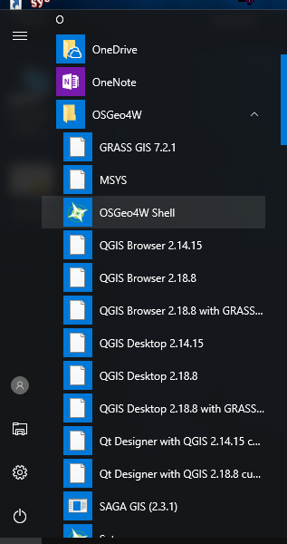

.. _basic_info:

Basic Information
================================================================================

.. include:: ../../includes/substitutions.rst

* Inspection of file contents
* Location determination
* Investigate suitability

Exercises
================================================================================

1. :ref:`pdal:workshop-single-point`
2. :ref:`pdal:workshop-metadata`
3. :ref:`pdal:near`

Printing a Single Point
================================================================================

Purpose:
    * Verify PDAL is working correctly
    * Learn about point cloud data types
    * Familiarize yourself with terminal

:ref:`Workshop Materials <pdal:workshop-single-point>`

Start Terminal (first point)
================================================================================

1. Start the |Terminal|

Command (first point)
================================================================================

In your |Terminal|, issue the following:

.. literalinclude:: ../../exercises/info/single-point-command.txt
    :linenos:

1. ``pdal``: Inside the ``pdal/pdal`` image, run the `pdal` command

2. ``info``: `info` is a "kernel" in PDAL-speak. It is a unit
   of functionality driven by the command line.

Command (first point)
================================================================================

.. literalinclude:: ../../exercises/info/single-point-command.txt
    :linenos:

3. ``c:/Users/hobu/PDAL/exercises/info/interesting.las``:
   File to run ``info`` command on

4. ``-p``: argument corresponds to "print a point".

5. ``0`` means to print the first (starting from 0)

Run (first point)
================================================================================

.. figure:: ../../images/info-interesting-single-point.png

    `JSON`_ output of the first point

.. _`JSON`: http://json.org

.. _metadata:

Printing File Metadata
================================================================================

Purpose:
    * Investigate files
    * Verify data validity
    * Compute bounding box
    * Retrieve supporting information

:ref:`Metadata Workshop Materials <pdal:workshop-metadata>`

Command (metadata)
================================================================================

In your |Terminal|, issue the following:

.. literalinclude:: ../../exercises/info/metadata-command.txt
    :linenos:

* `JSON`_ output
* Tree structure
* Coordinate system
* Filter output

Run (metadata)
================================================================================

.. figure:: ../../images/info-interesting-metadata.png

    `JSON`_ output of file metadata

Searching Near a Point
================================================================================

Purpose:
    * Neighborhood query
    * Point ordering

:ref:`Near Workshop Materials <unavco:near>`

Command (near - metadata)
================================================================================

In your |Terminal|, issue the following:

.. literalinclude:: ../../exercises/info/near-command-1.txt
    :linenos:

* Print *all* metadata info
* Find and compute midpoints from ``bbox`` metadata
* Query file nearest midpoint

Command (near - query)
================================================================================

In your |Terminal|, issue the following:

.. literalinclude:: ../../exercises/info/near-command-2.txt
    :linenos:

* Print 3-nearest points (in order)
* Output `JSON`_ format

Run (near - query )
================================================================================

.. image:: ../../images/info-near-point.png

Next
================================================================================

On to :ref:`translation`

