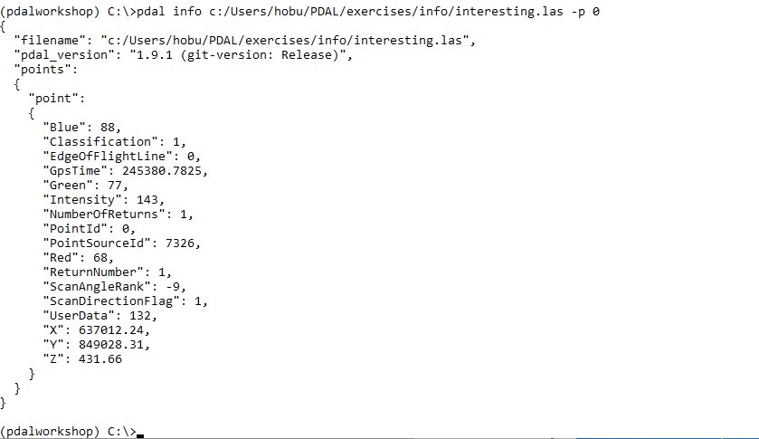
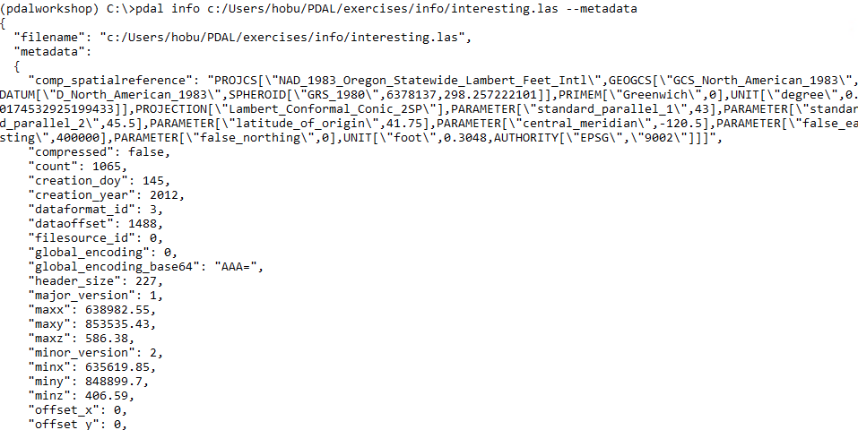
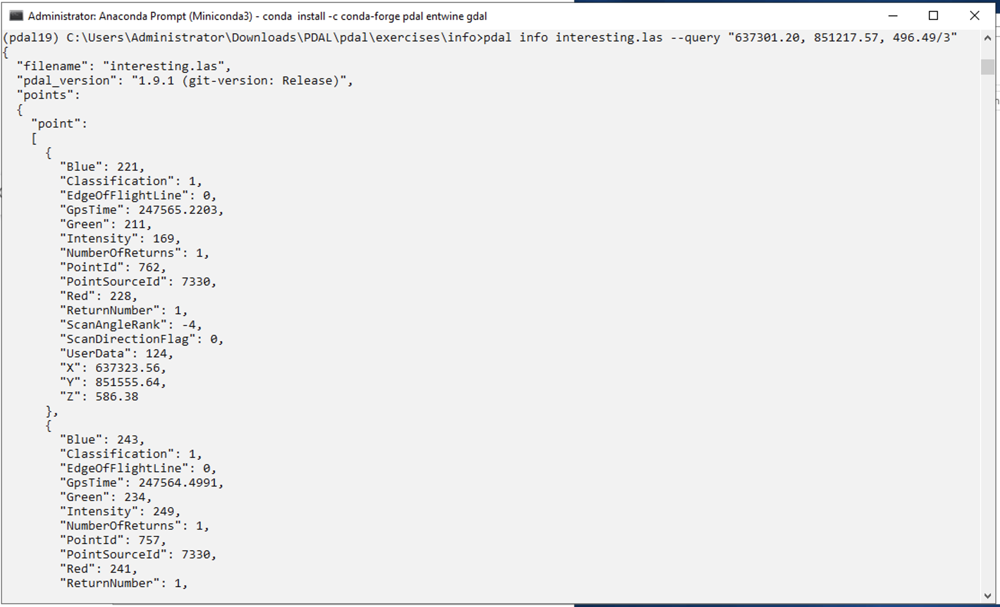

.. _basic_info:

Basic Information
================================================================================

* Inspection of file contents
* Location determination
* Investigate suitability

Exercises
================================================================================

1. :ref:`single-point`
2. :ref:`metadata`
3. :ref:`near`

Printing a Single Point
================================================================================

Purpose:
    * Learn how to run PDAL via :ref:`docker`
    * Verify PDAL is working correctly
    * Learn about point cloud data types

:ref:`Workshop Materials <unavco:single-point>`

Command (first point)
================================================================================

In your `Docker Quickstart Terminal`, issue the following:

.. literalinclude:: ../../exercises/info/single-point-command.txt
    :linenos:

1. ``docker``: All our commands start with ``docker``

2. ``run``: Tells docker we're going to run an image

3. ``-v /c/Users/Howard/PDAL:/data``: Maps our workshop directory to a directory called
   ``/data`` inside the container.

Command (first point)
================================================================================

.. literalinclude:: ../../exercises/info/single-point-command.txt
    :linenos:

4. ``pdal/pdal``: Run the image with name ``pdal/pdal``

5. ``pdal``: Inside the ``pdal/pdal`` image, run the `pdal` command

6. ``info``: `info` is a "kernel" in PDAL-speak. It is a unit
   of functionality driven by the command line.

Command (first point)
================================================================================

.. literalinclude:: ../../exercises/info/single-point-command.txt
    :linenos:

7. ``/data/exercises/info/interesting.las``: Our directory
   is now mounted at ``/data``

8. ``-p``: ``-p`` corresponds to "print a point".

9. ``0`` means to print the first

Run (first point)
================================================================================

    `JSON`_ output of the first point

.. _`JSON`: http://json.org

.. _metadata:

Printing File Metadata
================================================================================

Purpose:
    * Investigate files
    * Verify data validity
    * Compute bounding box
    * Retrieve supporting information

:ref:`Metadata Workshop Materials <unavco:metadata>`

Command (metadata)
================================================================================

In your `Docker Quickstart Terminal`, issue the following:

.. literalinclude:: ../../exercises/info/metadata-command.txt
    :linenos:

* `JSON`_ output
* Tree structure
* Coordinate system
* Filter output

Run (metadata)
================================================================================

    `JSON`_ output of file metadata

Searching Near a Point
================================================================================

Purpose:
    * Neighborhood query
    * Point ordering

:ref:`Near Workshop Materials <unavco:near>`

Command (near - metadata)
================================================================================

In your `Docker Quickstart Terminal`, issue the following:

.. literalinclude:: ../../exercises/info/near-command-1.txt
    :linenos:

* Print *all* metadata info
* Find and compute midpoints from ``bbox`` metadata
* Query file nearest midpoint

Command (near - query)
================================================================================

In your `Docker Quickstart Terminal`, issue the following:

.. literalinclude:: ../../exercises/info/near-command-2.txt
    :linenos:

* Print 3-nearest points (in order)
* Output `JSON`_ format

Run (near - query )
================================================================================

Next
================================================================================

On to :ref:`translation`

