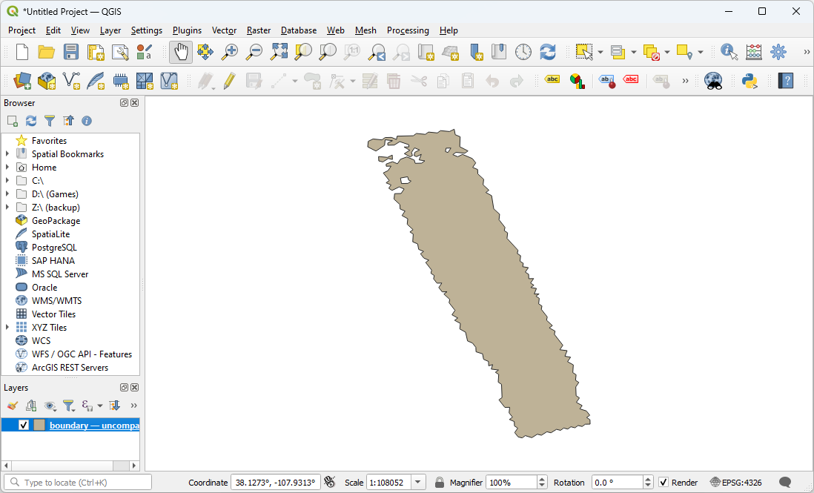

.. _boundary:

Boundary
================================================================================

Purpose:
    * Estimate spatial footprint
    * Do it quickly
    * Balance speed/quality
    * Look with :ref:`qgis`

:ref:`Boundary Workshop Materials <unavco:boundary>`

Boundary (command)
================================================================================

.. literalinclude:: ../../exercises/analysis/boundary/boundary-command-boundary.txt

Boundary (command output)
================================================================================

.. image:: ../../images/boundary-text-output.png

Boundary (blizzard)
================================================================================

Boundary (tindex)
================================================================================

.. literalinclude:: ../../exercises/analysis/boundary/boundary-command-tindex.txt

Boundary (tindex output)
================================================================================

.. image:: ../../images/boundary-tindex-run.png

Boundary (QGIS)
================================================================================

.. image:: ../../images/density-add-layer.png

Boundary (QGIS)
================================================================================

Next
================================================================================

On to :ref:`clipping`
