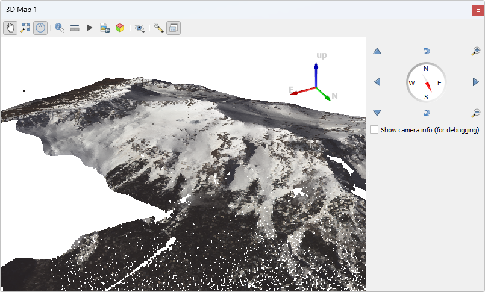

.. _colorization:

Colorizing points with imagery
================================================================================

Purpose:
    * Top-down projection of RGB imagery
    * Improve visualization
    * Assign other GDAL data to points

:ref:`Colorizing Workshop Materials <unavco:colorization>`

Colorization (setup)
================================================================================

* LAZ point cloud
* GeoTIFF

Pipeline
================================================================================

1. :ref:`readers.las`
2. :ref:`filters.colorization`
3. :ref:`filters.range`
4. :ref:`writers.las`

Range?
================================================================================

* GDAL assigns NODATA values
* Range filter tosses them

Colorization (pipeline)
================================================================================

.. literalinclude:: ../../exercises/analysis/colorization/colorize.json

Colorization (command)
================================================================================

.. literalinclude:: ../../exercises/analysis/colorization/colorization-run-command.txt
    :linenos:

Colorization (polygon)
================================================================================

.. image:: ../../images/colorize-run-command.png

Colorization Filter
================================================================================

* For every point

  * Query GDAL-readable raster
  * Set point attribute to band value

LAS Writer
================================================================================

* Output LAZ
* LAS 1.2
* Point Format 3

Colorization (verify)
================================================================================

Next
================================================================================

On to :ref:`denoising`
