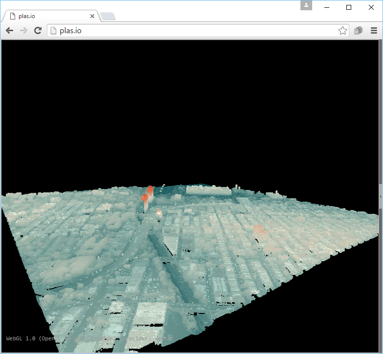

.. _denoising:

Removing noise
================================================================================

.. include:: ../../includes/substitutions.rst

Purpose:
    * Remove noise with a statistical method
    * Maintain point integrity

:ref:`Denoising Workshop Materials <pdal:colorization>`

Pipeline
================================================================================

1. :ref:`readers.las`
2. :ref:`filters.outlier`
3. :ref:`filters.range`
4. :ref:`writers.las`

Range Filter
================================================================================

* Big cluster of extreme ``Z`` values
* Range filter tosses them

Denoising (pipeline)
================================================================================

.. literalinclude:: ../../exercises/analysis/denoising/denoise.json

Denoising (command)
================================================================================

.. literalinclude:: ../../exercises/analysis/denoising/denoising-run-command.txt
    :linenos:

Denoising (execution)
================================================================================

.. image:: ../../images/denoise-run-command.png

Statistical Outlier Filter
================================================================================

See [Rusu2008]_ for more information.

.. [Rusu2008] Rusu, Radu Bogdan, et al. "Towards 3D point cloud based object maps for household environments." Robotics and Autonomous Systems 56.11 (2008): 927-941.

Denoising (verify)
================================================================================

Next
================================================================================

On to :ref:`density`
