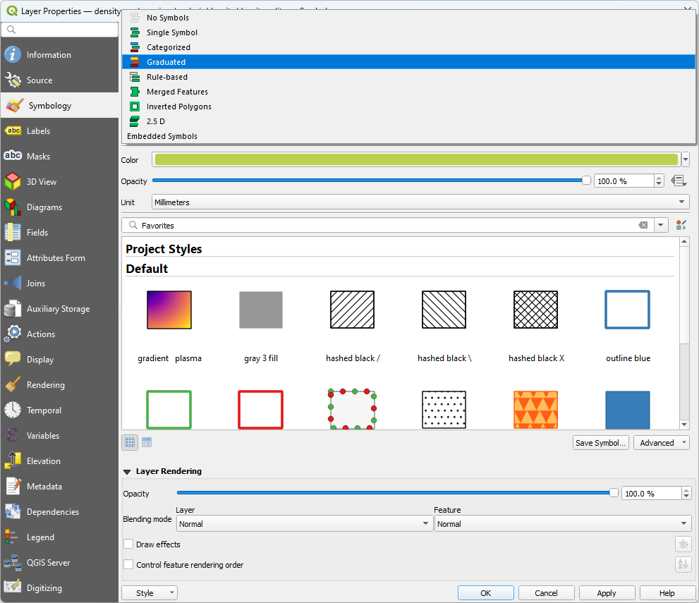
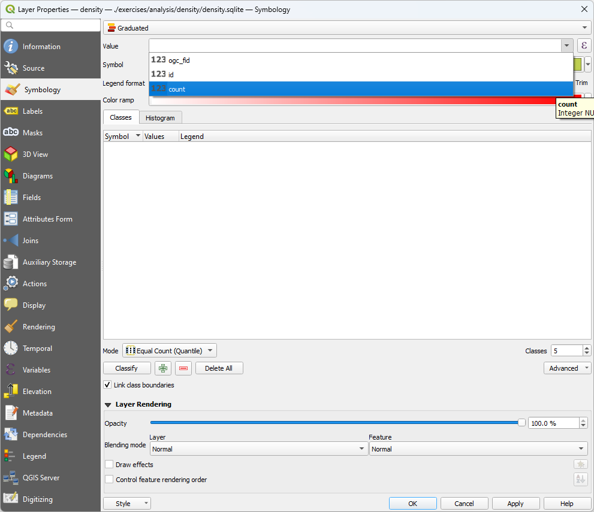
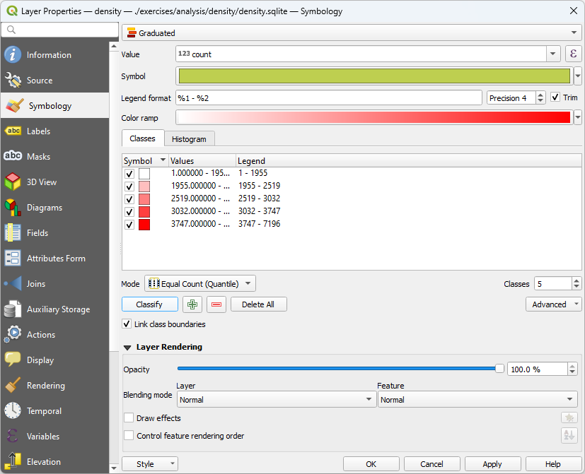

.. _density:

Visualizing acquisition density
================================================================================

Purpose:
    * Characterize collection density

:ref:`Density Workshop Materials <unavco:density>`

Density (execution)
================================================================================

.. image:: ../../images/density-command-run.png

filters.hexbin
================================================================================

* Hexagon tesselation
* Sample-based or user-specified edge size
* Count threshold

Density (view)
================================================================================

.. image:: ../../images/density-add-layer.png

Density (view)
================================================================================

.. image:: ../../images/density-select-layer.png

Density (view)
================================================================================

.. image:: ../../images/density-file-open.png

Density (view)
================================================================================

Density (view)
================================================================================

Density (view)
================================================================================

Density (view)
================================================================================

Density (edge size)
================================================================================

::

    --filters.hexbin.edge_size=24

Next
================================================================================

On to :ref:`thinning`
