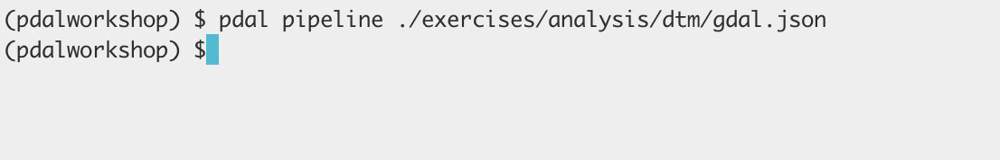
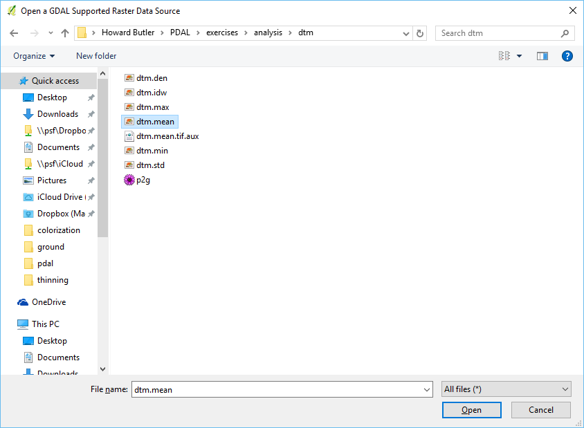
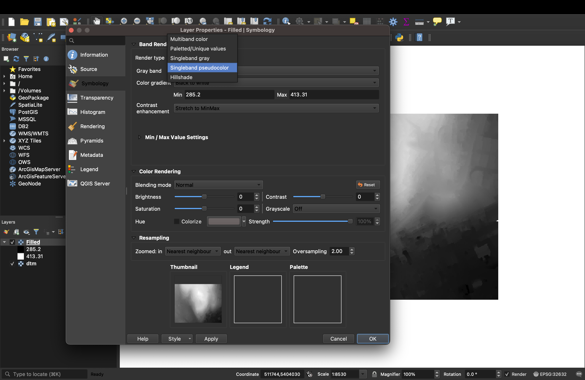
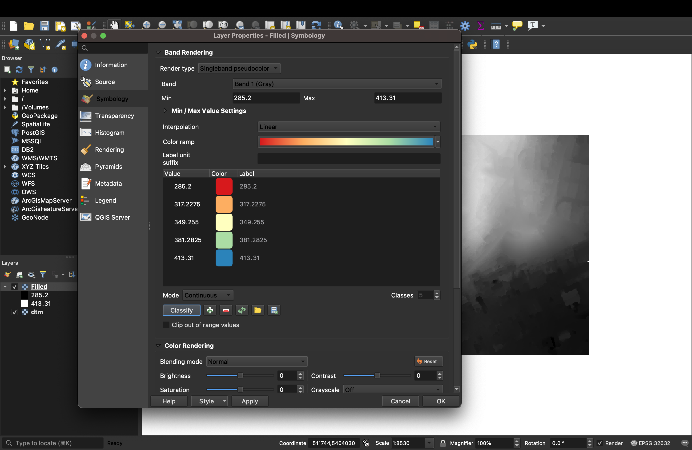
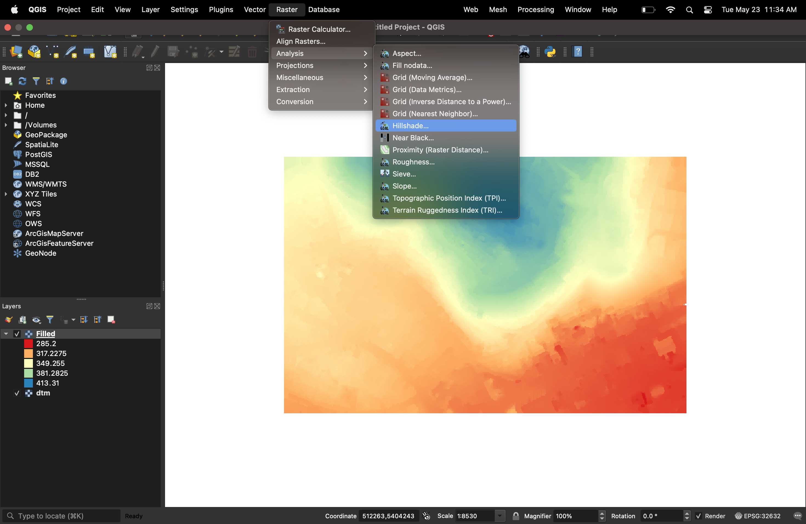
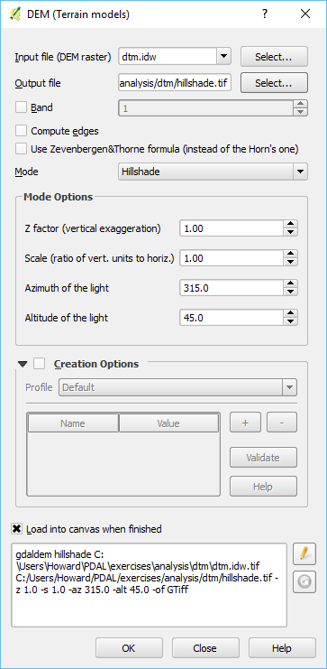

.. _dtm:

Generating a DTM
================================================================================

Purpose:
    * Generate a DTM from ground-filtered data
    * Data was created in :ref:`ground`
    * Visualize DTM using :ref:`qgis`

:ref:`DTM Workshop Materials <unavco:dtm>`

writers.p2g
================================================================================

* :ref:`writers.p2g`
* Generated using points2grid (OpenTopography)
* Write TIFF/ASCII raster
* Control pixel size

DTM (pipeline)
================================================================================

.. literalinclude:: ../../exercises/analysis/dtm/p2g.json
    :linenos:

DTM (execution)
================================================================================

.. literalinclude:: ../../exercises/analysis/dtm/dtm-run-command.txt
    :linenos:

DTM (command)
================================================================================

DTM (visualization)
================================================================================

DTM (visualization)
================================================================================

DTM (visualization)
================================================================================

DTM (visualization)
================================================================================

DTM (visualization)
================================================================================

DTM (visualization)
================================================================================

.. image:: ../../images/dtm-qgis-hillshade-done.png

Home
================================================================================
:ref:`Home <home>`

