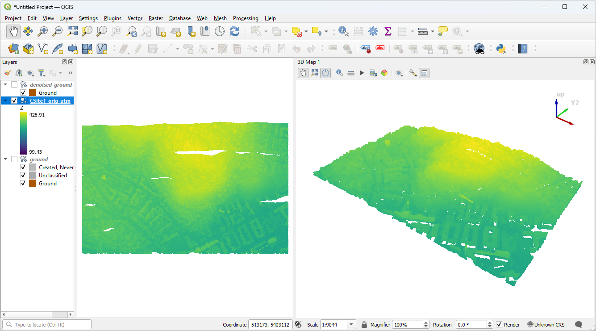

.. _ground:

Identifying ground
================================================================================

.. include:: ../../includes/substitutions.rst

Purpose:
    * Filter and classify ground points

:ref:`Ground Workshop Materials <pdal:ground>`

filters.ground
================================================================================

* Progressive Morphological Filter [Zhang2003]_.
* Exact (slow) and Approximate (fast)
* Ground only, no other types

.. [Zhang2003] Zhang, Keqi, et al. "A progressive morphological filter for removing nonground measurements from airborne LIDAR data." Geoscience and Remote Sensing, IEEE Transactions on 41.4 (2003): 872-882.

Ground (execution)
================================================================================

.. literalinclude:: ../../exercises/analysis/ground/ground-run-no-filter.txt
    :linenos:

Ground (view)
================================================================================

Ground (noise)
================================================================================

Noise!

.. image:: ../../images/ground-classified-included-side.png

Ground (ground only)
================================================================================

.. literalinclude:: ../../exercises/analysis/ground/ground-run-ground-only.txt
    :linenos:
    :emphasize-lines: 6

Ground (denoised first)
================================================================================

.. literalinclude:: ../../exercises/analysis/ground/translate-run-ground-only.txt
    :linenos:

Ground (view)
================================================================================

.. image:: ../../images/ground-filtered.png

Next
================================================================================

On to :ref:`dtm`
