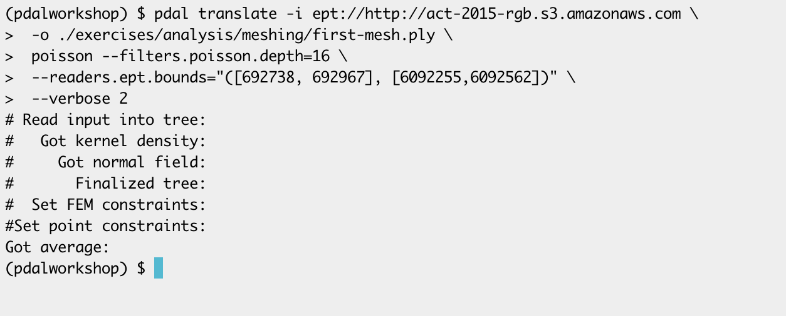
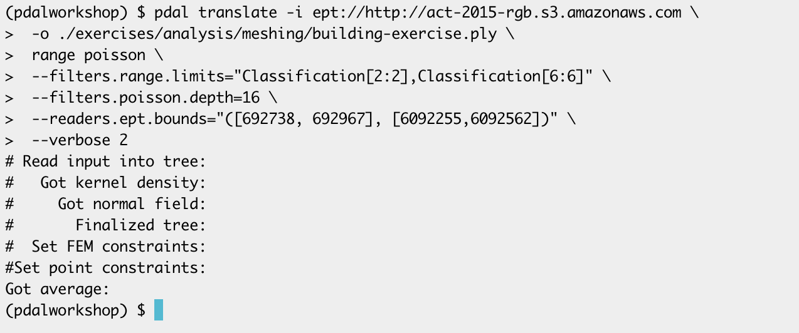

.. _meshing:

Creating surface meshes
================================================================================

.. include:: ../../includes/substitutions.rst

.. index:: ground, classification, filtering

Purpose:
    * Create a solid surface (PLY file)

Command
================================================================================

.. literalinclude:: ../../exercises/analysis/meshing/meshing.txt
    :linenos:

Execution
================================================================================

Result
================================================================================

You can view the mesh in Cloud Compare, you should see something similar to

.. image:: ../../images/first-mesh.png

Filtering
================================================================================

.. literalinclude:: ../../exercises/analysis/meshing/meshing-buildings.txt
    :linenos:

Windows Command
================================================================================

.. literalinclude:: ../../exercises/analysis//meshing/meshing-buildings-win.txt
    :linenos:

Output
================================================================================

Next
================================================================================

On to :ref:`rasterization`
